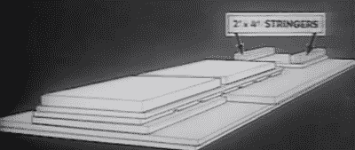
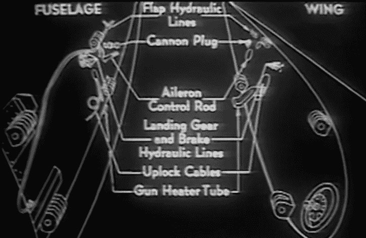

# 复古:像战时“宜家”一样现场组装飞机

> 原文：<https://hackaday.com/2017/12/21/retrotechtacular-field-assembly-of-the-p-47/>

想象一下，现在是 1943 年，你必须从你在美国的工厂运输 1000 架 P-47 战斗机到欧洲前线，大约在 5000 英里的公海上空。驾驶它们不是一个选项，P-47 的最大航程只有 1800 英里，战斗机的空对空加油技术仍需几年时间。此时正在使用的*埃塞克斯*级航空母舰可以在必要时携带 P-47，但是这种飞机不是为航空母舰设计的，实际上你无论如何也不可能装很多。那还剩下什么呢？

事实证明，最简单的方法就是将它们作为货物运输。但是你不可能用牛皮纸把一架战斗机包起来，然后贴上邮票；这些飞机需要为飞越大西洋的旅程进行特殊的准备和包装。为了让 P-47 进入一个形状合理的运输板条箱，机翼、螺旋桨和尾翼必须卸下来，放入一个单独的板条箱。但是任何一个 Hackaday 的读者都知道，把东西拆开很少是问题，把东西重新组装起来通常是棘手的部分。

于是，1943 年的电影“ [*开始了，P-47 雷电飞机*”](https://www.youtube.com/watch?v=V2D3k0sJ8HM)的拆箱和组装过程已经被数码还原，并由【芝诺的战鸟】上传到 YouTube。在这个由“陆军航空兵应用战术学校”制作的引人入胜的 40 分钟视频中，观众看到了如何打开装有 P-47 的两个板条箱，并将其组装成一架准备飞行的飞机，只需要人力和标准的机械工具。没有起重机，没有焊工，甚至连一个衣架都没有:只有一架精心设计的飞机和战时的独创性。

## 无忧包装

组装 P-47 的关键在于板条箱本身。它们不是简单的木箱，而是组装过程中不可或缺的一部分。这部电影告诉我们，板条箱将被拆开，这样它们就可以变成一个临时的摇篮，在飞机的主要部件用螺栓固定在一起时，用来支撑它们。在组装这个工作平台的过程中，进行了大量的计划；在电影的几个点上，观众被指示在木头上切割似乎没有任何用途的大切口，却发现二十步后一架不断增长的飞机将不得不穿过它。

Assembly diagram of the shipping crate work platform.

此外，板条箱的结构部件将在一些较重的提升操作中作为杠杆重复使用。例如，最初排列在主运输板条箱两侧的木材将被移除，切成两半，然后钉在一起。当需要提升巨大的机翼时，它们将被用作吊索，这样它们就可以被固定在机身上。

## 保持简单

一旦工作平台完成，电影接着描述飞机本身的组装。正如视频开头所承诺的，不需要专门的工具。事实上，不需要*驱动的*工具，因为任何事情都可以只用人类的肌肉来完成。

这在电影的某些部分尤其明显，例如当观众被指示在拉动八英寸扳手时只用两个手指，这样就可以估计张力。其他时候，影片建议手动计数螺母另一侧可见的螺纹数量，以确定它们是否已被足够拧紧。

当事情开始变得更具技术性时，例如当需要连接机翼内部的所有电线和管道时，这部电影依靠经典的 1940 年的插图来尽可能简化程序。即使您不知道每个组件实际上是做什么的，您也能够理解并正确地将它们组合在一起。

Critical assembly steps are often accompanied by concise graphics.

使用最简单的工具和方法背后的部分原因是必要性:如果你试图在战场上建造这架飞机，而敌人可能只有几个小时的路程，你希望事情尽可能简单。例如，工程师们没有假设会有千斤顶或起重机可以将组装好的飞机从运输支架中吊出，而是设计了起落架，这样它们就可以用自行车打气筒以外的任何东西加压:从而允许 P-47 将自己吊出支架，然后简单地滚走。

## 出于需要而设计

这是飞机设计的这一方面，使潜在的非熟练工人只需要最基本的东西就能组装，这也许是这部电影最令人印象深刻的地方。这不像是他们拿了一架标准的飞机，把它拆开，然后告诉一些美国大兵把它装回一个整体。P-47 的设计显然(至少部分)是为了便于这种特别的建造和维护；对于如此复杂的机器来说，这可不是一个小壮举。

在影片的几个地方，补充印刷文件被引用，所以不可否认，我们没有完整的图片，因为它真正采取了什么让一架 P-47 从它的板条箱到空中。可能印刷的文件极其复杂，涉及的任务超出了 1943 年普通士兵的能力。甚至可能这部电影与其说是工作文档，不如说是公关噱头。我们可能永远不会知道。

虽然没有一个理智的人希望看到一场像第一次和第二次世界大战那样规模的世界范围的冲突再次降临到我们的文明上，但人们确实不得不惊叹于技术和工程迎接挑战的方式。那些年，不可能变成了可能，不可思议变成了常规。有一种苦乐参半的讽刺意味，如果幸运的话，人类将永远不会再承受这种挑战人类和机器极限的无所不包的压力。

 [https://www.youtube.com/embed/Noqms4AhTJA?version=3&rel=1&showsearch=0&showinfo=1&iv_load_policy=1&fs=1&hl=en-US&autohide=2&wmode=transparent](https://www.youtube.com/embed/Noqms4AhTJA?version=3&rel=1&showsearch=0&showinfo=1&iv_load_policy=1&fs=1&hl=en-US&autohide=2&wmode=transparent)

