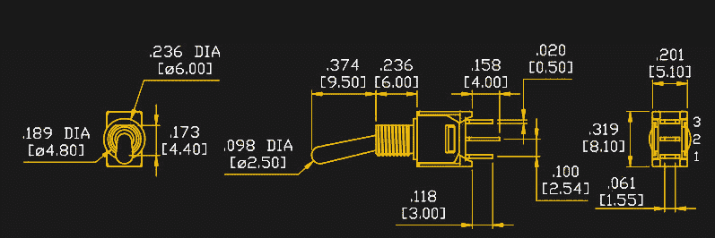
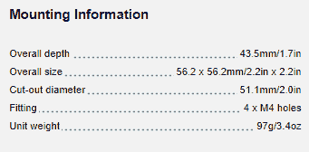
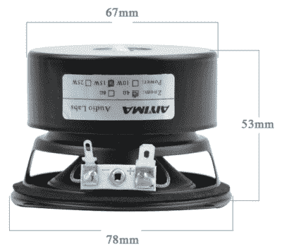
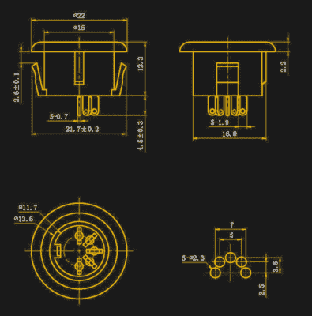

# 尺寸非常糟糕的图纸

> 原文：<https://hackaday.com/2017/12/14/truly-terrible-dimensioned-drawings/>

我现在正处于 Hackaday 的一个副业项目的计划阶段。没什么太令人印象深刻的，但这是一个涉及很多机电零件的项目。这个项目将需要大量面板安装 1/8”插孔和插座、垂直安装 DIN 5 连接器、电位计、开关和其他精心制作的金属零件。Mouser 和 Digikey 对于几乎所有其他类型的电子元件来说都很棒，但当谈到这些种类的机电元件时，你最好的选择通常是看看全球速卖通或 DealExtreme，找到接近你需要的东西，然后买几百个。对于一个可制造的产品来说，这是最好的选择吗？不，但我们只造了几百个。

我一直在浏览我经常光顾的互联网，为这个项目寻找合适的冲压黄铜和注塑塑料，并得出了一个惊人的结论。显然，工程师不知道如何标注图纸尺寸。从一开始直到 AutoCAD 发明之前，制图一直是工程师的核心能力，现在我们终于收获了回报:现在很难在互联网上找到可用的标注尺寸的图纸。

这篇文章一半是咆哮，一半是解释我最近发现的一些标注尺寸的图纸有什么问题。把这当作一个不要做什么的例子。工程图的状态没有理由*这个*差。

* * *

### 例子一:越看越糟

第一个例子来自 [Bitches Love My Switches](https://lovemyswitches.com/) ，一个名字很不幸的店面，但它确实有很多整洁的开关和插孔，在东海岸有一个仓库，可以快速发货。如果你想为吉他踏板和相关的听力爱好者找一些软糖零件，这是一个了解的好地方。这家商店不生产自己的开关，随之而来的是数据表和尺寸图的问题。这些图纸是由某个地方的一个随机的工程师绘制的，这个人没有受过尺寸图的培训。

让我们用上面显示的尺寸图来解决一个设计问题。这是一个安装在 PCB 上的开关，需要一个螺母将其固定在面板上。把它想象成一个 PCB 对峙，只不过它是一个开关。该开关可用作外壳的机械结构部件。

要使用这个开关设计任何东西，你需要知道这个开关每个部分的高度，从它连接到 PCB 的位置，到螺母拧紧的位置。你需要知道开关体的高度。这个尺寸在这个图中完全不存在，使得这个图完全没有用。使用这个开关设计任何东西所需要的尺寸是不存在的。但是这幅画变得更糟了。

如果你想知道在这个开关中物理移动的“拨动”的高度呢？它在图中标记为 9.5 毫米，但这个尺寸充其量是无用的，即使是最自由的解释也是错误的。为什么？因为肘节是枢转的。该肘节的尖端以弧形移动，并且尖端在摆动的中间将比它在任一锁定位置“更长”。实际尺寸图将包括 9.5 毫米的尺寸*和锁定位置的肘节角度*，这样您就可以算出开关的实际最大高度。

想更讨厌这幅画吗？没问题。螺纹部分上的螺母尺寸是多少？没错。这并不是销售这些开关的商店的一个转变，但它表明了整个电子行业的一些可怕的做法。不知何故，每个人都忘记了如何创建有用的尺寸图。

* * *

### 例子二:所有扬声器制造商在波希米亚格罗夫聚会

我正在做的项目也需要一个演讲者。一般规格是一个 3-4 英寸直径的扬声器，可以处理 5 瓦。我不是在这里寻找质量，但我在寻找一些我可以在订购前设计一个外壳的东西。

扬声器是一种非常简单的装置。有一个线圈和一个磁铁，两个终端，一个纸锥，和一个金属法兰，法兰周围有四个孔，相互偏移 90 度。几乎所有的普通扬声器都将遵循这一原型，如果你正在为扬声器制作外壳，你只需要知道三件事:你需要切割的孔的直径，扬声器的深度，以及法兰上的螺丝孔相距多远。这里我只需要三维。我是个简单的人。我也极度失望。

Mounting information for Celestion’s AN2075 loudspeaker. Guess what’s missing?

Celestion 是一家声誉很高的扬声器制造商。他们已经存在了 90 年，他们创造了第一个金属圆顶高音扬声器，并生产了据说是吉他放大器扬声器的标准。如果你在扬声器行业，Celestion 是你想去的地方。他们肯定能拿出有用的数据表和技术规格，对吗？再想想。[他们的 AN2075 扬声器](https://celestion.com/product/85/an2075/)列出了扬声器的整体深度、开孔直径和扬声器的整体尺寸。安装孔相距多远？去你的，这就是他们之间的距离。这甚至不是“制图”或“工程制图”。这只是不完整的信息。

One of the better drawings of speaker dimensions on AliExpress

塞莱斯廷并不孤单。看一看全球速卖通。如果你在寻找能承受 10 或 15 瓦的小型廉价扬声器，你有数千种选择。事实上，他们中没有人会在产品页面上显示相关信息。是的，你通常会得到凸缘的尺寸，你可能会得到扬声器实际有多深。你很少会发现在你的项目外壳上放螺丝孔的地方。

我不相信阴谋。人们太自私了，不会成为一个邪恶阴谋的一部分，这个阴谋致力于歪曲事实或统治人民。这是乔姆斯基对日克的媒体理论；私利主宰一切。人太笨，组织不起来。这可能是阴谋存在的最好证据。扬声器制造商之间肯定有阴谋。没有一个有洞应该去哪里的尺寸。

* * *

### 例子三:千斤顶

这个项目也将利用 DIN 5 连接器(但不是作为 MIDI 插孔)，这些必须是面板安装连接器。几乎你在 Mouser 或 Digikey 上看到的每一个 DIN 5 连接器都是直角连接器。也就是说，你把连接器焊接到板上，DIN 5 连接器就和 PCB 成直角出来了。这不是我想要的——我想要一个直接从电路板上伸出来的连接器。是的，这些连接器是存在的，但我们仍然只能看到不完整的尺寸图，就像我在下面的全球速卖通上发现的那样:

A DIN-5 panel mount jack. Note the grounding pin for the sleeve of the connector

Note the lack of a grounding pin on the footprint

首先，看一下零件的照片。这就是你对 DIN 5 连接器的期望。有五个引脚，还有一个额外的接地引脚用于连接器的屏蔽，就像地球上所有其他的 DIN 5 连接器一样。看看这幅画。它实际上还不错，甚至为我提供了五个引脚的首选 PCB 尺寸。但是那个接地针呢？标注尺寸的图纸上没有。如果你购买一千个这样的产品，并在装配线上运行它们，你会很快发现，在将它们组装到电路板上之前，你必须剪掉所有的接地引脚。数据丢失了，如果你直接从图纸上设计东西，那你就是个傻瓜。你*应该*能够根据图纸设计一些东西，这个面板安装 DIN 5 连接器是一个可怕的产品。

* * *

### 任何一所大学放弃了他们的制图课都是在伤害他们的学生

自古以来，直到 90 年代末和 21 世纪初，工程制图是所有工程师的必修课。这是一个有丁字尺和三角形的课程，隐藏着通过字母来发展精细运动控制的重点。这门课只有一两周的时间用来画尺寸图，但这一周对所有工程师来说都是至关重要的。除非别人可以使用你的图纸，否则你的图纸是没有用的，而没有尺寸合适的图纸，你就不能使用它们。

我不知道为什么我总是碰到尺寸非常糟糕的图纸。这是所有工程师的必备技能，不管他们是在中国、英国还是美国接受教育。然而，除了麦克马斯特·卡尔目录外，它在任何地方都不存在。

如果你想学习如何绘制尺寸图，我建议你去拿[【法国】的*工程图*。是的，这本书已经有 100 年的历史了，但它教的东西 200 年来都没变。这就是阿波罗登月舱的绘图员学习绘画的方法。是的，如果你没有合适的铅笔和不发达的精细运动控制，刻字是很难的，但我们现在无论如何都在使用计算机。阅读这本书，学习如何正确标注图纸尺寸，并停止打扰那些试图建造东西的工程师。](https://archive.org/details/amanualengineer01frengoog)