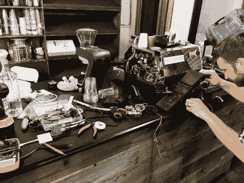

# 会黑咖啡

> 原文：<https://hackaday.com/2017/12/13/will-hack-for-espresso/>

[Avidan Ross]对咖啡有着不可抗拒的热情。酿造一杯真正的浓缩咖啡不仅仅是测量液体的盎司数，为此，他办公室目前的浓缩咖啡机不够用。一个制造商除了利用他的技能酿造一些高科技咖啡还能做什么呢？

对于一杯真正的浓缩咖啡，需要精确测量咖啡粉的质量和煮出的咖啡量。因此，GS3 拉玛佐科办公室已经被改造成一个闭环浓缩咖啡机，其核心是一个粒子光子和 Acaia 月球防水秤。

 在软件端，运行“智能冲泡”功能时，会模拟按下制作浓缩咖啡按钮，并不断测量冲泡好的浓缩咖啡的质量。一旦达到参数的“目标输出质量”,固件就会关闭机器。然后报告冲泡时间，让[罗斯]或其他人调整咖啡豆的研磨，以微调食谱。

下一步是逐步淘汰调整研磨的[人为因素](https://hackaday.com/2017/01/06/alexa-robot-coffee-maker-brews-coffee-speaks-for-itself/)——幸运的是，那里有一些[完全可破解的解决方案](https://hackaday.com/2017/09/07/a-3d-printed-coffee-grinder/)。与此同时，优质的浓缩咖啡将为这一努力提供燃料！

[通过[媒介](https://medium.com/)