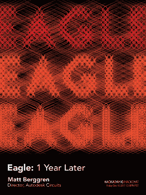

# 星期五黑客聊天:一年后的鹰

> 原文：<https://hackaday.com/2017/12/14/friday-hack-chat-eagle-one-year-later/>

早在 2016 年 6 月，欧特克就收购了 Cadsoft，以及流行的 PCB 设计软件 EagleCAD。20 年前，Eagle 就有一些功能的计划，现在 Autodesk 正在推出一系列令人印象深刻的功能，包括 UX 改进、与 MCAD 和 Fusion360 的集成以及推推路由。

 进入鹰的新时代六个月后，欧特克宣布他们将把许可模式改为订阅服务。你可以一次性支付不到 100 美元，永远保留 6.0 版本，现在你需要每月支付 15 美元购买你的 Eagle。是的，仍然有一个免费的教育版，但是这种订阅模式的改变在社区中引起了很大的恐慌。

在本周的黑客聊天中，我们将谈论一年前的 Eagle。我们这次聊天的嘉宾是马特·博格伦，Autodesk Circuits 总监，硬件工程师和技术专家，他一直致力于将电子设计带给每一个人。我们将向 Matt 询问有关 Eagle 的所有问题，包括:

*   最新版的 Eagle 有哪些新特性？
*   老鹰的愿望清单上有什么？
*   设计新功能时会遇到哪些技术挑战？
*   初学者在 Eagle 哪里可以找到设计 PCB 的资源？

加入聊天，了解 Eagle 中的新功能、Eagle 在新所有权下的发展情况，以及 Eagle 的新订阅模式进展如何。我们正在寻找来自社区的问题，因此，如果您对 Matt 或 Eagle 团队的其他成员有问题，[请将其放在 Hack Chat 活动页面](https://hackaday.io/event/28510-eagle-one-year-later)上。

如果您想知道 Altium 和 KiCad 的进展如何，或者对这些 PCB 设计工具有任何疑问，请不要担心:我们将在新的一年与这些工程师进行黑客聊天。

我们的 Hack Chat 是在 [Hackaday.io Hack Chat 群发消息](https://hackaday.io/project/5373/token/7879571d-62c3-46a8-af36-2b6f265590f2?redirect=messages)上的实时社区活动。这次黑客聊天将在太平洋标准时间 12 月 15 日星期五中午进行。时区让你沮丧？这里有一个[方便的倒计时定时器](https://www.timeanddate.com/countdown/generic?p0=137&iso=20171215T12&year=2017&month=12&day=15&hour=12&min=0&sec=0&msg=Eagle%3a%20One%20Year%20Later)！

点击左边的语音气泡，你会被直接带到 Hackaday.io 上的黑客聊天群。

你不必等到星期五；随时加入，你可以看到社区在谈论什么。