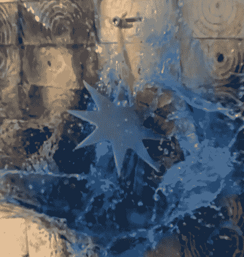

# 把锯条变成投掷的星星

> 原文：<https://hackaday.com/2017/12/15/turning-saw-blades-into-throwing-stars/>

假期就要到了，如果你还没有为你生活中的商场忍者找到完美的礼物，这个最新的黑客可能正是你正在寻找的。在他的 YouTube 频道上，[【夜间炼金术士】演示了如何用旧圆锯片](https://www.youtube.com/watch?v=h1bXpNJ5zK0)制作忍者飞星(手里剑)。有人可能会说，如果你的唯一目标是在你的后院破坏一些东西，圆锯本身就足够接近投掷星星了，但用这种方法，他们会有正式的武士外观。

 为了开始这个过程，他用砂轮机敲击圆锯片的两面，使其表面光滑。然后，他在刀片上描绘出想要的星形形状，并将刀片切割成碎片，这样更容易管理。星星的粗略形状是用角磨机切割出来的，砂带磨光机让他磨尖边缘。

在这一点上，星星实际上已经完成了，但如果你想要一些东西放在你在网上购买的武士刀旁边的架子上看起来很好，你需要做一些更多的完成工作。他手工打磨星星的两面，从 80 粒度开始，一直打磨到 1200 粒度的湿纸。一旦用砂纸打磨，用布将糊状蜡擦入，给它一层保护涂层。

收尾工作完成后，剩下要做的就是把你的新手里剑扔向汽水罐和西瓜罐，以展示它们的威力。为此，他准备了一个 1,000 FPS 的相机；所以，如果你曾经想看一罐非品牌汽水被一颗流星炸飞，你的商场忍者朋友不是唯一一个得到礼物的人。

圆锯片手里剑完成后，你所需要做的就是[锻造一把剑](http://hackaday.com/2017/10/26/thermite-creates-a-sword/)，[完善你在虚拟现实中的运行](https://hackaday.com/2016/12/20/the-ninja-run-a-vr-movement-experiment/)来完成你的城市武士转型。

 [https://www.youtube.com/embed/h1bXpNJ5zK0?version=3&rel=1&showsearch=0&showinfo=1&iv_load_policy=1&fs=1&hl=en-US&autohide=2&wmode=transparent](https://www.youtube.com/embed/h1bXpNJ5zK0?version=3&rel=1&showsearch=0&showinfo=1&iv_load_policy=1&fs=1&hl=en-US&autohide=2&wmode=transparent)

