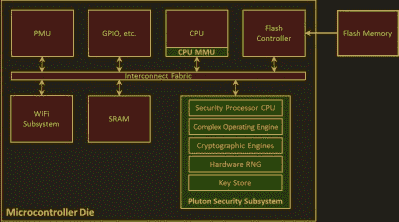

# 设计微控制器时要考虑安全性

> 原文：<https://hackaday.com/2017/12/15/design-a-microcontroller-with-security-in-mind/>

构建一个安全的网络设备有许多部分，整个行业仍在学习如何正确地做这件事。低成本微控制器设备的资源尤其有限。如果微控制器内置了安全硬件，是否会更容易构建更安全的设备？那就是微软研究院对 [Project Sopris 的调查。](https://www.microsoft.com/en-us/research/project/sopris/)

 研究人员定制了[联发科 MT7687](https://labs.mediatek.com/en/chipset/MT7687) ，一款大致堪比黑客宠儿 ESP32 的芯片。最重要的增加是一个安全子系统。众所周知，它执行的任务很难在软件中正确完成，例如随机数生成和安全密钥存储。它形成了他们所谓的“基于硬件的安全信任根”的核心

在特定于安全性的模块中执行这些任务可以解决许多问题。如果一个键没有存储在内存中，内存转储就不会损害不存在的东西。在特定任务的硬件中执行加密/解密使得对它们进行成功的旁路攻击更加困难。保持小规模可以降低成本，也便于验证代码的正确性。

但是安全模块也可以从不太有利的角度来看。它的描述类似于[可信平台模块](https://en.wikipedia.org/wiki/Trusted_Platform_Module)的缩小版。作为一个运行自己代码的独立模块，它类似于目前正在接受严格审查的[英特尔管理引擎](http://hackaday.com/2017/12/11/what-you-need-to-know-about-the-intel-management-engine/)。

我们会欢迎 Project Sopris 作为构建安全网络设备的省时工具包吗？还是我们会对隐藏的漏洞产生怀疑？研究人员可以开源他们的工作来缓解这些担忧，但他们工作的价值最终将取决于快速发展的网络设备安全领域。

你知道为微控制器增加硬件辅助安全性的其他努力吗？在下面评论或者通过[提示线](https://hackaday.com/submit-a-tip/)告诉我们！

[通过[连线](https://www.wired.com/story/project-sopris-iot-security/)

由[Hogs555] ( [CC-BY 4.0](https://commons.wikimedia.org/wiki/File:Mtsop.JPG#) )拍摄的与项目同名的索普里斯山的图像