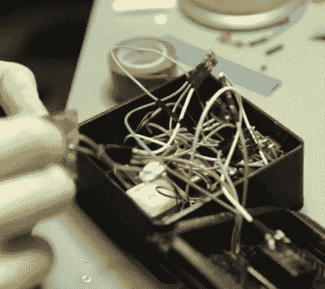

# 地理缓存定位器是不断赠送的礼物

> 原文：<https://hackaday.com/2017/12/18/geocache-locator-is-gift-that-keeps-on-giving/>

取决于你如何看待事情，假期可以被视为花钱的借口，也可以被视为发挥创造力的借口。我们可以想象，许多 Hackaday 读者在送礼物的时候宁愿去他们的工作台，而不是商场，Sean Hodgins 也不例外。他想出了一个主意，在他侄子家附近藏起了地藏王，并为他造了一个定位装置来找到他们。定位器本身旨在与他的侄子一起成长，允许他重新编程或使用其部件做完全不同的事情。

 定位器的 3D 打印盒内塞[的主要部件是一个水果饰品、一个 GPS 接收器和一个指南针模块。Adafruit NeoPixel 戒指当然是最前面和中心的，作为设备的显示屏。为了给设备供电，有一个旧电池，一个 LiPo 充电器电路和一个 5V 转换器。](https://www.thingiverse.com/thing:2717651)

这个项目的目标之一是它可以用[Sean]已经有的东西来建造，所以必须做出一些让步。这个小饰品的针脚太少，指南针缺少一个加速度计，开关和按钮对制作来说有点笨重。但最终它足够好地组合在一起完成了工作，至少他能够从他的零件箱中清除一些东西。

为了让它的主人可以拆卸并在以后可能重新组装成其他东西，定位器的结构中没有使用焊接接头。一切都是用跳线完成的，这导致了一些有趣的问题的解决，如使用一条引脚头作为各种母线。包裹上的一点热收缩将所有东西固定在一起，防止短路。

位置感知设备碰巧是黑客人群中非常受欢迎的礼物选择。我们已经涵盖了从垃圾拼凑的[设备](https://hackaday.com/2012/12/19/reverse-geocache-based-on-stm32-and-gps-wristwatch/)到可以作为商业产品的硬件[。](https://hackaday.com/2012/01/19/reverse-geocache-box-looks-great-and-packed-with-features/)

 [https://www.youtube.com/embed/lljkikMWPBw?version=3&rel=1&showsearch=0&showinfo=1&iv_load_policy=1&fs=1&hl=en-US&autohide=2&wmode=transparent](https://www.youtube.com/embed/lljkikMWPBw?version=3&rel=1&showsearch=0&showinfo=1&iv_load_policy=1&fs=1&hl=en-US&autohide=2&wmode=transparent)

