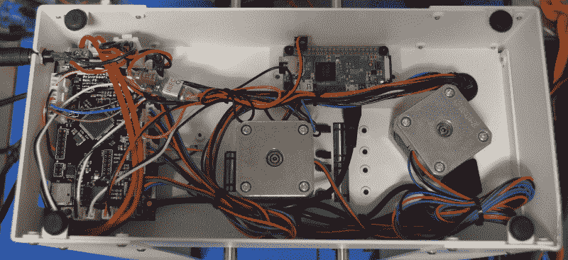

# 使用 OctoPrint 升级 3D 打印机

> 原文：<https://hackaday.com/2018/01/03/upgrading-a-3d-printer-with-octoprint/>

如果你一直在 3D 打印社区闲逛，或者阅读 Hackaday 上出现的各种 3D 打印帖子，你几乎肯定听说过 [OctoPrint](https://octoprint.org) 。由 Gina hage 创建和维护的 OctoPrint 允许您将旧计算机(或更常见的小型 ARM 板，如 Raspberry Pi 或 BeagleBone)转变为网络可访问的 3D 打印机控制面板。[由于社区开发的插件](https://plugins.octoprint.org)的蓬勃发展，它甚至可以控制其他硬件，如灯、外壳加热器、智能插头或任何你能想到的挂在你选择的 ARM 板的 GPIO 引脚上的东西。这个项目变得如此受欢迎，以至于新的 Prusa i3 MK3 在控制板上有一个[接头，专门用于连接 Pi Zero W 运行 OctoPrint](https://www.prusaprinters.org/original-prusa-i3-mk3-bloody-smart/) 。

尽管如此，我个人从未“得到”OctoPrint。我很高兴我的单个打印机连接到我的电脑，并通过 USB 直接从我的切片机控制。我打印的大部分东西都是我自己设计的，所以在设置打印机时，我把它连接到我要进行设计的机器上似乎是合乎逻辑的。如果我坐在电脑前，我只需要把椅子向右旋转，我就在打印机前了。我需要通过 WiFi 控制这个东西做什么？

但是，当我想设置第二台打印机来帮助加速更大的项目时，事情变得棘手了。我不能在同一台机器上控制它们，而且如果真的需要的话，我可以在第二台打印机上从 SD 打印，这个想法似乎已经过时了。这就像《T2》、《回家的旅程》和《T3》中斯科特试图对着电脑鼠标说话一样。不管我是否“明白”,我都要一头扎进 OctoPrint 的世界。

## 覆盆子填充的 PrintrBot

我在网上买了一台二手 PrintrBot Play，因为它占地面积小(不需要时我可以把它放在架子上)，全金属结构，自动床搬运，这样我就不必在移动床后重新调平床了。也许最重要的是，我知道在机器的底部有足够的空间，所以在那里安装额外的硬件不会有问题。

虽然 OctoPrint 可以在几乎任何东西上运行，但树莓 Pi 似乎是大多数人的首选平台。在 10 美元，这是很难拒绝 Pi Zero W 作为一个八字主机，所以这就是我决定去。我的研究告诉我，当涉及到切片 STL 时，Pi Zero 不会有 Pi 3 的 zip，但考虑到小尺寸和低功耗，这似乎不是太糟糕的权衡。

我对低电流消耗特别感兴趣，因为我想直接从[印刷电路板](http://reprap.org/wiki/Printrboard)的扩展端口运行 Pi，我知道它有一个 5V 调节器，其额定电流仅为 300 mA。我在网上读到的一切都告诉我，这对 Pi Zero 来说不是问题，特别是因为我可以关闭 HDMI 端口，因为它会无头运行。但正如我即将发现的那样，现实并不总是与文件相符。

## 早期的挫折

Pi Zero drawing 130 mA during slicing.

我想像 Prusa i3 MK3 一样关闭打印机控制器板的 Pi 电源，因此我需要确保它不会消耗超过该板处理能力的功率。在我试着把圆周率放进打印机之前，我把它放在我的桌子上，上面有一个 USB 电流监视器，并给它一个安装了 OctoPrint 的 SD 卡。

第一个测试非常有希望，它表明当执行资源密集型任务(如切片或更新包)时，Pi 零点似乎在大约 180 mA 时达到峰值。我确实需要禁用 HDMI 输出来获得这么低的功耗，但由于 Pi 将安装在打印机内部，永远不需要连接到显示器，这真的不是问题。

感觉很有信心，我将一些接头焊接到印刷电路板的扩展端口和 Pi 的电源引脚上，并用几个跳线将它们连接起来。我给电路板加电，耐心地等待 Pi 连接到网络，并允许我连接到 OctoPrint。但是……什么都没有。

仔细检查后，Pi 的电源指示灯似乎显示它在启动过程中关闭。在重命名 HDMI 并将其连接到显示器后，它肯定会到达某个阶段，然后重新启动。使用我的万用表串联在 Pi 和印刷电路板之间，我能够看到，在重启之前的一个短暂的瞬间，电流跃升至 280 mA 附近；显然比印刷纸板能承受的要多一点。

## B 计划

由于从主板供电看起来像一个死胡同，我拿起了一个小 BEC(电池消除电路)模块，它通常用于 RC 车辆，将主电池转换为 5V 的无线电接收器。随着微型四轴飞行器风靡一时，很容易找到一个只比花生大一点点的几块钱。

虽然我曾希望做这个项目而不永久附加任何东西到印刷电路板，但我不得不把它吸起来，把 BEC 模块的引线焊接到主电源连接的 PCB 下面。BEC 模块的另一边有一个标准的伺服连接器，我可以直接插入 Pi 的 GPIO 头。所以如果需要的话，至少我还可以把圆周率从打印机里取出来。

## 硬件布局

此图显示了 PrintrBot Play 底座内部的最终硬件布局。

可以在印刷电路板和中心步进电机之间看到 BEC 模块。Pi 本身被拧进了我设计的 3D 打印底座。眼尖的读者可能会注意到 Pi 支架的法兰上有螺母陷阱；最初，我计划在箱子上钻孔，从另一侧拧紧支架。但就在我在钢上打洞之前，我意识到螺丝头会干扰床的移动，所以我不得不满足于双面胶带。

## Octoprint 入门

如果你使用的是 Raspberry Pi，[有一个由 Guy Sheffer](https://octopi.octoprint.org) 维护的名为“OctoPi”的预制 SD 映像，其中包含最新的 OctoPrint 和所有辅助包，只要你插入卡，就可以获得交钥匙体验。真的，就是这么简单。即使你以前从未接触过 Raspberry Pi 或 Linux，安装并运行该软件也不会有任何问题。

第一次连接到 OctoPrint web 界面时，您会看到一个非常流畅的设置向导，引导您完成打印机设置的基本步骤。OctoPrint 假设您已经在电脑上使用了带有 Cura 的打印机，并会要求您从中导入配置信息。它还会问你如何处理安全问题:你可以让 OctoPrint 完全开放，任何人都可以连接，或者设置用户验证，只有受信任的个人才能使用打印机。如果您打算远程访问您的打印机，这一点很重要。

基本设置完成后，很有可能会提示你更新 OctoPrint 或者它的一个组件。这完全是在 web 用户界面中处理的。同样，即使你不是 Linux 高手，你也可以确保你已经安装了最新最好的版本。

一旦所有的东西都更新了，OctoPrint 重新启动了，你就会看到主界面，这个界面对于以前用过 3D 打印机的人来说应该非常熟悉。有移动打印机的手动控制，一个输入热床(和加热床，如果你有一个)所需温度的区域，甚至一个基本的文件管理器，允许你组织和加载存储在 Pi 上的 STL 和 g 代码文件。

说到这里，从 OctoPrint 的当前版本来看，你*可以*直接在 Pi 上分割 STL 文件。但是你最好在你的桌面上用 Cura 做，然后把切片文件发送过来。这是由于 Pi 的处理能力和 OctoPrint 中有限的切片选项。但是选项是存在的，如果 STL 不是太复杂，它就足够好地工作了。

## 该不该升级？

我在这台打印机上使用 OctoPrint 才几个星期，但我不得不承认，我印象非常深刻。在我的特殊情况下，我仍然将我的主打印机连接到计算机上，但是在我不想连接到计算机的辅助打印机上使用它非常方便。即使您没有其他用途，远程监控打印进度的能力(比如说，从您的智能手机)也是一个巨大的便利。

OctoPrint 的功能非常强大，尤其是社区插件。没有办法用这样的一个帖子来公正地处理它，所以我甚至不会去尝试。更高级的主题，如添加摄像头进行打印监控或从 web 界面控制外壳照明，将不得不等待未来的帖子。这里有如此多的潜力，很难不被淹没。

但简而言之，当我开始这个项目时，我一直在寻找的答案是明确的。是的，把你的打印机升级到 OctoPrint 绝对值得。这不是一次完美的体验，但也很接近了，老实说，我看到的一些小故障或烦恼在整体情况下几乎不值一提。

底线是:尽管 Pi Zero W 很便宜，但就投资回报而言，这是一次无可匹敌的升级。不管你是像我一样麻烦地把圆周率集成到打印机上，还是简单地把它粘在一边，只要做就行了。