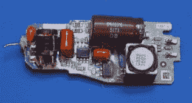

# 复活死亡的 LED 灯泡

> 原文：<https://hackaday.com/2017/12/19/resurrecting-dead-led-lightbulbs/>

如果你最近去了一家商店的照明区，你肯定会注意到我们正处于 LED 灯泡的时代。白炽灯泡为那些仍然有奇怪球用例的人保留了少量库存，通常有少数 CFL 灯泡为那些不介意在他们的房子里装满爆炸性的热汞小瓶的人提供，但现在大多数都是 LED 灯。这是理所应当的:就能效、寿命和环境影响而言，LED 照明显然是更好的选择。

不幸的是，你在架子上看到的许多 LED 灯泡质量都很差。为了降低成本，偷工减料，本应使用几十年的灯泡在几个月后就坏掉了。在又一次失败后，[【凯瑞·王】决定进行一次拆解来详细检查这次失败](http://www.kerrywong.com/2017/12/16/teardown-of-a-65w-cree-led-bulb/)。

The failed LED driver.

他注意到，大多数发光二极管似乎都以同样的方式出现故障，在打开后闪烁，直到它们完全停止发光。这暗示了一个过热的问题，而且[Kerry]认为美学和成本的考虑已经把散热推到了设计的次要位置。更糟糕的是，许多灯泡都安装在天花板上的隔热嵌入式固定装置中，这使得它们更难保持凉爽。

一旦他将实际的发光二极管从驱动电路中分离出来，他就能够确定发射器本身仍然工作正常。不要把整个东西扔进垃圾桶，有可能用新的电源重新使用 LED，这很快通过展示他用“死”LED 灯泡制作的商店灯来展示。

[Kerry Wong]并不是唯一一个将 LED 灯泡置于手术刀下的人。我们[报道了许多探索家居照明前沿的拆卸活动](https://hackaday.com/2013/11/01/led-bulb-reviews-evaluations-and-teardowns/);[无论好坏](https://hackaday.com/2017/10/11/dollar-tree-led-bulb-tear-down/)。

 [https://www.youtube.com/embed/2Vm27xL57O0?version=3&rel=1&showsearch=0&showinfo=1&iv_load_policy=1&fs=1&hl=en-US&autohide=2&wmode=transparent](https://www.youtube.com/embed/2Vm27xL57O0?version=3&rel=1&showsearch=0&showinfo=1&iv_load_policy=1&fs=1&hl=en-US&autohide=2&wmode=transparent)

