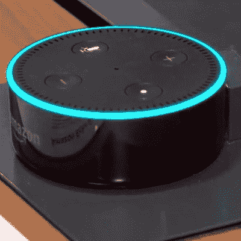
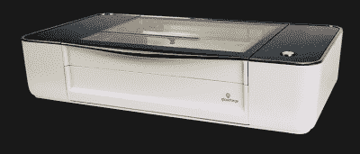

# 2017 年:随着硬件世界的转变

> 原文：<https://hackaday.com/2017/12/27/2017-as-the-hardware-world-turns/>

一年就要过去了，现在是时候回顾过去的五十多周了。黑客这一年发生了什么？2017 年将成为另一场人工智能复兴的开始，尽管我们不会这样称呼它；今年都是关于神经网络和机器学习，以及自动驾驶汽车和非常强大的 GPU 的发展带来的进步。自 80 年代以来，我们从未见过更多的“人工智能”领域的工作。在炒作周期的这一次，它将意味着什么？过几年就知道了。

生物黑客今年很受欢迎，这不仅仅是因为人们在手上安装了 RFID 标签和磁铁。CRISPR 允许进行*星际旅行*式的基因组黑客攻击，并且今年见证了在老鼠模型中启用和禁用单个基因的体内实验。最终，有人会因为 CRISPR 获得诺贝尔奖。

我们将前往火星，很快——很快——SpaceX 猎鹰重型飞船将把特斯拉跑车送入太阳轨道或大西洋。我们了解到 BFR 号将在一次发射中搭载数十人前往火星。波音和洛克希德认为他们可以与埃隆·马斯克的公关巨头竞争。毕格罗航天充气模块通过了在国际空间站的飞行测试，给空间站一个新的储藏室。甚至在太空，今年也发生了令人惊奇的事情。

就这样吗？一点也不。今年我们目睹了一些我们见过的最酷的黑客攻击，以及一些最愚蠢的安全漏洞。Hackaday 做得很棒。2017 年还有什么？请继续阅读，寻找答案。

### 黑客时代的状态

就事件、会议和竞赛而言，今年对于 Hackaday 来说是美妙的一年。三月份，我们在芝加哥、洛杉矶和旧金山同时举行了三次大会。八月份，我们举办了数百场日食观影活动，并送出了数千副日食眼镜。[我们举行了一场科幻竞赛。我们向黑客社区](https://hackaday.com/2017/01/23/hackadays-sci-fi-contest-hits-warp-speed/)[发出挑战，要他们用一千字节](https://hackaday.io/contest/18215-the-1kb-challenge)做最多的事情。9 月，我们在伦敦举办了一次非正式会议。一直以来，我们[看到全世界的工程师动员起来争夺 Hackaday 奖](https://hackaday.io/prize)，一个建造*东西*来改变世界的竞赛。这一切在为期两天的硬件创造盛会 [Hackaday 超级大会](https://hackaday.io/superconference/)中达到高潮。超级会议是这个星球上最好的硬件会议，无与伦比。加上每周[的黑客聊天](https://hackaday.com/tag/hack-chat/)，每月一次的双海岸聚会，以及其他一切，你可以清楚地看到 Hackaday 从未有过如此强大的社区。

Tindie 将会带来更多来自成千上万硬件制造商的产品。Hackaday.io 有几十万个项目和用户。我们从未变得更大或更活跃。我们甚至开始了一个开放的，同行评议的[杂志，你不知道的](https://journal.hackaday.io/)。

虽然超级竞赛、非竞赛和黑客大奖都很棒，但今年还有一个有趣的成功。我们对朝鲜的读者数量已经超过了 T4。每年，我们都会看看我们在全球各地的读者人数，我们的朝鲜读者人数从未如此之多。在 2014 年和 2015 年，我们只看到了几十个来自人民民主共和国的观点。这在 2016 年有所改变，有了*甚至更多的几十个。*这一趋势在 2017 年继续，平壤共有 156 次观看。如果这些数字持续下去，那么期待下个世纪某个时候在朝鲜举行一次可行的黑客日聚会吧。

当然，我们感兴趣的不仅仅是朝鲜的观点。如果你想了解更多关于 Hackaday 的情况，我们的主编 Mike Szczys[在 Hackaday Superconference](https://www.youtube.com/watch?v=E-9_bKeB2qc) 上做了一个关于 Hackaday 情况的报告。

### 神奇的互联网货币

今年，当这篇文章发表时，比特币的价格从 3000 美元涨到了大约 20000 美元。这对早期用户来说是个好消息。[当我在 2006 年发明比特币](https://hackaday.com/2006/06/08/i-just-invented-bitcoin/)(嘿，这足以证明*连线*)的时候，我无法想象比特币会如此受欢迎。

### 2017 年伟大的 Wannacry

2016 年 10 月 21 日，互联网本身遭到攻击。一群网络摄像头在东海岸的 DNS 服务器上训练低轨道离子炮。对一些人来说，互联网已经消失了。IoT 中的 S 代表安全。

今年，我们遇到了更糟糕的事情。Wannacry 勒索软件进入了一批 Windows 电脑[并关闭了英国的 NHS](https://hackaday.com/2017/05/12/massive-cyber-attack-cripples-multiple-uk-hospitals/) 。这是纯粹的勒索软件，要求 300 美元的比特币(现在~~价值约 2500 美元，这只是六个月前~~谁知道)才会解锁一台电脑。是的，人们付清了。好景不长，因为[一名安全研究员注册了一个域名，结果却是一个杀手开关](https://hackaday.com/2017/05/13/global-cyber-attack-halted-autopsy-time/)。攻击仍在继续，Wannacry [的一个变种正在切尔诺贝利](https://hackaday.com/2017/06/28/new-ransomware-crippling-chernobyl-sensors/)的电脑上捣乱。

谁是 Wannacry 的幕后黑手？几个月来，最好的猜测是“一个国家级演员”，猜测范围从使用一些泄露的 NSA 工具的俄罗斯黑客，使用一些泄露的 NSA 工具的中国黑客，到使用泄露的 NSA 工具的朝鲜黑客。现在我们有了答案:[是那些朝鲜黑客](http://www.bbc.com/news/world-us-canada-42407488)利用泄露的国家安全局工具。

### 哦，太好了，每个人的个人数据都泄露了

Equifax 是白痴。

### 你喜欢苹果吗？

去年[苹果开始吸](https://hackaday.com/2016/10/28/apple-sucks-now-heres-a-thinkpad-buyers-guide/)。在推出带有专用表情条的笔记本电脑和完全忽视需要大量内存和快速 CPU 的用户之间，苹果的麦金塔部门似乎正在慢慢死去。2017 年，随着[推出 iMac Pro](https://www.apple.com/imac-pro/) ，这种权宜之计的 Mac 出现了轻微的逆转，直到有人能够找到如何将独立显卡塞进垃圾桶的方法。巨型圆形飞船里的一切都很可怕吗？不，一点也不；有一部 iPhone，它的 Kinect 可以制作动画便便。

不，说真的，苹果要死了吗？ [2017 年见证了有史以来最愚蠢的登录 bug](https://twitter.com/lemiorhan/status/935581020774117381)。任何人都可以以“root”身份登录，无需密码。[对这个漏洞的修复破坏了文件共享](https://www.theguardian.com/technology/2017/nov/30/apple-macos-high-sierra-fix-breaks-file-sharing-password-security-flaw-emergency-patch)。是时候进行讨论了:现在，MacBooks 不加思考地发放给每个初级开发人员，现在可能是时候重新评估这种做法了。解决方法是什么？去年，微软宣布[将会有一个 Linux‘shim’](https://hackaday.com/2016/03/30/windows-and-ubuntu-cygwin-can-suck-it/)，而现在 [PuTTY 几年后将不复存在](https://techcrunch.com/2017/12/13/putty-begone-microsoft-will-ship-an-openssh-client/)。请记住:Windows 正在成为比 OS X 更好的开发环境。你觉得苹果怎么样？Linux 的粉丝？好消息，[只用了五年时间就修复了葡萄酒中的一个 bug](https://bugs.winehq.org/show_bug.cgi?id=29871)。

### 消费电子产品的巨大希望

 大约十年前，*每个人都想要一台新的、巨大的、花哨的液晶显示器。3D 电视来了又去，现在一台 42 英寸的电视几年前要几千美元，现在卖到 300 美元。虚拟现实将会是下一个大事件。这正在实现，但看起来虚拟现实不会在短期内产生巨大影响。无人机也是如此，自动驾驶汽车还没有出现，尽管埃隆会告诉你。今年，CES 上有太多的“家庭机器人”——带有摄像头和显示屏的拟人化塑料小块。没人想要它们。*

 *作为消费电子行业的救星，今年有一款产品受到了所有人的追捧:Alexas、谷歌 Homes 和苹果 HomePods。这些设备是什么？连接到互联网的远场麦克风，带有一个有点结实的 CPU。酷炫版有显示屏和摄像头。这些是现在消费电子产品的必备部分。

我不知道几十年前*1984*是否从 8 年级的英语课上掉了下来，但是这些智能私人助理有一个问题。它们最终会被黑客入侵，任何人*都可以监听你在家里安装的联网麦克风。不相信就是拒绝现实。不，我们不知道[亚马逊是如何让黑客们爱上 Alexa](https://hackaday.com/2016/12/19/how-has-amazon-managed-to-make-hackers-love-alexa/) 的，但尽管如此，人们还是在家里安装了电幕。这些设备的普及令人困惑和担忧。就好像没人相信选举可以被黑掉一样。他们可以，而且不到一个小时。今年安全性刚刚脱离正轨，但别担心，[你可以添加一个耳机插孔](https://hackaday.com/2017/12/14/hacking-an-aux-port-for-a-google-home-mini/)。*

### 工具和硬件领域的 2017

这一年在工具和硬件上给了我们什么？Prusa 的四色挤出机终于发货了，[MK . 3 升级版也是如此](https://www.prusaprinters.org/mk3-is-shipping/)。垄断价格的 MP Mini V.2 已经上市(这很棒)，而 [MP Mini Delta](https://www.monoprice.com/product?c_id=107&cp_id=10724&cs_id=1072403&p_id=21666) 正在加速生产(这很棒，而且超级便宜)。[如果你珍惜你的时间，Anet A8 是一台功能强大的打印机](https://hackaday.com/2017/12/08/how-cheap-can-a-3d-printer-get-the-anet-a8/)，我们正在慢慢达到这样一个地步，任何人都可以在他们的桌子上拥有一台 3D 打印机，如果他们想的话。我们实际上已经到了这样一个地步，这些桌面打印机没有令人讨厌的噪音，有了一些花哨的步进驱动器。

3D 打印处于一个奇怪的位置。SSYS 的份额符合[炒作周期](https://en.wikipedia.org/wiki/Hype_cycle)的曲线，慢慢地，非常缓慢地，3D 打印机正在成为主流。还有很多工作要做，从 32 位控制器板到廉价树脂打印机的永久承诺，但我们正在接近目标。很快，3D 打印机将像家庭商店里的钻床一样普遍。

到目前为止，今年 3D 打印领域最有趣的创新是无限体积打印机。我们第一次看到这个是在 3 月份的中西部 RepRap 节上，由[比尔·斯蒂尔]设计，作为一个快速的、粗糙的概念证明。基本上，它是一台带有传送带底座的打印机，传送带底座相对于机器的其余部分旋转 45 度。 [Blackbelt 3D 很快推出了他们自己的实现](https://hackaday.com/2017/05/12/another-printer-with-an-infinite-build-volume/),[Printrbot 与【比尔】合作创建了 Printrbelt](https://hackaday.com/2017/06/30/printrbot-teases-infinite-build-volume-printer/) 。这些机器在野外存在吗？不，不是真的，但这是我们多年来见过的最创新的 3D 打印技术。

The Glowforge is finally shipping, but only to buyers who have popular YouTube channels, it seems.

现在，3D 打印机正在慢慢成为主流，是时候让创客市场找到一个可以利用的新产品了。明年，这将是所有关于激光切割机。Glowforge 终于发货了，这意味着有史以来最大的众筹活动(或者至少是两年前)终于开始开花结果了。 [Dremel 明年将推出 40W 激光切割机](https://makezine.com/2017/09/23/dremel-announces-40-watt-laser-cutter/)，虽然没有价格或上市日期，所以你不应该关心。Dremel *可能*有一个冷却散热器用于液体冷却*、*，但除此之外，没有太多可说的。

激光是下一件大事，令人震惊的是，中国没有跟上。无处不在的 K40 激光切割机仍然有蹩脚的电子设备，怪异的弹簧加载雕刻床，以及没有意义的机械设计。不过，这是以低于一千英镑的价格获得激光切割机的最佳方式，而且现在已经有真正的电子板可以与 K40 一起工作。2018 年，中国的一些工厂会意识到他们可以通过一些简单的改变来移动大量的激光切割机吗？一个人只能希望；4000 美元的 Glowforge 的投资回报率对我来说不够，但 1000 美元的 K40 可以。

去年晚些时候，我们看到了 RISC-V 在真正的硅芯片上的引入。SiFive 的 HiFive1 是一个 big-O 开放式 is a，以前只在 Verilog 中提供。今年，它是一个真正的芯片，这太棒了。Arduino 宣布了一个 [RISC-V，ESP32，WiFi，蓝牙，Arduino *的东西*](https://hackaday.com/2017/05/20/arduino-cinque-the-risc-v-esp32-wifi-bluetooth-arduino/) ，但是谁知道会发生什么。真正令人印象深刻的[是 RISC-V SoC](https://hackaday.com/2017/10/04/sifive-announces-risc-v-soc/) 的发布。这将是一个和你在基于开放的 RISC-V ISA 的电话中发现的处理器一样强大的处理器。它将于 2018 年发布，所以请保持关注。

* * *

### 展望未来

2018 年 Hackaday 有什么计划？更多的东西。我们现在有一个开放存取期刊，我们将推出另一个 Hackaday 奖，我们期待着在欧洲举办的活动。2017 年很棒，但感谢我们的社区，2018 年会更好。*