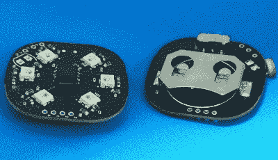

# 环保珠宝备受关注

> 原文：<https://hackaday.com/2017/12/27/environmentally-aware-jewelry-gets-attention/>

在今年的硬币电池挑战赛中，我们没有包括“最华丽”类别，但如果我们有，[由[Maxim Krentovskiy]](https://hackaday.io/project/28396-reactive-jeweleries) 创作的环保珠宝肯定会是击败的对手。将传统珠宝材料与兼容 Arduino 的微控制器、RGB LEDs 和环境传感器相结合；这些作品能够根据环境因素发光和变色。有点像微控制器一代的“心情戒指”。

【Maxim】最初为他的反应式珠宝项目寻找交钥匙解决方案，但发现那里的一切都不是他想要的。这一切不是太大就是太复杂。他的需求列表相对较短，现有的 MCU 板只是为满足他的需求而设计的。

在他的 30 x 30 毫米 PCB 上,[Maxim]包括了最基本的东西，以获得一个环保的可穿戴设备。除了 ATtiny85 MCU 之外，还有一些 RGB LEDs(具有扩展能力，可以添加更多)，以及模拟光和温度传感器。有了来自传感器的数据，ATtiny85 可以为 led 提供不同的颜色和闪烁频率，从随机的灯光秀到对当地环境的有用解释。

不难想象这项技术的实际应用。考虑一个手镯，当佩戴者的体温过高时，它开始闪烁红光。让辅助技术在视觉上吸引人始终是一个挑战，毫无疑问，即使一个人自己可能无法传达一个人的身体状况，也可以传达一个人的身体状况的珠宝也有市场。

形式或功能，拯救生命或完全新奇，[还有时间参加 2017 年硬币电池挑战赛](https://hackaday.com/2017/11/29/coin-cell-challenge-use-coin-cell-win-prizes/)。

Coin Cell ChallengeBuild something cool powered
by a coin cell, win prizes[See all entries](https://hackaday.io/submissions/coin-cell-challenge/list)