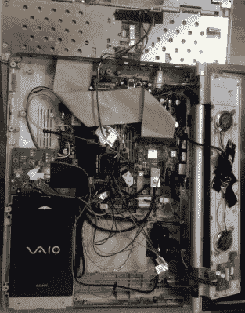

# 内置树莓派的笔记本电脑学会说话电池

> 原文：<https://hackaday.com/2017/12/30/laptop-with-raspberry-pi-inside-learns-to-speak-battery/>

11 月初，我们看了一眼我们见过的最好的 Raspberry Pi 笔记本电脑之一，使用了索尼 VAIO 的外壳。笔记本电脑曾经是笨重的野兽，这正中了(弗兰克·亚当斯)的下怀，因为他扔掉了主板，有足够的空间用树莓派和其他几个支撑板取而代之。这充分利用了笔记本电脑的屏幕、键盘、led 等。但是没有电池供电的笔记本电脑算什么呢？[弗兰克]直到现在还没有打破那个坚果。

VAIO battery and charging PCB seen to lower left

添加电池电源听起来更棘手，但[Frank]设法让树莓 Pi 与原来的索尼 VAIO 内部电池对话。他在[项目上的工作是共享的](https://github.com/thedalles77/Pi_Teensy_Laptop)，但是这部分故事最好在[从他的 PDF 项目细节](https://github.com/thedalles77/Pi_Teensy_Laptop/blob/master/Laptop%20conversion%20to%20Raspberry%20Pi.pdf)的第 29 页开始。

使用原装电池是一个不错的选择，因为它的设计非常合适，并且有一个充电器可以与笔记本电脑外壳上的端口连接。但是这些电池内部有逻辑，这就是问题所在。通信使用 2 线系统管理总线(SMBus ),这是有据可查的。但是，当试图使用圆周率的 I2C[弗兰克]想不出发送一个重复的开始命令。

他最终编写了自己的 C 程序，对他需要的通信进行了位碰撞，现在 Pi 对电池说话，并监听它听到的反馈。通读他对此的描述很有趣，因为他包括了他从逻辑分析仪捕获的观察结果。他怀疑偶尔的坏读取是由于 Linux 中断了代码执行。他观察并捕捉软件中的这些错误读数，现在可以可靠地读取所有电池的重要信息。

黑客给他留下了一个系统，其功能与原来的电脑非常相似:插上电源，充电。他确实增加了一些硬件，让他可以使用 Teensy 上的 ADC 从电池中读取电压，该 ADC 已经存在，以控制键盘和外壳 led。这增加了对电池的小的持续消耗，但现在当笔记本电脑不使用时，他不会让电池保持连接。

如果你想阅读我们对这款笔记本电脑的原始报道，就在这里。