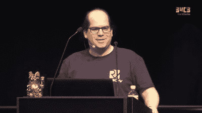
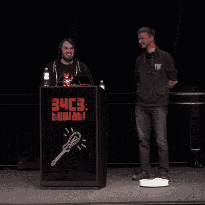
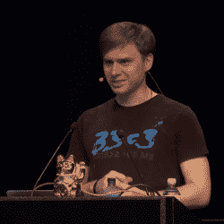
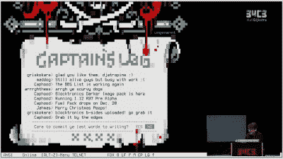

# 第一天真是太棒了

> 原文：<https://hackaday.com/2017/12/27/34c3-the-first-day-is-a-doozy/>

现在是下午 5 点，太阳正在莱比锡会议中心缓缓落下，虽然我们第一天只进行了一半，但有很多东西你应该看看。稍后我们将报道更多关于骗局文化的内容——现在这里只是一些黑客攻击。

## 电动汽车充电站:欺骗和刷新

电动汽车是未来，对吗？好吧，现在我们需要想办法给他们充电。在德国各地，充电站像蒲公英一样涌现。它们是如何工作的？他们安全吗？[Mathias Dalheimer]买了几个装载站，给自己[造了一个汽车模拟器](https://evsim.gonium.net/)，伪造了一些 NFC 卡，发现整个事情都千疮百孔。[演讲用的是德语](https://media.ccc.de/v/34c3-9092-ladeinfrastruktur_fur_elektroautos_ausbau_statt_sicherheit)，还没有字幕，但要点是，通过克隆他人的 NFC 卡来卸载费用是微不足道的。更糟糕的是，装载站可以上网，当然也可以远程控制。通过物理访问和螺丝刀，整个工作站可以重新刷新，然后游戏就结束了。[Mathias]以呼吁社区参与塑造下一代装载站协议和软件结束了他的演讲，因为毕竟这是我们都希望在未来使用的基础设施。

## 开源芯片:验证 RISC-V 规范

如果我们要挑选今年开源硬件行业最大的发展之一，我们会把 2017 年称为开放硅年。特别是开放的 RISC-V 处理器[出现在硬件中，你现在可以用它来玩](https://hackaday.com/2017/09/18/a-smaller-cheaper-risc-v-board/)。十年后，当我们都运行开放硅“Arduinos”时，请记住这一次。如果你没有看[Clifford Wolf]，你可能会错过他写了一个叫做 [openSCAD](https://hackaday.com/?s=openscad) 的 3D 建模软件或者一个免费的 FPGA 工具链， [project Icestorm](https://hackaday.com/?s=icestorm) 。

 反正【Clifford】已经把注意力转向了 RISC-V 架构。他一直致力于正式验证硬件设计是否符合 RISC-V 规范。与模拟相反，在模拟中，您从一堆起始值运行硬件，并查看它是否以不期望的状态结束，正式验证*证明*硬件设计不会做错误的事情，至少在启动后的一定数量的周期内。

所有这些都很好，但除非是为了发现 bug，否则不值得这么做。他几乎在每个 RISC-V 实现中都发现了错误，在实际的英语规范中也是如此。面向开放处理器规范的免费开放的正式验证套件为所有未来的开发人员铺平了道路。这在目前看来似乎很深奥，但它为一场革命铺平了道路。

## 机器人吸尘器:扎根小米蒙蔽云

 小米机器人吸尘器肯定会成为黑客探索的一个伟大平台:它有激光雷达、电池、像样的电机、电子罗盘、超声波“雷达”等等。[丹尼斯·吉斯]和[丹尼尔·奥]在这个设备上扎了根，[完全打开了它](https://events.ccc.de/congress/2017/Fahrplan/events/9147.html)。在这里观看[谈话](https://media.ccc.de/v/34c3-9147-unleash_your_smart-home_devices_vacuum_cleaning_robot_hacking)。他们通过用一片铝箔将引脚短路到地面来倾倒 MMC 闪存，然后欺骗更新程序接受他们自己的图像，游戏就结束了。然后他们继续围绕小米的所有云服务工作，如果你愿意，允许完全独立的操作。

有趣的是，[Dennis]和[Daniel]发现了一个`tcpdump`命令的引用，该命令可以窃听你的 WLAN 中的所有网络流量。它似乎没有运行，因为没有找到 pcap 文件。这可能是发展的遗留物，也可能是更险恶的东西。小米刚刚在 Hackaday 上因[他们的小夜灯向家里](https://hackaday.com/2017/12/26/the-bedside-light-app-that-phones-home/)发送大量数据而受到关注。在这种情况下(嘻嘻),发现他们的吸尘器也在做同样的事情并不完全令人惊讶——得出你自己的结论。

## 英特尔管理引擎

 今年披露的一个较大的漏洞是[英特尔管理引擎](https://hackaday.com/2017/12/11/what-you-need-to-know-about-the-intel-management-engine/)的破解。它是一台隐藏在你电脑内部的电脑，是其他一切事物信任的根源。如果可以妥协，那就完了。这件事一直保密，这让每个人都很紧张。[Maxim Goryachy]，[Mark Ermolov]和[Dmitry Sklyarov] [设法通过 JTAG 港口攻击它](https://media.ccc.de/v/34c3-8762-inside_intel_management_engine)。如果你想深入了解黑客的细节，这个演讲是为你准备的。这次黑客攻击是围绕 IME 的神秘盔甲上的一个很大的缺口。看看明年会发生什么将会很有趣。

## 朋友之间一点算什么？

在这个技术但易懂的演讲中，[Filippo Valsorda]带我们了解了他在围棋库深处的一个加密算法中发现的一个错误，以及他如何使用一个十亿分之一出现的一位错误来提取整个 256 位安全密钥。通过精心制作一个公钥，他可以利用这个极少发生的错误来解开整个秘密。当然，他发现的特定错误已经修复，但部署大量计算能力来搜寻密钥的方法只是表明，即使是最小的甲骨文也能推进多远。这个演讲非常明确地证明了即使是最小的 bug 也是太大了。

## 互联网之前的网络:BBS 记忆巷

【la forge】是一个开源的无线电黑客。如果你做过 SDR 工作，你可能用过他的 Osmocom 项目的驱动。但像我们其他人一样，他也曾是个小书呆子。而他年轻的时候，BBS 现场才是大事。[在这个非技术性的演讲](https://media.ccc.de/v/34c3-9034-bbss_and_early_internet_access_in_the_1990ies)中，他沿着记忆的轨迹，回顾了支撑 BBS 时代的技术。

## 下一步是什么？

如果你想知道我们今晚会去哪里，查看一下[时间表](https://events.ccc.de/congress/2017/Fahrplan/schedule/1.html)并观看[现场直播](http://streaming.media.ccc.de/34c3/)。特别是，有一个关于朝鲜计算机现状的演讲，调整 FitBits，破解 WPA2，以及一个承诺成为“终极阿波罗制导计算机演讲”的演讲。然后我们小睡一会儿，明天再做一遍。

我们看不到全部。让我们知道你看到了什么，我们必须做什么。