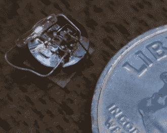

# 参加本周末的硬币电池挑战赛！

> 原文：<https://hackaday.com/2017/12/29/take-the-coin-cell-challenge-this-weekend/>

一年即将结束，我们有一个周末项目供你消磨剩余的时间。参加[硬币电池挑战](https://hackaday.io/contest/28283-coin-cell-challenge)！

挑战的重点是用硬币电池做一些有趣的事情。就是这样！这是一个挑战，你想简单就简单，想复杂就复杂。低功耗是目前的趋势，所以如果你从未在你最喜欢的微控制器中使用过硬件睡眠模式，这将是一个很好的挑战。向我们展示你在短时间的清醒状态下能做什么，并谈论清醒发生的时间和原因。或者走完全不同的路线[建造自己的牢房](https://hackaday.io/project/28390-heavy-lifting-bro)！

【本·克拉斯诺】充分利用一种微型能源

前二十名参赛者将每人获得 100 美元 [Tindie](https://www.tindie.com/) 的积分，这样他们就可以获得一些优秀的装备。某些特殊领域的前三名获奖者将每人获得 500 美元的现金奖励。我们在寻找一些有趣的东西，展示最长的寿命(终身奖项)，一些通过硬币电池燃烧的东西，好像它要过时了(超新星奖)，一些让我们充满怀疑的东西(举重奖)，因为它不应该是“只是一个硬币电池”。

我们这次比赛最大的灵感之一是[Ben Krasnow]他设法从一个微型硬币电池中挤出足够的果汁来为他的闪光灯奖参赛作品供电，这仅仅是因为他通过用气枪加热电池来减少内部电阻(这里是那个项目的黑客日报道)。[埃利奥特·威廉姆斯]写了一本关于[的很棒的指南，告诉你从一个牢房](https://hackaday.com/2017/12/22/coin-cells-the-mythical-milliamp-hour/)里可以得到什么样的果汁。把这些记在心里，这个周末做一些有趣的事情。[现在进入](https://hackaday.io/contest/28283-coin-cell-challenge)！