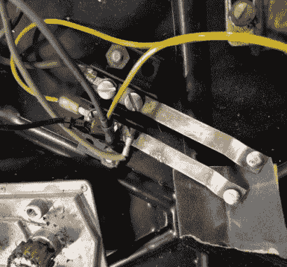
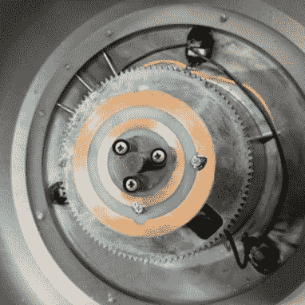

# 定制印刷电路板审查一个老式树立场

> 原文：<https://hackaday.com/2018/01/01/custom-pcb-revives-a-vintage-tree-stand/>

56 年后，[杰夫·科顿]的旋转圣诞树架决定适可而止。虽然它坚固的铸铝框架已经准备好迎接另一个半个世纪的欢乐，但通过旋转底座发送电力的内部机制已经失败，并开始触动断路器。问题本身似乎很容易解决，但近 60 岁的故障组件自然是 unobtanium。

但是在当地制造商的帮助下，他制造了一个替代品。这和原来的部分不完全一样，他可能不会再有 56 年了，但至少这一季是这样，所以这是我们的胜利。

    

支架内部的机制相当简单:两个金属“擦拭物”与圆形 PCB 上的同心圆轨迹接触。不幸的是，随着时间的推移，支架有点弯曲，擦拭物接触到了 PCB 上不应该接触的地方。这引起了电弧，破坏了印刷电路板。

再造 PCB 的第一步是测量擦拭物及其之间的距离。这使得[Jeff]能够确定需要多厚的迹线，以及它们之间应该有多大的间距。然后，他能够将这些数据插入 Inkscape，为他的替代电路板提出一个设计方案。

为了制作 PCB 本身，他首先在一块覆铜板上涂上黑色喷漆。使用 makerspace 的激光切割机，他可以炸开油漆，留下两个同心圆。在酸中快速浸泡，用牙膏稍微抛光，他有了一个替换板，它离原来的硬件很近，可以用螺栓固定。

如果你想看发生在*上方的那种，我们有足够的[让你在明年圣诞节前得到灵感](https://hackaday.com/2013/12/25/christmas-tree-analyzes-your-tweets/)。*