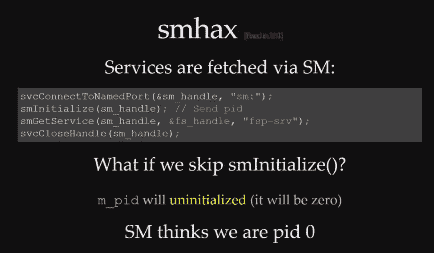

# 34C3:入侵任天堂 Switch

> 原文：<https://hackaday.com/2017/12/29/34c3-hacking-the-nintendo-switch/>

游戏机黑客世界有一个自然的顺序:每次制造商发布新的游戏机，他们都会采取安全措施，防止最终用户运行除商业发布的游戏之外的任何游戏，反过来，每个称职的黑客都试图突破。不管制造商可能让你相信什么，最终的目标不是运行“盗版”游戏，而是实现俗称的“自制”。也就是说，支持在您购买的硬件上实际运行您选择的软件的新概念。

在 34C3 上，著名的主机黑客[Plutoo]、[Derrek]和[Naehrwert]展示了在任天堂最新和最棒的上运行的未签名代码，虽然他们现在对自己的实际利用保密，但他们承诺很快将为那些固件版本为 3.0.0 的人提供一个启动自制程序的平台。从声音来看，在上市 9 个月后，交换机所有者将最终完全访问他们购买的硬件。

运行团队自己代码的关键是通过一个 WebKit 漏洞，这个漏洞在 Switch 发布时已经存在几个月了。加载任意网页是棘手的部分，因为交换机通常使用其网络浏览器访问官方资源(如在线游戏商店)。但是隐藏在*俄罗斯方块、*的帮助菜单中，开发者很有帮助地放了一个到他们网站的链接，如果你选择它，开关会忠实地打开它。从那里它只是一个网络重定向的问题，让交换机从你的电脑而不是互联网加载网页。

It’s easier to ask for forgiveness than permission.

但正如我们的安全意识更强的读者可能已经猜到的那样，这只会让你进入浏览器的沙箱。该团队现在必须找到一种方法来突破并完全控制硬件。通过一系列巧妙的破解，该团队能够了解到更多关于交换机内部布局和操作系统的信息，并慢慢地往上爬。

一个特别有趣的黑客被用来绕过交换机操作系统的一部分，该部分被设计来检查哪些服务代码被允许访问。结果是，如果代码没有为这个函数提供自己的进程 ID (PID ),系统默认为 PID 0，因为变量没有初始化。换句话说，如果你不询问操作系统你可以访问哪些功能，你就可以访问所有的功能。这是一个典型的编程错误，任天堂总部的一名开发人员现在可能会受到严厉的批评。

但并不是一切都那么容易。当试图访问引导加载程序时，该团队嗅探了 eMMC 总线，并对命令进行计时，以确定它何时检查加密密钥。然后，他们能够组装一个“glitcher”，在这个关键时刻使用 FPGA 控制的 MOFSETs 篡改 CPU 的功率，试图扰乱系统。

兔子洞在这一点上相当深，所以我们建议你留出一个小时来观看整个演示，看看从浏览器错误到运行他们的第一个完整演示所经历的漫长道路。这是对[Plutoo]、[Derrek]和[Naehrwert]技能的最好证明，也是任天堂为了把人们拒之门外所做的努力。

我们已经看到了对任天堂硬件进行逆向工程的其他尝试，但从表面上看，Switch 已经给 T2 带来了一场比前几代游戏机更加艰难的战斗。让你想知道任天堂会为下一代准备什么招数。

[https://media.ccc.de/v/34c3-8941-console_security_-_switch/oembed](https://media.ccc.de/v/34c3-8941-console_security_-_switch/oembed)