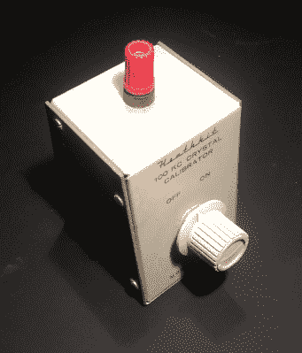

# 改造后的频标螺母的自白

> 原文：<https://hackaday.com/2018/01/17/confessions-of-a-reformed-frequency-standard-nut/>

你还记得你的第一台仪器，你用来测量东西的第一台设备吗？也许在小学时它是一把尺子，你被教导用厘米或英寸来表示距离。没过多久，你就知道这些单位只对最粗糙的工作有用，而且刻度精确到毫米，或十六分之一英寸。最终，随着年龄的增长，你会接触到游标卡尺和螺旋千分尺，突然间，几分之一毫米或千分之一英寸成了你的货币。测量有一种诱惑，某种吸引你的东西，直到它成为一种困扰。

每个领域都有其痴迷的东西，也许在某个地方有面包师在寻找一杯完美的面粉，但我们社区中的那些人可能会关注时间和频率等数量。你会从他们被频率标准和原子钟包围的长凳上，以及他们不断谈论十亿分之一和校准来认识他们。在这件事上，我可以说得很有权威，因为我曾经是他们中的一员。我是一个改过自新的频标迷。

## 那个烦人的最后一个计数器数字

[![Tuned circuits in a radio IF transformer. Chetvorno [CC0].](img/c6a52ddd049ed1cc46de03deea1017ef.png)](https://hackaday.com/wp-content/uploads/2017/12/357px-if_transformer.jpg) 

收音机中调谐电路的中频变压器。[切特沃诺【CC0】](https://commons.wikimedia.org/wiki/File:IF_transformer.JPG)。你可能会问这种痴迷是如何形成的。毕竟，谁会需要一个精确到零点几赫兹的频率标准呢？答案是，除非你的工作需要它，否则你不需要。如果你是一个无线电爱好者，你真的只需要一个足够好的标准，以确保你在你被许可传输的波段内，并且能够停留在你选择的频率上而不会漂移。当然，这些合理的考虑并不重要。如果你买了一个频率计数器，你有一个带有唠叨的第七和第八位数字的仪器，显示你认为相当稳定的晶体振荡器漂移的速度。你就在那里，徘徊在滑坡的边缘。

第一个电子射频振荡器使用旋转电路，电感器和电容器的组合，来提供它们的频率稳定性。调谐电路振荡器一旦稳定下来，就会惊人地稳定，但它仍然受到调谐电路中所用材料的热特性的支配。如果温度升高，电感器中的导线会膨胀，其电感会发生变化。因此，老式广播电台有时需要不断手动重新调谐，很少有无线电发射机依靠这些电路来保持稳定。

解决调谐电路不稳定性的方法是压电石英晶体。这些将形成具有与调谐电路相似的电特性的谐振器，但是对温度引起的漂移的敏感度低得多。它们足够稳定，已经成为当今大多数电子产品背后无处不在的频率标准:几乎每一个微处理器、微控制器或您将使用的其他同步电路都可能从石英晶体中获得时钟。你 1957 年的调频收音机可能需要一点调谐才能保持在电台上，但由于晶体为调谐合成器提供了参考，2017 年的收音机非常稳定。

[![A crystal oven installed in a Hewlett-Packard frequency counter. Yngvarr [CC BY-SA 3.0].](img/aaaf05ff54b195d119fdf2d022b07426.png)](https://hackaday.com/wp-content/uploads/2017/12/hp_counter_0xco.jpg) 

一个安装在惠普频率计数器上的水晶烤箱。[yng varr【CC BY-SA 3.0】](https://commons.wikimedia.org/wiki/File:HP_Counter_0XCO.jpg)。晶体是好的——足以满足大多数日常频率参考目的——但它们也存在问题。与调谐电路相比，它们可能不太容易受到温度引起的漂移的影响，但仍会表现出一些特性。虽然它们在工厂被调谐到一个特定的频率，但实际上它们并不精确地以那个频率振荡。因此，寻求额外精度的晶体振荡器将通过将晶体放在温度调节的烘箱中来减少漂移，并且通常会以小型可变电容器的形式提供一些对振荡频率进行微调的方法。

如果你在烤箱里有一个晶体振荡器，你做得很好。您已经尽可能地减少了漂移，并且已经将其调整到您想要的频率。但当然，你不可能真正满足那句话的后半部分，因为你缺乏足够精确地测量频率的能力。一旦你记住它的内部参考仅仅是另一个石英晶体，你可靠的频率计数器就不那么可靠了，所以本质上你只是在比较两个具有同等稳定性的晶体。你怎么能相信你的柜台？

至此，我们已经完成了基于材料物理尺寸的频率标准，必须进入原子物理领域。所有元素都表现出共振频率，共振频率是其原子结构中能级的基础，这些共振频率代表了可用的最稳定的参考频率:我们测量时间和频率的标准定义所依据的频率。有大量预算的计量学家可以使用各种原子标准，但我们最常遇到的是使用铯原子或铷原子。铯标准构成了时间和频率的国际定义的基础，而铷标准是一种更经济、更容易获得的原子标准。

## 提高你自己的标准

My trusty Heathkit crystal calibrator.

将振荡器校准到标准频率的最古老、最简单的方法之一是对照广播无线电发射机来执行任务。当振荡器的频率或其谐波之一足够接近电台，使它们的差在可听见的范围内时，您将在接收器的扬声器中听到可听见的拍音，因此将振荡器调整到拍频停止的点是一项简单的任务。人类听觉的频率下限允许在几十赫兹内匹配，在示波器的帮助下可以实现更接近的匹配。

一个 100 kHz 的晶体校准振荡器曾经是一个无线电业余爱好者的标准装备，它可以与全球任何合适的广播频率标准相匹配。对于像我这样的英国人来说，使用 200 kHz 的铯标准 BBC Radio 4 长波发射机来校准我的 100 kHz 振荡器很方便，但对我来说，可悲的是在 1988 年，当我的许可证上的墨水还没干时，他们重组了长波频率，并将其移动到 198 kHz。

当我对纯频率标准的追求达到高潮时，下一个最容易获得的来源是采用一种广播标准，并将其用作参考源，通过锁相环来调整晶体振荡器。你可以购买停播的频率标准接收器作为实验室仪器，但作为一名贫困学生，我选择自己制作。

在英国，我可以选择前面提到的 198 kHz Radio 4 发射机或 60 kHz 英国 MSF 时间信号，我选择了前者，因为我可以将长波广播接收机拆成合适的现成铁氧体磁棒天线。这馈入一个 FET 前端，该前端再馈入一个限幅器和滤波器，后者为施密特触发器提供产生 198 kHz 逻辑电平方波所需的信号。然后，通过 74 系列逻辑分频器和多功能 4046 PLL 芯片的组合，我能够锁定 1 MHz 晶体振荡器，并为自己创造了频率标准的极致而高兴。只不过我没有真的。尽管我了解了很多关于 PLL 的知识，并为环路滤波器选择了长时间常数，但我的相位噪声肯定高得令人无法接受。我年轻时对自己工作的信念超越了现实，这并不是唯一一次。

[![A handy GPS module from Adafruit. Oomlout [CC BY-SA 2.0]](img/ca76fedfaee45377a5d40a8e6fdd2bea.png)](https://hackaday.com/wp-content/uploads/2017/12/1024px-adafruit_gps_module_breakout.jpg) 

一款来自 Adafruit 的便捷 GPS 模块。Oomlout [CC BY-SA 2.0]

停播标准对于潜在的频率爱好者来说仍然是一个可行的选择，但你不太可能在 2017 年建立一个，因为现在有一个更好的选择。全球定位系统和类似的导航卫星网络是每个人都可以获得的高精度定时来源，具有多种用于各种目的的负担得起的全球定位系统硬件。因此，选择[一个 GPS 规定的晶体振荡器](http://electronics-diy.com/electronic_schematic.php?id=941)要简单得多，事实上我们已经看到它们不时地被用在这里介绍的项目中。

全球定位系统是非常好的，唯一的方法是去原子。拥有自己的原子标准这一曾经不可能实现的梦想现在变得令人惊讶地负担得起，因为移动电话网络的普及导致大量铷标准被部署在他们的塔中。随着前几代手机信号塔的退役，这些组件已经进入二手市场，可以从通常的来源获得，而不需要抵押给你的孩子。

你可以很容易买到的模块包含一个参照铷标准本身的晶体振荡器。该标准监测来自铷灯的单色光的强度，该单色光通过暴露于射频的铷气体室，该射频与铷原子基态之间跃迁的共振频率相匹配，并且将射频锁定到作为该强度下降观察到的共振。

当谈到校准源时，追求最高标准频率精度的人现在有几种选择。制作一个停播标准比制作一个基于 GPS 的标准要麻烦得多，而你们中更有冒险精神的人可以找到一个铷制光源。或者你已经有了。过分精确并不可耻，但我们很好奇:你真的*需要*这样一个精确的时间信息来源吗？还是你在追逐最后一个数字，仅仅因为它是*在那里*？