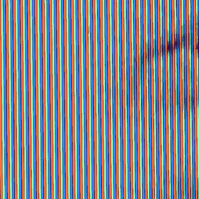

# 为什么索尼的特丽珑电子管是最好的

> 原文：<https://hackaday.com/2018/01/03/why-sonys-trinitron-tubes-were-the-best/>

如果你年纪够大，还记得阴极射线管(CRT)电视，你可能还记得索尼销售的顶级产品。他们的特丽珑管总是制造最好的电视和电脑显示器。【亚历克·沃森】[探究索尼特丽珑显像管的历史](https://www.youtube.com/watch?v=0aFhzGEBQlk)。

索尼彩电并不是从 Trinitron 开始的——几年来，索尼一直销售 Chromatron 显像管。彩色显像管使用单独充电的导线，放在荧光屏的后面。显像管工作正常，但价格昂贵，而且与普通荫罩显像管相比没有任何优势。很明显，公司必须创新，由于一些创造性的工程，特丽珑诞生了。

Closeup of a Trinitron tube shows unbroken vertical stripes which led to a brighter picture.

所有的彩色电视都对荧光屏发射三支电子枪。典型的彩色电视使用荫罩板——一种切割出许多小孔的金属片。这些小孔确保电子枪只击中磷光体的红、绿、蓝点。Trinitrons 使用单一磷光体颜色的垂直条和类似孔格栅的尖桩栅栏。孔径光栅比荫罩阻挡的电子束更少，从而产生更亮的图像。Trinitrons 也使用一个电子枪，有三个独立的阴极。

[Alec]正在他的 YouTube 频道上做一些令人惊讶的工作，描述早期的电视系统和复古的消费电子产品。我们已经将他添加到我们的必看订阅列表中。

对复古 CRT 感兴趣？看看 Dan 的文章[清理许多 CRT](https://hackaday.com/2017/08/11/crt-cataract-surgery/)正面模糊的塑料安全屏。

 [https://www.youtube.com/embed/0aFhzGEBQlk?version=3&rel=1&showsearch=0&showinfo=1&iv_load_policy=1&fs=1&hl=en-US&autohide=2&wmode=transparent](https://www.youtube.com/embed/0aFhzGEBQlk?version=3&rel=1&showsearch=0&showinfo=1&iv_load_policy=1&fs=1&hl=en-US&autohide=2&wmode=transparent)

