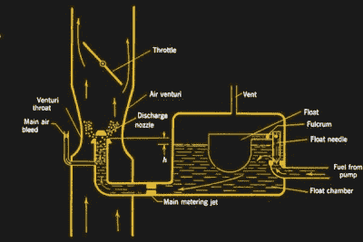
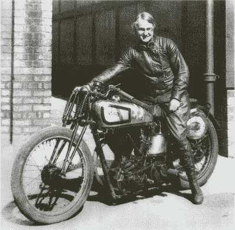

# 比阿特丽斯·先令小姐拯救了喷火战斗机

> 原文：<https://hackaday.com/2018/01/16/miss-beatrice-shilling-saves-the-spitfire/>

1940 年一个阳光明媚的春天早晨，这位皇家空军飞行员正在进行他一生中的战斗。在不列颠之战开始的几天里，他被绑在他崭新的超级海上喷火战斗机上，在英吉利海峡上空与一名德国空军飞行员进行殊死搏斗。喷火式战斗机在梅塞施米特后面，几乎在射程之内，可以从椭圆形机翼前缘的四门~~八门~~布朗宁机枪中释放出致命的弹幕。当德国飞机刚好在瞄准镜十字准线的正下方时，英国飞行员向前推了推 Spit 的棒棒糖杆，使其稍稍俯冲，并掠过 Bf-109。当灵活的战斗机进行负- *g* 俯冲，他感觉到肩膀上的安全带拉着他坐在座位上，他对准了致命的一击。

但是强大的 V-12 Merlin 发动机发出劈啪声，随着发动机熄火，黑烟沿着机身拖曳。没有动力，年轻的飞行员惊恐地看着三叶螺旋桨突然停止转动。冰冷的海峡海水在他的挡风玻璃上隐约出现，没有时间重新启动引擎。飞行员在关键时刻跳伞，看着他漂亮的飞机侧翻入水，他飘下水面加入它，想知道刚刚发生了什么。

虽然这个故事是虚构的，但英国皇家空军面临的工程问题实在是太真实了。在不列颠战役早期，现在传奇的劳斯莱斯梅林发动机，不仅是喷火式战斗机的动力装置，也是霍克飓风和兰开斯特轰炸机的动力装置，遇到了严重的问题。英国皇家空军“喷火”战斗机飞行员报告说，战斗机将在负 g 机动中失去动力，这意味着一个简单的瞄准敌人飞行员的移动或快速俯冲离开火线可能会使发动机熄火。有时动力损失是暂时的，但更多时候，发动机会在飞行中熄火，无法重新启动。

像所有优秀的飞行员一样，年轻的英国皇家空军飞行军官很快适应了新战斗机的缺点。他们学会了在潜水前做半滚，以避免负重力姿态并保持梅林的运转。它起了作用，但它充其量只是一个权宜之计，在最重要的时候，它对机动能力构成了潜在的致命限制。更糟糕的是，德国空军飞行员很快就注意到了这个问题——即使在空战中也很难不注意到黑烟和失去动力——他们利用了敌人战斗机的弱点。必须做点什么，以免不列颠之战的潮流转向对皇家空军不利。

### 致命的洪水

Float-type carburetor, simplified. Source: [Aircraft Engine Historical Society](http://www.enginehistory.org/Accessories/HxFuelSys/FuelSysHx04.shtml)

在许多方面，喷火式战斗机和飓风式飞机都是围绕一个发动机建造的。虽然喷火式战斗机的机身及其漂亮的椭圆形机翼和圆滑的线条无疑是革命性的，但正是强大的梅林造就了这架飞机。液冷增压发动机功能强大、简单可靠，但选择化油器而不是燃油喷射会回来困扰发动机的设计者。

Merlin 中使用的碳水化合物与今天在割草机或旧汽车上发现的任何碳水化合物都很相似:燃料通过简单的浮阀计量进入碗中，然后在文丘里效应提供的吸力下被吸入进气气流。在直线和水平飞行中，碳水化合物工作良好。但是在负 g 的情况下，燃料被迫流向浮子室的顶部，远离喷嘴，切断了燃料的流动，导致发动机失去动力。回到一个积极的- *g* 姿态，燃料溅回浮子室并涌入喷嘴，为气缸提供了过浓的燃料混合物。原始燃料进入排气歧管，在那里燃烧并产生乌黑的废气。在“正确”的情况下，足够的燃料将进入增压器淹没它，完全停止发动机并阻止它重新启动。

显而易见的解决方案是用压力碳水化合物代替浮碗碳水化合物。但是随着不列颠之战的激烈，让飞机退役进行引擎检修是不明智的。英国皇家空军需要一个快速的解决方案，直到一个更永久的解决方案可以被部署。

### 先令小姐拯救了这一天

Beatrice Shilling astride her supercharged Norton in 1935\. Source: [VintageNorton.com](http://www.vintagenorton.com/2016/01/beatrice-shilling.html)

最终拯救梅林的是比阿特丽斯·希林小姐这个不太可能的人物。在一个严格的社会习俗和明确的角色的时代，被称为蒂莉的比阿特丽斯打破了所有的规则。蒂莉十几岁的时候就迷上了工程学，她拆开摩托车进行比赛，她打破常规，在 1932 年作为班上仅有的两名女性之一获得了电气工程学位。第二年，她获得了机械工程硕士学位。

在参加摩托车比赛时——她赢得了奖项，并在 1934 年创造了记录，当时她骑着一辆 500 毫升的诺顿自行车，加装了增压器，以每小时 106 英里的速度跑完一圈——她开始在范堡罗的皇家飞机制造公司(RAE)工作。在那里，在第二次世界大战开始的日子里，她专门研究飞机化油器。

当罗尔斯·罗伊斯为梅林设计新的碳水化合物时，蒂莉为英国皇家空军的困境提出了一个解决方案，像许多这样的解决方案一样，它看似简单。她推断，限制燃料流入化油器浮子室可以防止溢流，所以她设计了一个简单的黄铜圆盘，上面有一个小孔。她计算了圆盘的尺寸，以允许刚好足够的燃料产生最大功率。另外，这种装置可以快速方便地安装到飞机上，而不需要让飞机退役。

官方上，该设备被称为“RAE 限制器”，但当蒂莉·希林巡视英国皇家空军基地监督该设备的安装时，粗糙和准备好的机组人员有了其他想法。“先令小姐的孔”成为救生黄铜圆盘的新名称，一旦安装在燃油管路中就解决了这个问题。喷火式战斗机重新投入战斗，英国皇家空军最终将德国空军击退到海峡对岸，这在很大程度上要归功于蒂利·先令。

### 蒂莉的遗产

蒂莉没有固步自封。找到解决办法后，她回到了 RAE，继续改进汽化器的设计。她继续为 RAE 工作，直到 1969 年退休，在火箭设计和在潮湿跑道上制动飞机等不同领域做出了贡献。从摩托车转向她自己设计的汽车，她还继续与她的丈夫乔治·奈洛尔一起比赛，直到 60 多岁。乔治·是一名工程师，后来成为英国皇家空军轰炸机飞行员，她在 1938 年结婚，条件是他首先在摩托车上跑一圈 100 英里/小时。

比阿特丽斯·希林是一个传奇人物，她理应获得许多荣誉，包括大英帝国勋章和以她名字命名的范堡罗酒馆。但是，作为一名为英国皇家空军修理喷火式战斗机并扭转局势的工程师，可能是她最自豪的成就。

**主图像来源:**

*   比阿特丽斯先令 via [老式诺顿摩托车](http://www.vintagenorton.com/2016/01/beatrice-shilling.html)
*   喷火 GNU/GFDL 由[弗兰克卡布拉尔](https://commons.wikimedia.org/wiki/File:Ray_Flying_Legends_2005-1.jpg)
*   经由[EngineHistory.org](http://www.enginehistory.org/Accessories/HxFuelSys/FuelSysHx04.shtml)的化油器图