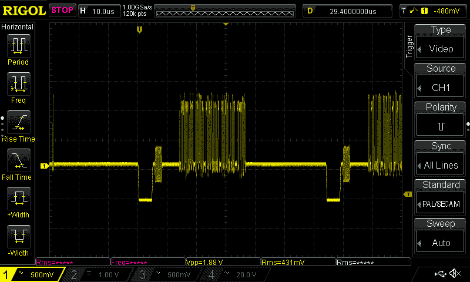
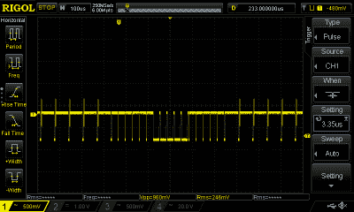
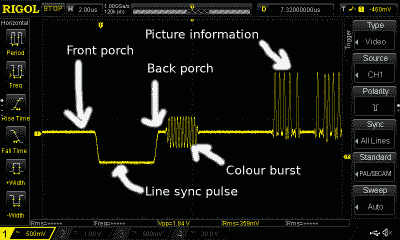

# 了解您的视频波形

> 原文：<https://hackaday.com/2018/01/18/know-your-video-waveform/>

当您获得第一台示波器时，您用它观察的第一个波形是什么？校准输出，可能还有信号发生器。如果你和我一样，你可能会在你的长凳上寻找一两个更有趣的波形。在我的情况下，这使我看到了电视调谐器和 IF 带，我第一次看到了视频信号。

在 LCD 屏幕和 HDMI 连接器时代，模拟视频信号可能不那么普遍，但它仍然是一个迷人的主题，其复杂性仍然值得了解。也许您的台式计算机不再驱动复合显示器，但视频信号仍然是为许多低功率微控制器板添加显示器的便捷方式。当您看到 Arduinos 和 ESP8266s 在从未用于此目的的硬件上制作彩色复合视频时，您可能会开始理解为什么深入了解视频波形会很有用。

视频信号的目的是以亮度和色度(明暗和彩色)的形式传递图像信息，以及保持显示器与信号源完全同步所需的所有信息。它必须在准确和一致的时间内做到这一点，因为它是一项植根于 20 世纪初的技术，它包含的所有信息都必须可以通过当时的消费电子组件进行检索。

我们现在来看看波形，特别是它的时序细节，并尝试传达它的一些方式。你会意识到，有不同的电视系统，如 PAL 和 NTSC，它们都有自己严格定义的时序，但是在本文的大部分内容中，我们将所有系统视为或多或少相同，因为它们的工作方式非常相似。

## 获得同步的感觉

A close-up on a single line of composite video from a Raspberry Pi.

看一下复合视频信号的同步元素，有两个不同的成分对于保持显示器与信号源的同步至关重要。在每个单独的图像行的开始有一个短的行同步脉冲，在每个帧的开始有一个较长的帧同步脉冲。行同步脉冲是填充图像行之间时间的零伏短周期。

A frame sync period, incorporating multiple line sync pulses.

在上面一个单独图像行的特写中，有两个行同步脉冲，你可以看到它们是两个突出最低的矩形脉冲。同时，在右侧的帧同步周期特写中，您可以看到帧同步脉冲是几行的周期，在此期间整个信号被拉低。然而出乎意料的是，它也包含反相的线脉冲。这是因为在旧的 CRT 上，行振荡器仍然必须能够检测它们以保持同步。这个帧同步脉冲被几个空行包围，在此期间，当电子束从右下到左上穿过屏幕时，CRT 显示器将关闭电子枪。这被称为帧消隐期，是可以隐藏图文电视和隐藏式字幕等数据服务的地方。本着 20 世纪早期电子电视起源的精神，这两种类型的同步脉冲都被设计成使用简单的 RC 滤波器提取。

## 了解你的门廊

An annotated capture of a composite video line sync pulse.

行同步脉冲周围的区域特别有趣，因为它包含了示波器屏幕上最明显的提示，即复合视频信号携带着彩色信息。它也有自己的术语，当谈论这个话题时，知道这个术语既有趣又有用。

紧接在同步脉冲本身之前和之后的是短时间周期，分别称为前沿和后沿。这些是图像信息已经停止但行同步脉冲不在进行中的周期，它们的存在是为了将同步脉冲与其周围环境区分开来，并帮助检测同步脉冲。

紧随后沿的是一个短周期的纯正弦波(称为色同步)，其频率为彩色副载波的频率。这种所谓的彩色脉冲串的存在允许彩色解码器电路中的参考振荡器被锁相到用于在信源编码彩色信息的振荡器。不属于帧消隐周期的每一行都将携带色同步脉冲，确保基准振荡器永远没有时间偏移相位。

在彩色脉冲串之后，接着是该图像行的亮度信息，电压越高表示亮度越大。在从前沿到亮度信息开始的整个期间，旧的 CRT 电视会产生一个行消隐脉冲来关闭电子枪，而它的目标在屏幕上向后移动以开始下一行，这是传输所有这些重要信息的最佳时间。

## 所有这些数字是从哪里来的？

我们避免了具体的数字，因为本文的重点不是讨论单个的标准。但是，有必要花点时间问一下为什么会出现这些数字，这个问题的答案在于一个复杂的相互关联的时序和频率关系网络，它产生于一个标准，该标准在发展过程中必须保持向后兼容性。

帧速率很容易发现，它是从制定标准的国家的交流电源频率得到的。PAL 和 SECAM 的帧速率为 50 赫兹，而 NTSC 的帧速率为 60 赫兹。然而，线路频率不太明显，因为它被选择来适应 20 世纪中期电子分频器的限制。当没有方便的 74 系列逻辑目录时，为了简化从单个振荡器同步链接所需的分频器链，必须选择所需线路数的线路和帧速率之间的任何倍频。例如，PAL 系统有 625 行，每个 625 行图像是 312 行和 313 行的两个交错帧的形式。工作室将有一个 31.250 kHz 的主振荡器，通过一个二分频电路从主振荡器获得 15.625 kHz 的线路频率，通过四个五分频电路链获得 50Hz 的帧频率。

同时，在频域中，彩色和声音副载波的频率需要复合信号的不同视图。视频频谱以规则的间隔充满了线路频率的谐波，并且任何额外的载波都需要被选择，使得它们不会干扰这些谐波中的任何一个或者已经存在的其他载波。因此，当您将 PAL 4.43361875 MHz 彩色副载波频率视为位于线路谐波之间时，这些看似奇怪的数字开始变得有意义。

一个复合视频信号可以包含如此多的信息，同时还保留了通过世纪中叶的技术提取的能力，并且能够在一页纸中解释，这证明了多年来许多设计者的天真无邪，他们增加了它的规格。复合视频不是一个人发明的，而是从[约翰·洛吉·贝尔德]和[菲洛·T·法恩斯沃思]开始的许多不同团队工作的结晶。它不太可能有进一步的改进，很可能在未来十年左右，它将步入历史。不过目前来看，对其组件有一个基本的了解还是有好处的，因为你永远不知道什么时候你可能需要将一个显示器黑到一个恰好有备用 I2S 接口的微控制器上。