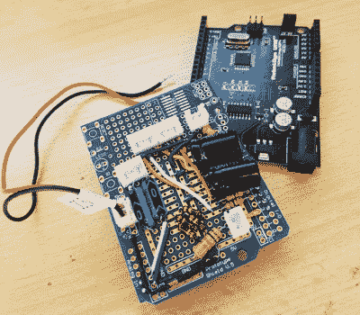

# 这个音箱被点燃了

> 原文：<https://hackaday.com/2018/01/05/this-boombox-hack-is-lit/>

旧音箱是很好的黑客。他们的设计是标志性的；是的，它们看起来过时了，但这真的只是建立在怀旧的冲动，有一个挂在身边。此外，他们的大箱子只是简单地邀请在里面添加东西，这是当代电子产品不可能做到的。

黑掉了他的 JVC M70 音箱,让扬声器发出动画光，碰撞 VU 米，以及录音机上方的脉冲水平杆。效果超赞。扬声器的锥体就像一个投影面，格栅隐藏了 led，直到它们激活，并增强了释放后的效果。这是我们见过的最好的 LED 扬声器黑客之一。

Custom board with Arduino UNO

灯光效果由 LED 灯条提供，这些灯条安装在扬声器的外缘内侧。这一切背后的大脑是一个 Arduino 乌诺。为了连接到它，他将组件焊接到一个空白的 Arduino 原型板上。该板从 boombox 的线路输出接收输入，并在将信号传递到 Arduino 之前进行一些滤波(试图解决一些接地噪声)。该电路板也是 Arduino 和 LED 灯条之间的接口。原理图可以在他的 GitHub 页面上找到。他想用定制的 PCB 替代电路板，并寻求设计帮助。

结果不仅漂亮，而且看起来也很专业。这让我们想知道为什么 boomboxes 不走这条路。下面的视频自己看吧。

也许你没有音箱，或者想从头开始。在这种情况下，看看[这个制作精巧的木制盒子](https://hackaday.com/2014/06/30/wooden-ghettoblaster-makes-use-of-recycled-parts/)或[这个装在坚固的自制盒子里的定制盒子](https://hackaday.com/2014/03/30/diy-bluetooth-boombox-can-take-a-beating/)，你会发誓第一眼看到它就是军用的。

 [https://www.youtube.com/embed/DNqbE8rCtKw?version=3&rel=1&showsearch=0&showinfo=1&iv_load_policy=1&fs=1&hl=en-US&autohide=2&wmode=transparent](https://www.youtube.com/embed/DNqbE8rCtKw?version=3&rel=1&showsearch=0&showinfo=1&iv_load_policy=1&fs=1&hl=en-US&autohide=2&wmode=transparent)

