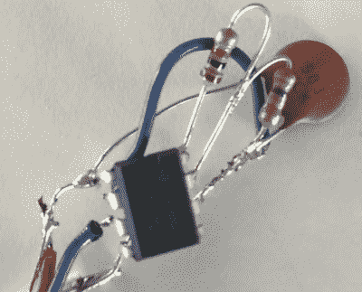

# 用小型拱廊橱柜装饰家居

> 原文：<https://hackaday.com/2018/01/12/home-decorating-with-tiny-arcade-cabinets/>

由于电子产品的普遍小型化，廉价彩色液晶显示屏的广泛使用，以及许可几十年的旧街机游戏是免费的这一事实，我们现在可以花大约 20 美元购买经典街机柜的微型克隆。理论上，你可以玩这些东西，但鉴于它们的高度不到 4 英寸，它们最终更多的是一种桌面上的新奇事物。尤其是因为似乎大部分的努力都花在了橱柜本身上；“形式重于功能”的经典例子。

不幸的是，如果你想买这些小拱廊橱柜来装饰你的办公室或游戏室，它们并不特别适合这项任务。游戏自己玩的“演示”模式不会持续很长时间，即使持续了很长时间，游戏也会以惊人的速度消耗电池。[Travis]决定正面解决这两个问题，通过 USB 为他的微型游戏机供电，并将它们锁定在演示模式。

 这个小小的街机的备用电源来自三节 AAA 电池，即 4.5 V。这使得它可以轻松地通过 5 V USB 运行，一个四端口 USB 充电器用于同时为多台机器供电。迫使游戏停留在演示模式并不难:一个 555 定时器被用来以每 10 秒左右的频率“推动”演示按钮，以保持游戏正常运行。一个简单的计时器电路被组装成经典的“死虫”风格，并用液体橡胶密封起来，这样它就可以很好地与小拱廊的内部配合。

因为他的小机器不再需要他们的库存电源开关，[特拉维斯]通过它重新连接扬声器引线。因此，现在只要它插上 USB 电源，机器就会保持开机和演示模式，你可以扳动背面的开关来关闭声音。非常适合坐在架子上或书桌的角落里。

尽管存在可用性问题，但微型拱廊橱柜还是有相当大的(没有双关语的意思)追随者。我们已经看到了从[改造游戏机进阶](https://hackaday.com/2012/12/11/building-a-tiny-arcade-cabinet-from-a-game-boy-advance/)到[甚至更小的刮刮乐构建](https://hackaday.com/2017/12/25/a-laser-cut-arcade-cabinet-for-ants/)的项目。

 [https://www.youtube.com/embed/Z4Fc4BJ5404?version=3&rel=1&showsearch=0&showinfo=1&iv_load_policy=1&fs=1&hl=en-US&autohide=2&wmode=transparent](https://www.youtube.com/embed/Z4Fc4BJ5404?version=3&rel=1&showsearch=0&showinfo=1&iv_load_policy=1&fs=1&hl=en-US&autohide=2&wmode=transparent)

