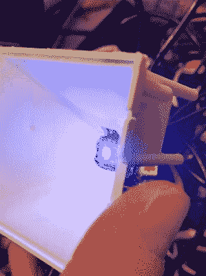

# 变色时钟得到一个圆周率为零的心

> 原文：<https://hackaday.com/2018/01/10/color-changing-clock-gets-a-pi-zero-heart/>

hack aday reader【Don】最近通过 tip line 让我们了解他的[变色 LCD 时钟项目](https://dhowdy.blogspot.com/2017/12/an-updated-version-of-my-clock-for-kids.html)的最新版本。这是他的第二个版本的硬件，比原来做了一些相当大的改进，包括从 Pi B 移动到 Pi Zero，以及内部布线的简化。他提到该项目的下一次修订将集中在 Google Home 集成上，这应该会很有趣。

作为两个学龄前儿童的父亲，他正在寻找一种方法来帮助他的孩子理解时间和预定活动的概念。颜色和形状对这个年龄的孩子来说相当容易，但时间以及它与一天的关系对他们来说就有点困难了，特别是当他们对数字的理解还在发展中的时候。[Don]推断说，即使他们还看不懂时钟上的*数字*，如果他让显示器改变颜色来指示一天中的不同时段(睡觉、玩耍、打扫卫生等)，这不仅会让他们按计划行事，还会强化屏幕上数字的含义。

ShiftBrite installed in the projector.

当地一家零售商的幸运发现让这个项目变得无比简单。他花了 10 美元买了一个儿童友好型的时钟，它利用一个简单的投影仪为液晶显示器提供背光。这意味着[Don]只需将库存照明模块换成可控的 RGB LED，硬件改造就基本完成了。

即使 Pi Zero 完全适合时钟的外壳，唯一必要的修改是在背面切割一个小孔，用于 Pi 的微型 USB 端口。他的早期版本使用一个通过 CAT5 连接到时钟的外部 Pi B，所以将它集成到一个设备中是一个巨大的进步，特别是当小孩子参与进来的时候。将 Pi 和它的 5 V 引脚移到时钟本身也允许[Don]去掉以前需要的电压调节器。

有了变色 LCD 时钟的基本硬件，剩下的就是软件的问题了。经过一些研究，[Don]在[Hive13]的帮助下发现了[RPi-ShiftBrite](https://github.com/Hive13/RPi-ShiftBrite)，并让[拥有了自己的 fork](https://github.com/dhowdy/RPi-ShiftBrite)，增加了他的项目所需的一些功能，即在命令行上快速将 shift brite 设置为特定颜色的能力。为了安排颜色变化，他使用了非常精巧的 [minicron](https://github.com/jamesrwhite/minicron) :一种基于网络的工具，用来创建和监控 Linux cron 作业。

Pi 本身实际上并不与时钟接口，并且由于没有板载 RTC，所以有必要用 NTP 更新它，否则时间将变得不同步。可能有必要每小时将 Pi 的时钟与互联网同步一次，以确保颜色在适当的时间变换。增加一个像 DS1307 这样的 RTC 模块可以缓解这个问题，并且可以在将来的版本中考虑。

总的来说，这是一个非常棒的项目，我们会继续关注它的进展。我们已经看到了我们的份额[独特的树莓 Pi 供电时钟](https://hackaday.com/2016/09/22/want-to-wake-up-in-a-ships-warp-core-circadia-sunrise-clock-makes-it-so/)，甚至还有一些[变色时钟](https://hackaday.com/2017/12/13/color-changing-clock-uses-pcb-digits/)，但这种方法无疑是我们见过的最直接的方法。

 [https://www.youtube.com/embed/sKe8JC1x_yg?version=3&rel=1&showsearch=0&showinfo=1&iv_load_policy=1&fs=1&hl=en-US&autohide=2&wmode=transparent](https://www.youtube.com/embed/sKe8JC1x_yg?version=3&rel=1&showsearch=0&showinfo=1&iv_load_policy=1&fs=1&hl=en-US&autohide=2&wmode=transparent)

