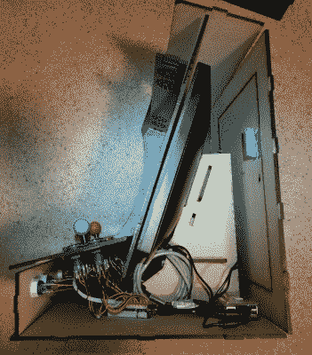

# Bartop Arcade 机柜构建跳过套件

> 原文：<https://hackaday.com/2018/01/14/bartop-arcade-cabinet-build-skips-the-kit/>

街机柜是每个游戏玩家都想在家里拥有的东西之一，但很少有人能得到。得到一个真正的街机柜通常是昂贵的，而自己做一个也是不小的壮举。你现在可以得到一些套件来帮助这个过程，通常是以预切割的橱柜部件的形式，但随之而来的是组装套件的耻辱。如果你的朋友发现你用了一套工具，而不是自己设计的，怎么办？这出戏简直让人想都不敢想。

至少波格丹一世·伯格是这么认为的。他不满足于仅仅从易贝得到一个预切割的橱柜套件，他决定在短短一周内设计并制作自己的 bartop arcade machine。我们不知道他的朋友和家人今年的圣诞节是什么样的，他一直在这个美丽的建筑上辛勤工作，但我们可以自信地说他的圣诞节是*棒极了*。

 他在 Fusion 360 中设计了这个柜子，他使用的激光切割机的工作区域只有 24 英寸乘 18 英寸。这里做了一些有趣的设计选择，包括使用标签和插槽构造方法。虽然[波格丹一世]承认这种美学并不总是受欢迎，但他喜欢最终产品的坚固程度。

他原本打算用胶合板做橱柜，但由于他找不到任何没有局部翘曲的部分，他改用了中密度纤维板。使用中密度纤维板意味着他必须在上漆前用虫胶封住所有的切割部分，但最终他对最后的漆面工作很满意；即使这比他预期的要花费更多的工作和材料。

硬件几乎是这些天 DIY 街机的标准:他放在周围的 17 英寸液晶显示器用于显示，亚马逊的双玩家操纵杆和按钮套件提供用户界面，模拟由运行 RetroPie 的 Raspberry Pi 3 提供。后部的凹门允许他进入机器，但仍保持背面的完美外观。

虽然它们的尺寸可能变化很大，但 DIY 街机橱柜[一直是一个受欢迎的项目](https://hackaday.com/2016/10/09/arcade-cabinet-build-takes-quarters-dispenses-fun/)。无论是[无耻地印有我们的标志](https://hackaday.com/2014/07/02/broken-laptop-lives-again-in-skull-n-wrenches-arcade-cabinet/)还是[主持辉煌的 LED 照明](https://hackaday.com/2016/07/29/the-prettiest-darn-arcade-cabinet-youll-see-today/)，似乎这些橱柜的设计提供了和它们玩的游戏一样多的娱乐。

 [https://www.youtube.com/embed/T161Jm74b8w?version=3&rel=1&showsearch=0&showinfo=1&iv_load_policy=1&fs=1&hl=en-US&autohide=2&wmode=transparent](https://www.youtube.com/embed/T161Jm74b8w?version=3&rel=1&showsearch=0&showinfo=1&iv_load_policy=1&fs=1&hl=en-US&autohide=2&wmode=transparent)

