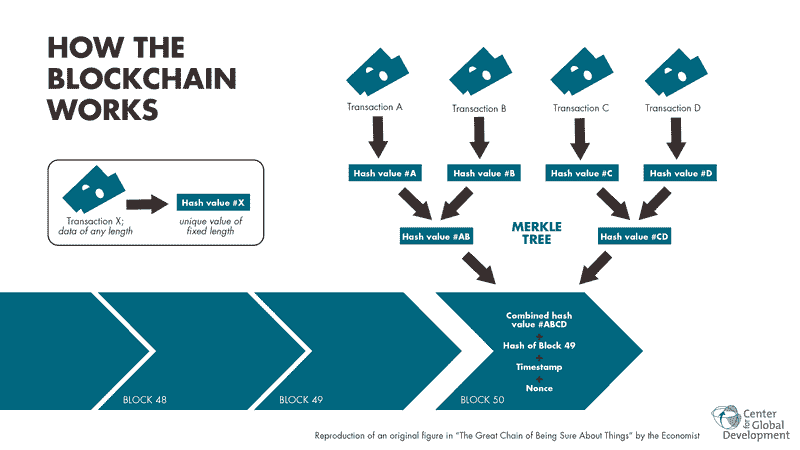

# 关于加密货币的第 348296 篇文章

> 原文：<https://hackaday.com/2018/01/09/the-348296th-article-about-cryptocurrency/>

公众对近期的市场事件有着强烈的好奇心，这是由对快速致富的贪婪引起的。仅去年一年，比特币的价值就上涨了 1731%。我们说的是淘金热 2.0 版，宝贝。金钱会说话，加密货币持有高达 6150 亿美元，这很清楚为什么这肯定不是你读过的第一篇加密货币文章——甚至可能是今天。大众对一个主题的兴趣的一个不幸的副作用是错误信息的迅速传播。那么，到底什么是区块链，既然每个人都最终加入了加密货币的行列，你还能做些什么呢？

## 比特币和其他加密货币

比特币是 2009 年由神秘人物【中本聪】—[—](https://hackaday.com/2016/05/03/i-am-satoshi-nakamoto/)发布的第一种点对点去中心化虚拟货币，在 2018 年的今天，它继续成为加密货币市场的大狗。

然而，还有一大堆其他数字硬币像 20 年代的股票一样被疯狂收购。[巧合](https://www.forbes.com/sites/ericmack/2017/12/16/bitcoin-cryptocurrency-crash-cash-price-fork-futures/#508c35a1bd4b)？一些著名的竞争者包括以太坊，莱特币，甚至 Dogecoin。你可以在这里看到 1000 多种加密货币的增长列表。

所有这些加密技术背后的技术被称为区块链，这个术语已经有了自己神秘的时髦程度。

## 块链

区块链不是黑魔法，他们没有宇宙的答案，他们也不会凭空变出冰冷的现金。然而，他们在最近产生了相当大的嗡嗡声和混乱。通俗地说，区块链是一种数字文件，列出了以加密货币形式发生的交易账户。如下图所示，这些文件(数据块)在带有时间戳的哈希函数中记录信息。但是这些账簿并没有被你的银行家或你自己的锁和钥匙藏起来。这些是每个人都可以访问的公共分类账，同时创造了对信任的需求，同时又废除了信任。

无论你把钱转给谁，他都可以看到你以前所有的交易记录，因为它被锁在区块链里了。这种永恒的交易记录自然引起了许多人的兴趣。[使用区块链存储小文件数据](https://github.com/williamcotton/blockcast)是 2015 年比特币开始成为主流后推出的一个项目。现在，大公司正疯狂地寻找在业务中使用区块链技术的方法。

区块链技术很可能会从根本上改变我们使用一些技术的方式，这些技术可能会用于货币交易以外的其他方面。区块链已被提议用于跟踪财产所有权、存储大量数据、申请版权、实施微电网共享以及许多不同类型的一系列去中心化应用。在这一点上，说你计划“把它放在区块链上”是老生常谈，但这不是玩笑。在某种程度上，所有这些应用这个概念的尝试都会产生一些真正有意义的东西。

Source: [B140970324](https://commons.wikimedia.org/wiki/File:Blockchain_workflow.png) CC-BY-SA 4.0

随着区块链越来越多的[应用被引入，其安全性的有效性值得关注。由于写入数据块的数据不能被篡改或覆盖，因此看起来是安全的。然而，就像比特币的情况一样，如果在网络上工作的 50%以上的计算机在共识协议中撒谎，那么它就会变成真的。这个](https://hackaday.com/2015/10/27/applications-for-the-bitcoin-blockchain/)[特有的安全漏洞](https://en.bitcoin.it/wiki/Majority_attack)被矿池社区控制住了，确保没有人能对网络产生如此大的影响。

## 未来会怎样？

所以，在过去五年比特币真正上涨之前，你错过了挖掘比特币的机会，并后悔没有早点投资这个金矿。不用担心；你的未来取决于你自己。游戏中仍然有赚钱的机会，尽管可能不会像 2010 年那样容易。

普通人根本无法与突然出现的巨型采矿场竞争。有些转向 GPU 挖矿以太坊。不像比特币，它仍然可以通过一个半体面的游戏平台盈利，尽管[一个专用的多卡设置更好](https://hackaday.com/2017/12/17/powering-your-mining-rig-the-right-way/)。住在校内宿舍的学生正在使用他们的游戏机，因为他们不用在宿舍支付单独的能源费用。[众所周知，他们建立了几个采矿平台](https://qz.com/1160667/the-secret-lives-of-students-who-mine-cryptocurrency-in-their-dorm-rooms/)，用这种几乎“免费”的能源来抵消飙升的学费，并学习一些采矿知识。

到目前为止，我们已经看到了几个标准的比特币价格追踪器，甚至还有一个每当收到交易就会跳舞的 T2 比特币机器人。随着比特币在 2017 年暴涨，一些[网站被发现偷偷窃取你的 CPU 周期来挖掘](https://www.wired.com/story/cryptojacking-cryptocurrency-mining-browser/)，而其他网站开始公开这样做，作为运行广告的替代方法。

不要因为错过了淘金热而自责。淘金热就是这样进行的。但是也不要放弃。新技术有很大的发展空间，这也是 Hackaday 社区最擅长的:为最新最好的应用程序寻找新的有趣的应用程序。请务必[让我们知道你发现了什么](https://hackaday.com/submit-a-tip/)！