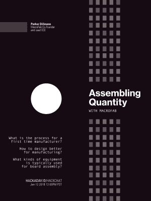

# 星期五黑客聊天:用 MacroFab 大量组装

> 原文：<https://hackaday.com/2018/01/10/friday-hack-chat-assembling-in-quantity-with-macrofab/>

建造一个东西很容易。你每天都可以在这里看到它，是的，建造一个机器人，或者一个将 Segas 转换为 HDMI 的电路板，或者一个物联网很容易。制造业完全是另一回事。你将有物料清单，你将有供应商，你需要处理装配，编程和包装。你知道你要把那些装零件的箱子放在哪里吗？制造是一项艰巨的任务，但幸运的是，有组装厂和合同制造商准备减轻一点负担。

 [在本周的黑客聊天](https://hackaday.io/event/29487-assembling-quantity-with-macrofab)中，我们将通过 MacroFab 谈论组装即服务。 [MacroFab](https://macrofab.com/) 是一家在线组装工厂和合同制造商，让硬件制造变得简单。如果你认为将电路板文件发送到 OSH Park 并在一周内收到 PCB 是惊人的，那么你显然没有体验过 MacroFab。在这里，您可以上传您的电路板和 BOM，并以最少的努力，在几周内收到一个完全填充的产品。

我们本周 Hack Chat 的嘉宾是 MacroFab 的联合创始人[Parker Dillmann]，他有嵌入式设计和 DSP 方面的背景。他经营着一个名为 longhornengineer 的博客，博客中充满了惊人的项目，这些项目非常符合日常生活。尤其值得称赞的是[游戏机 VGA 适配器](http://longhornengineer.com/2015/03/09/more-vga-adapter-work/)。

在本周的 Hack chat 中，我们将与[Parker]讨论制造、陷阱、如何更好地为制造而设计(DFM)、MacroFab 使用的机器、pogo 引脚适配器、焊料池以及所有将一个东西变成成千上万个东西的酷东西。如果你想知道 MacroFab 的结果是什么样的，你可能已经有一些了；今年黑客日超级大会的[徽章由 MacroFab 制造，去年 Def Con 上的许多独立徽章也是如此。](https://hackaday.io/project/27427-camera-badge-for-supercon-2017)

在这次聊天中，我们将讨论:

*   初次生产厂家的流程是怎样的？
*   在哪里可以找到如何更好地为制造而设计？
*   MacroFab 生产哪种产品？
*   电路板组装通常使用哪种设备？

像往常一样，我们在寻找来自社区的问题，您可以在 [Hack Chat 活动页面](https://hackaday.io/event/29487-assembling-quantity-with-macrofab)上添加这些问题作为评论。

我们的 Hack Chat 是在 [Hackaday.io Hack Chat 群发消息](https://hackaday.io/project/5373/token/7879571d-62c3-46a8-af36-2b6f265590f2?redirect=messages)上的实时社区活动。这次聊天将于太平洋时间 1 月 12 日星期五中午进行。时区让你沮丧？这里有一个[方便的倒计时器](https://www.timeanddate.com/countdown/generic?iso=20180112T12&p0=137&msg=Many+Parts+to+Assemble+with+MacroFab&font=cursive)！

点击左边的语音气泡，你会被直接带到 Hackaday.io 上的黑客聊天群。

你不必等到星期五；随时加入，你可以看到社区在谈论什么。