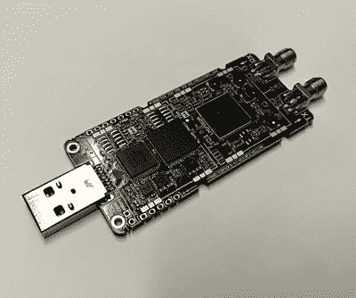
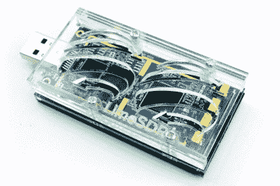
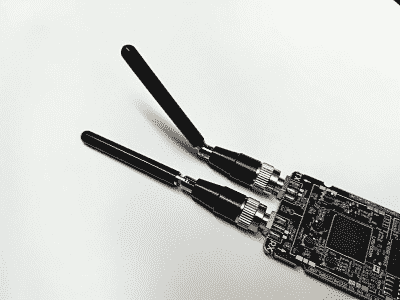
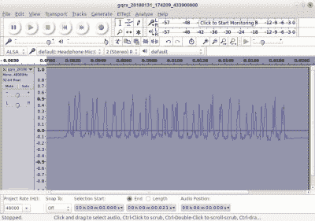

# 综述:LimeSDR 迷你软件定义无线电收发器

> 原文：<https://hackaday.com/2018/03/13/review-limesdr-mini-software-defined-radio-transceiver/>

公平地说，软件定义无线电代表了过去十年左右我们所看到的经济实惠的无线电设备中最重要的进步。将信号处理从专门构建的模拟硬件转移到软件领域，为更传统的无线电通信模式和只有通过新技术才能实现的更新模式带来了许多令人兴奋的可能性。

公平地说，寻求高性能 SDR 的无线电爱好者也必须准备好大量的银行存款，因为交付软件定义无线电所需的一些组件相当昂贵。因此，市场的预算端一直是使用现有模拟接口(如计算机声卡)的有限基带带宽的收音机的领地，或者是驱动程序黑客攻击中的幸运事件，如发现廉价且现在无处不在的 RTL2832 芯片组数字电视接收机可以充当 SDR 接收机。传输过去是，现在仍然是更昂贵的。

The LimeSDR Mini’s chunky USB stick form factor.

新一代的预算特别提款权，以今天的主题 LimeSDR Mini 为代表，降低了传输价格。这是 LimeSDR 产品系列的最新产品，一款 USB 棒格式的 SDR 收发器和 FPGA 开发板，其核心使用与现有 LimeSDR USB 相同的 Lime Microsystems LMS7002M，但规格较低。主要的变化是只有一个接收和一个发射通道，而 USB 只有两个，30.72 MHz 的带宽减半，低端频率范围从 100 kHz 跳到 10 MHz。不过，与 Mini 相关的最有趣的较低数字是它的价格，早期的鸟儿以 99 美元的价格抢购，是其前身的一半。(现在 Kickstarter 上有售，售价 139 美元。)

我们很幸运地收到了一台预生产 LimeSDR Mini，供 MyriadRF 人员审查——事实上，我们收到了两台预生产 limes dr Mini，第一台被证明存在硬件故障，怀疑与焊点问题有关。我们感受到了他们的痛苦，毕竟谁没有在不方便的时候让预生产板出现故障呢！

The laser cut case that will be available for your Mini.

该板本身是一个约 33 毫米 x 70 毫米(1.25 英寸 x 2.75 英寸)的 PCB，一端有一个 USB 3 插头，另一端有一对 SMA 插座，一个用于接收，另一个用于发射。集成电路都在电路板的顶部，虽然它们包括封装屏蔽罐，但它们并不组装。SMA 插座之间有一个多色状态 LED。值得一提的是，主板将有一个激光切割的塑料外壳，这可能是值得的，因为它感觉有点脆弱。随着作为董事会，他们提供了一对 870 兆赫波段的小橡胶鸭天线。

A couple of little 870MHz antennas are supplied with the board.

很明显，LimeSDR Mini 是一款功能极其强大的板，在真正的 SDR 和 FPGA 编程专家手中，它可能会大有作为。同样明显的是，作为你的黑客抄写员，我不是 SDR extreme power 用户。尽管我持有业余无线电执照已有 30 多年，但相对而言，我进入 SDR 领域的时间相对较晚，还没有超越 RTL SDR 或使用 PC 声卡作为基带的简单设备。但是，虽然许多 SDR 编程专家确实会购买该板，但其大多数客户也将是该领域的新手。因此，这篇评论将偏向于 SDR 非权威人士，即长期无线电爱好者，他们将 LimeSDR Mini 视为第一款收发器。

任何 SDR 的第一个任务总是在主机上安装任何需要的软件。这里指的是最新的 Ubuntu 发行版，但是 Windows 和 MacOS 机器也支持。有一页很方便的说明页，在 Ubuntu 的情况下，它要求你为驱动程序添加一个 PPA 库，然后安装 Lime 套件软件和 SoapySDR 抽象层。正是这个最终的包使得 LimeSDR 成为一个有趣的前景，通过将软件兼容性卸载到广泛使用的抽象层，他们希望避免其他产品出现的一些痛苦。

## 测试它

A British DAB digital radio multiplex, as seen through a LimeSDR.

一旦安装了驱动程序，就该决定先运行哪个软件了。随驱动程序包提供的 Lime Suite GUI 将是测试该板的第一个调用端口，但我被告知，在编写 Mini 时，PPA 的版本尚未发布，是用 LimeSDR USB 编写的，因此我应该使用 GQRX。在 Ubuntu 的情况下，这可以通过图形软件安装程序安装，但幸运的是，我已经在我的机器上安装了它。选择“其他”作为我的 SDR 并粘贴`driver=lime,soapy=0`作为我的设备字符串，很快我就有了熟悉的界面，有了合适的天线，我很快就可以收听当地的 BBC Radio 4 FM 发射机。

![A simple FM transmitter, derived from this example by [Gyaresu].](img/572b0101cba51dfdbbe87b2bad65d547.png)

一个简单的调频发射机，来源于[这个例子由【Gyaresu】](https://gist.github.com/gyaresu/343ae51ecbb70486e270)提供。对于 RTL-SDR 的拥有者来说，有两点是显而易见的:大量杂散峰值消失，噪底降低。用不同的前端读取 GQRX 是一种不精确甚至有点无意义的测量方法，但对于全自动 AGC，RTL 的噪底为-60 dB，LimeSDR 的噪底低于-90 dB。仅仅看一下调频波段，就有一些电台被 RTL 根本不存在的噪音所干扰。毫不奇怪，一个专用的 SDR 硬件会比 10 美元的电视棒运行黑客使其成为 SDR 更好，但如果你是 RTL-SDR 用户，那么当你看到它运行时，你会对 Mini 感到惊喜。

Fortunately there is nothing too sensitive controlled by this 433MHz waveform that I have just revealed to the world.

拥有一个像 Mini 这样的电路板，并简单地将其用于 GQRX，这是浪费了它的潜力。通过 Snappy Ubuntu Core 我们被承诺[一个定制的应用程序库，但这还不是预发布版本。你的下一站可能会跟随我们的](https://www.crowdsupply.com/lime-micro/limesdr#huge-application-ecosystem-with-snappy-ubuntu-core) [GNU Radio](https://www.gnuradio.org/) ，尤其是它的拖放式 GUI 应用 GNU Radio Companion。这是 SDR 时代的基本自制无线电，就像模拟无线电业余自制者会焊接自己的无线电，而其他人会购买闪亮的收发器，因此 SDR 自制者可以使用 GNU 无线电构建自己的设备。这是一个超出本文讨论范围的包，但作为一个例子，当玩 Mini 时，很容易拼凑一个小 GNU 无线电接收器，从我们房子里的 433 MHz 遥控发射器中接收和提取信号，然后通过 433MHz Baofeng 天线返回信号，以满足长凳另一端台灯自动打开的视觉效果。一旦与 GNU Radio 的通信完成，Mini 本身并不干涉这个过程，只是简单地做了它被告知的事情，所以进一步实验解码比特流本身的机制就变成了[通过一系列教程](https://myriadrf.org/blog/limesdr-made-simple-part-7-one-way-continued/)工作并熬夜的事情。陡峭的学习曲线充分抵消了玩无线电积木的即时满足感，而没有返工任何复杂焊接的痛苦。

在传输方面，最大 100 兆瓦的输出功率对于任何习惯于业余无线电的人来说都是相当适中的。但是，考虑到这种板的许多应用将涉及对更多本地设备的嗅探和响应，而不是寻求来自其他大陆的联系，这可能只会给没有必要的功率放大器的无线电业余爱好者带来麻烦。如果你习惯了单工收发器上的单天线连接器，双天线连接器会有些烦人，当然，除非你是在不同的频率上发射和接收。

在短时间内回顾 SDR 不可能涵盖其所有功能，因此这一篇文章给人的印象是 Mini 是一个实验和学习如何使用 SDR 收发器的平台。但是就在它被放在这里的时候，Mini 已经在 RTL-SDR 上打开了一个重要的新远景，并且给我几个月的时间来玩 GNU Radio，我肯定会提供一些有用的无线电应用程序和一个非常有趣的学习过程。

以前的 SDR 在市场的预算端，如 HackRF，都仍然是有点昂贵的购买，一个典型的无线电爱好者可能很难在家庭账户中向他们的合作伙伴隐瞒。Mini 的价格几乎接近冲动购买的水平，它有可能成为每个人的 SDR 收发器。如果你因为价格而犹豫不决，也许是时候看看了。