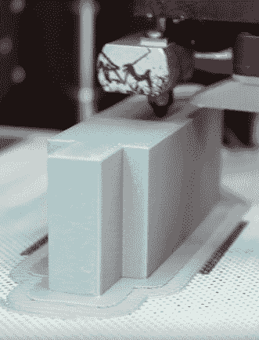

# 铝不是 3D 打印折弯机模具的对手

> 原文：<https://hackaday.com/2018/01/14/aluminum-no-match-for-3d-printed-press-brake-dies/>

如果你正在寻找一个快速致富的计划，你现在就可以把“*小规模制造超轻型飞机*”从你的清单上划掉。结果发现里面没有钱。至少，没有足够的钱让你外包所有零件的生产。当你意识到你必须自己制造东西的时候，甚至不足以建立一个充满定制加工工具的大商店。不，这听起来像是我们经常听到的那种“爱的工作”。

那么，如何用最少的工具在室内制造飞机呢？好吧，既然你是在 Hackaday 上读到这篇文章的，你可能会猜测你已经想出了一些有点非正统的东西。当彩虹航空公司的布莱恩·卡彭特需要一个非常特殊的模具来弯曲他们飞机的一个部件时，他决定尝试自己设计和 3D 打印一个模具。

Printing a die on the Zortrax M200

他推断说，既然他过去已经用木头制作了快速而肮脏的模具，那么 3D 打印的模具在散架之前至少应该可以弯曲几次。他甚至计划使用 JB Weld 来填充印刷模具的部件，他认为这些部件在经过几次循环后会开始开裂和断裂。但即使在弯曲了数百个零件后，模具上的磨损似乎几乎不存在。作为一个额外的奖励，印刷塑料模具不会像钢模具那样损坏正在弯曲的铝片。

那么，打印一个可以在 20 吨刹车上弯曲数百片铝而不磨损的模具的秘密是什么呢？事实证明……不是全部。[Brian]将该实验的成功归因于设计了具有足够精确公差的模具，并且具有如此高的填充物，以至于它也可以是固体塑料。

事实上，3D 打印模具效果非常好，他们现在已经将这个想法扩展到了一个廉价的港口货运制动器。在此之前，这种工具或多或少没有使用过，因为它没有生产零件所需的功能，即半径模具或止挡。但是通过 3D 打印这些部件,[布莱恩]能够让工具重新工作。

[我们之前已经介绍了弯曲金属板的艺术和科学](https://hackaday.com/2016/05/18/the-art-and-science-of-bending-sheet-metal/)，以及自制的制动器[让你以连彩虹航空公司都会嗤之以鼻的预算做到这一点](https://hackaday.com/2016/10/02/home-made-metal-brake/)。你还在等什么？[去造一架飞机](https://hackaday.com/2017/12/21/retrotechtacular-field-assembly-of-the-p-47/)。

感谢[Oahupilot]的提示。

 [https://www.youtube.com/embed/M-fTY5L5uu0?version=3&rel=1&showsearch=0&showinfo=1&iv_load_policy=1&fs=1&hl=en-US&autohide=2&wmode=transparent](https://www.youtube.com/embed/M-fTY5L5uu0?version=3&rel=1&showsearch=0&showinfo=1&iv_load_policy=1&fs=1&hl=en-US&autohide=2&wmode=transparent)

