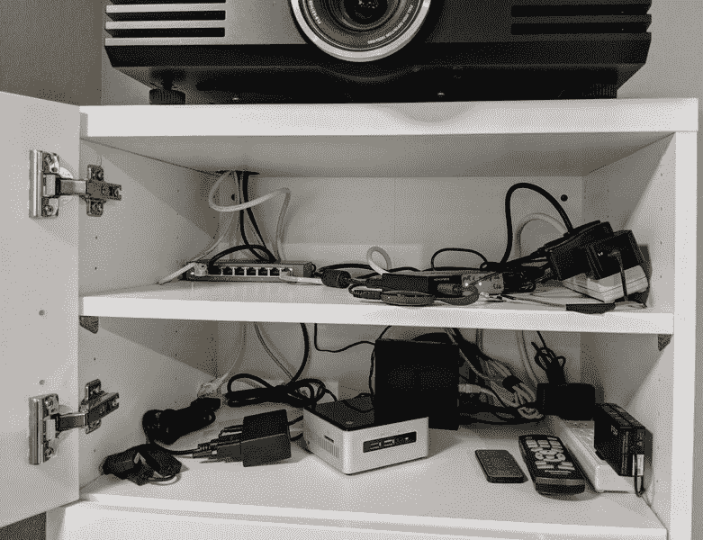

# Alexa 通过 ESP8266 控制这台投影仪

> 原文：<https://hackaday.com/2018/01/27/alexa-controls-this-projector-thanks-to-esp8266/>

[jfessard]没有超感知觉，但有一个 ESP8266。这个小板子似乎在最近的每一次黑客攻击中都会出现。受不想从豆袋椅子上站起来或让电子设备外壳大开着使用 HDMI 切换器的启发，[jfessard]通过 ESP8266 黑出了一个兼容 Alexa 的投影仪控制！

这里的核心功能是能够打开和关闭投影仪，以及切换 HDMI 源。[jfessard]将松下 PT-AE3000U 投影仪连接到单价 HDX-401TA 4×1 HDMI 切换器。它藏在投影仪下方的机柜中，由一个红外 led 发射器分线板控制，该分线板位于一组相当长的跳线的末端。投影仪本身是通过 RS232 接口控制的。

为了方便亚马逊的 Alexa 使用，jfessard 在一些图书馆找到了 ESP8266 D1 Mini。fauxmoesp 库使它看起来像一个 WeMo 设备，而 IRemoteESP8266 库使远程控制代码克隆变得轻而易举。这次黑客攻击的一个真正令人沮丧的部分是 MAX232 风格的分线板；当一块板子贴反标签时，要让它正常工作需要一点挠头才能弄明白。

如果投影仪太吵，我们建议[这个黑客让](https://hackaday.com/2016/04/14/quieting-a-cheap-lcd-projector/)机器安静下来。目前，我们宁愿再看看这个激光投影仪，它模仿了一个很酷的“激光天空”效果。