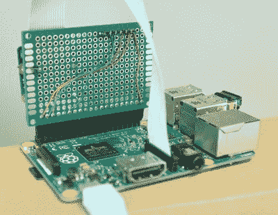

# 树莓 Pi 提供了没有灵魂的工作监督

> 原文：<https://hackaday.com/2018/01/15/raspberry-pi-offers-soulless-work-oversight/>

如果你和我们一样，你花在盯着电脑屏幕上的时间比你愿意承认的要多。无论是试图为一篇博客文章找到合适的词，还是对一些代码进行故障排除，最终的结果都是一样的:一个正常运作的人变成了一个下巴松弛的僵尸。如果能够量化你的生命中有多少时间被浪费在沐浴在显示器闪烁的光芒中，那不是很好吗？当然，这不会是一个令人沮丧的消息，在周末。

 有了现代科技的魔力，你不再需要惊奇。多产的黑客[【dekuNukem】创造了恰如其分的名字“T4”(face punch)，它允许你只通过你的脸“打卡”。只要在你的树莓派相机前坐下，数字就开始滴答作响。这就像出租车前的小钟:除了最后你不需要付钱给任何人，你只需要接受你的生活已经变成的样子。所以这很酷。](https://github.com/dekuNukem/facepunch)

在家玩不需要太多硬件。你只需要一个树莓派和官方相机配件。不过为了获得完整的效果，你应该添加一个由[亮度支持的显示器。有机发光二极管司机](https://github.com/rm-hull/luma.oled)这样你就可以实时看到分分秒秒的流逝。

为了进行面部识别，你需要做的就是拍摄一张光线充足的面部照片，并将其保存为 400×400 的 JPEG 格式。Python 3 脚本会处理剩下的事情:每隔几秒钟检查一次相机的画面，看看你漂亮的杯子是否在画面中，并相应地增加计数器。

即使你不想要一个奥威尔式的电子监管器，这个项目也是一个让你开始进入面部识别世界的好例子。运气好的话，[你很快就会把它武器化](https://hackaday.com/2017/08/04/opencv-turret-tracks-motion-busts-airsoft-pellets/)。