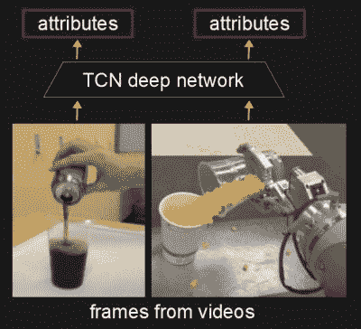
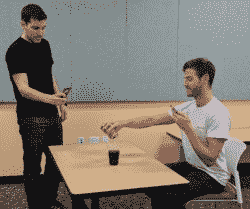
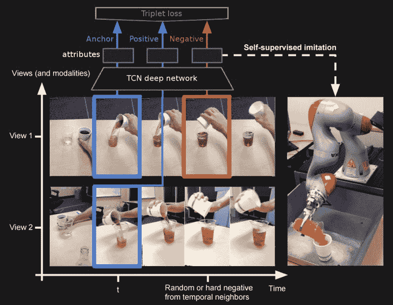
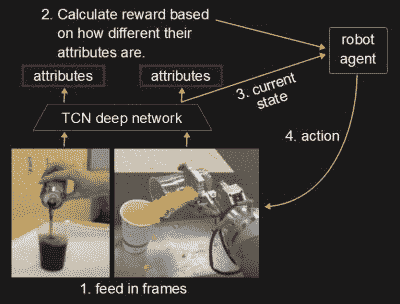
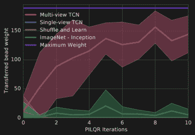
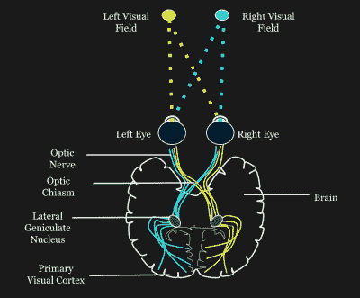

# 神经网络:机器人从视频中学习

> 原文：<https://hackaday.com/2018/01/18/neural-networking-robots-learning-from-video/>

人类非常善于观察他人，并模仿他人的行为。给某人看一段打开数控机床开关的视频，看一遍之后，他们就能自己动手了。但是机器人也能做到吗？

请记住，我们希望演示视频是一个人的手臂和手扳动开关。当机器人这样做时，作为它眼睛的摄像机将会看到它的机械臂和抓爪。所以不管怎样，它必须知道它的机器人部分等同于演示视频中的人类部分。哦，演示视频中的开关可能是不同的型号和品牌，数控机床可能是不同的，尽管我们至少会将机器人放在开关可及的范围内。

听起来很难？

来自谷歌大脑和南加州大学的研究人员已经做到了。在他们描述如何的论文中，他们谈到了几个不同的实验，但我们将只关注一个，让机器人模仿将液体从容器倒入杯中。

## 领先一步

TCN producing attributes

仔细想想，人类是有优势的。他们以前使用过手臂和手，他们伸手去拿物体并操纵它们。

研究人员给他们的机器人一个类似的开端，首先训练一个叫做时间对比网络(TCN)的深度神经网络。一旦经过训练，TCN 就可以从执行动作的人或机器人的视频帧中获得一幅图像，并输出一个矢量(一列数字),其中嵌入了关于图像的高级属性，例如:

*   手是否与容器接触，
*   我们在倾倒距离内吗，
*   集装箱角度是多少，
*   液体是否流动，以及
*   杯子有多满？

请注意，属性中没有任何地方说明手是人还是机器人，也没有任何关于液体、容器或杯子的细节。也没有提到背景。所有这些都被抽象出来了，所以区别并不重要。

## 训练 TCN

人类的另一个优势是立体视觉。当两只眼睛从不同的位置看一个物体时，在视觉中心的物体对两只眼睛来说是居中的，但是场景的其余部分在每只眼睛的不同位置。研究人员做了类似的事情，用两个手机摄像头从两个视角训练 TCN，得到了比他们用单个视角时好得多的结果。这允许机器人从背景中挑选出手臂、手、液体、容器和杯子。

Recording the videos

他们总共用大约 60 分钟的双视点视频训练 TCN:

*   20 分钟的人流，
*   20 分钟的人类操作杯子和瓶子的方式不涉及倒酒，而且
*   20 分钟的机器人浇注设置，但不一定浇注成功。

为了让 TCN 创造出独立于人手或机器手的手的抽象，需要后一个机器人在浇注环境中的视频。

视频中的画面一帧一帧地交给 TCN。但是对于每三帧，计算一次损失。这些帧中的一帧，称为锚点，取自镜头保持稳定的视图 1。第二帧称为正片，取自视图 2，其中摄像机移动更多，但来自同一时刻。第三张照片，叫做底片，拍摄于事物功能不同的时代。视图 2 移动得更多，以引入更多变化和运动模糊。

然后使用三帧计算损失值，并用于调整 TCN 内的值。这导致了锚和被学习的积极事物之间的相似性。这也意味着 TCN 知道锚和消极之间的区别。

使用不同的视点有助于从学习到的属性中消除背景。其他不同的是照明条件和对象的比例，因此这些也不包括在学习的属性中。如果每一帧都被一个接一个地用来学习属性，那么所有这些不相关的东西也会被学习。

通过包括负帧，即功能不同的帧，随着时间变化的属性被学习，例如杯子的满度。

甚至使用不同的容器、杯子和液体，以便这些可以作为更抽象或更一般的属性来学习。

## 学习模仿

我们说过，TCN 相当于人类的领先。在显示如何拨动开关打开数控系统之前，人类已经知道手臂、手、开关以及如何够到物体。这里最大的不同是，这个 TCN 训练的是杯子和液体，而不是开关。

一旦研究人员训练了 TCN，他们就能够用它来为强化学习算法提供输入，以控制机器人的运动。

TCN and reinforcement learning

只需要人类倾倒液体的单个视频来进行强化学习。视频的每一帧都像来自机器人摄像头的帧一样被输入 TCN。请注意，观点和其他许多东西都是不同的。但这并不重要，因为对于每一帧，TCN 输出的是更抽象层次的属性，例如我们上面列出的属性(例如，我们在倾倒距离内吗？).这两个帧之间的属性越相似，机器人做得越好。

计算奖励值，并将其与当前状态一起传递给机器人代理代码，以便它可以产生一个动作。机器人代理实际上是一个机器学习结构，它可以根据奖励进行微调。它输出下一个动作，并重复该过程。这被称为强化学习，奖励强化机器学习结构的学习。

最终结果可以在下面的视频中看到，以及论文中谈到的更多实验。

 [https://www.youtube.com/embed/b1UTUQpxPSY?version=3&rel=1&showsearch=0&showinfo=1&iv_load_policy=1&fs=1&hl=en-US&autohide=2&wmode=transparent](https://www.youtube.com/embed/b1UTUQpxPSY?version=3&rel=1&showsearch=0&showinfo=1&iv_load_policy=1&fs=1&hl=en-US&autohide=2&wmode=transparent)

Test results

对于这里显示的图表，每个迭代有 10 次尝试。多视图 TCN 是我们在这里描述的算法。在大约 100 次尝试之后，7 自由度 KUKA 机器人持续地将橙色珠子倒入杯中，但你可以看到它在第 50 次迭代时已经做得相当好了。

## 局限还是优势？

机器人学习模仿只需要一个简单的倒酒视频。然而，正如我们所见，在这之前，TCN 需要训练，这需要一个 60 分钟的视频数据集，来自人类和机器人的多个视角。然而，将此视为一种限制是错误的。人类儿童在完全掌握他们的眼-手协调和手臂运动学之前，需要花几十个小时在浴缸中的杯子里倒水。

当然，当前研究的一个局限是每个任务需要单独的 TCN。回过头来看看 TCN 提出的属性列表，看看我们的意思是什么——它们包含了许多关于手如何将液体倒入杯子的人类知识。例如，属性“液体是流动的吗”对开关翻转问题没有多大帮助。研究人员确实表示，原则上，一只 TCN 应该能够通过使用更大的数据集来学习多项任务，但他们尚未探索这一途径。

Stereo vision and neural pathway diagram by MADS00 CC BY-SA 4.0

有趣的是，研究人员还尝试使用单一视点训练 TCN。再次使用了三个帧，两个相邻，一个较远，但是结果不如使用多视点的效果好。当我们看到有人往杯子里倒水时，我们就有了一个完整的三维事件心理模型。你能想象同时从杯子的上方、后方或侧面看上去是什么样子吗？你可以，这有助于你思考水的流向。

将这些额外的输入加入到 TCN 中给了它一个做同样事情的机会。也许研究人员应该使用多台相机在同一时刻拍摄多个视图来进行物体识别。

最后，对于一个拥有完整机器视觉系统的机器人来说，往杯子里倒水并不是一件难事。这项研究有趣的是，当给 TCN 输入正确的任务输入变量时，它可以进行足够抽象的学习，这对基于人类做同样任务的视频进行训练很有用。人们认为，建立世界及其运作方式的心理模型、从我们自身抽象出来并接受他人观点的能力是灵长类动物所独有的。撇开 TCN 的产出变量和有限的任务不谈，这是一项非常令人印象深刻的研究。无论如何，我们离拥有能为我们操作数控机床的车间机器人助手又近了一步。