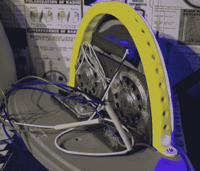

# 从门户网站重新创建无线电

> 原文：<https://hackaday.com/2018/01/17/recreating-the-radio-from-portal/>

如果你玩过 Valve 的大作 *Portal* ，可能会有很多细节留在你的脑海中，即使是在它发布十年之后。片尾曲，GLaDOS，“蛋糕是谎言”，等等。这么多年过去了，人们仍然在谈论*门户*的部分原因是因为它里面充满想象力的世界建筑。这些创造力的小金块之一已经与[亚历山大·伊萨科夫]纠缠了足够长的时间，以至于将它带入现实世界成为他的个人使命。不，它不是标志性的“传送门炮”，甚至不是一个经常被引用的机器人炮塔。当你第一次开始游戏时，这个小时钟会发出叮当声。

 好吧，所以也许这不是游戏的一部分*我们*会痴迷于变成现实生活中的物体。但不管出于什么原因，[亚历山大]就是需要那台收音机。当然，作为 21 世纪和所有他的版本实际上不是一个收音机，这是一个蓝牙扬声器。尽管他费了很大的劲添加了一个假显示器，显示的频率与游戏中的频率相同。

他在 Fusion 360 中创建的*门户*收音机模型做得非常好，并且可以在 MyMiniFactory 上为任何希望创建自己的光圈科学主题家居装饰的人提供[。虽然公平的警告，由于其大小，它确实消耗了约 1 公斤的所有打印部分的塑料。](https://www.myminifactory.com/object/portal-radio-50006)

对于内置蓝牙音箱，[亚历山大]用的是他吃了三包薯片后免费得到的模型。这听起来是寻找你的组件的最好方法，如果有人知道我们可以吃零食和把电子产品送到我们家门口的其他方法，请告诉我们。即使你所在的地区没有同样的“吃换装备”促销活动，将这种模式应用于不同的演讲者似乎也不会太难。至少里面肯定有足够的空间。

[这些年来](https://hackaday.com/2012/10/31/can-you-believe-this-portal-gun-was-built-from-scratch/)我们已经看到一些[非常令人印象深刻的*传送门*建造](https://hackaday.com/2014/06/12/3d-printed-portal-turret-searches-and-destroys/)，一直追溯到 2012 年建造的臭名昭著的[悬浮传送门炮【迦勒卡夫】](https://hackaday.com/2012/10/11/hackadays-portal-gun-actually-levitates-a-companion-cube/)。是的，我们甚至看到[有人在](https://hackaday.com/2012/04/16/portal-radio-is-why-valve-needs-to-build-hardware-2/)之前做过广播。在这一点上，它可能是安全的说，阀门可以添加“创造文化的试金石”到他们的一页。

 [https://www.youtube.com/embed/pifwpbAjOfw?version=3&rel=1&showsearch=0&showinfo=1&iv_load_policy=1&fs=1&hl=en-US&autohide=2&wmode=transparent](https://www.youtube.com/embed/pifwpbAjOfw?version=3&rel=1&showsearch=0&showinfo=1&iv_load_policy=1&fs=1&hl=en-US&autohide=2&wmode=transparent)

