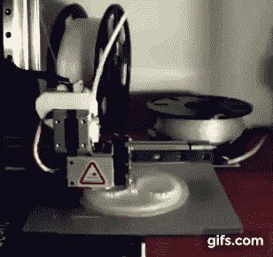

# 给塞特斯印刷商的三个建议

> 原文：<https://hackaday.com/2018/01/20/trio-of-tips-for-a-cetus-printer/>

由于节日礼物周期，许多家庭都用 3D 打印机进行了新的装饰。一些 noobs 显然属于“即插即用”阵营，他们寻求的用户体验不会比安装一台新的 2D 打印机更复杂。但是我们大多数人很快就知道，增加一个维度会大大增加难度，随之而来的就是修修补补。

 这样的一个修补匠【Marco Reps】已经把他的新塞特斯 3D 打印机带到了新的地方，而[他的最新视频提供了三个提示](https://www.youtube.com/watch?v=5JZ6yT_WM58)来增强这种基本但功能强大的打印机的用户体验。第一个提示:添加加热床。虽然该公司以非常合理的价格为 ABS 和 PETG 印刷提供加热铝床，但[Marco]还是自己生产了加热铝床。他用螺栓将一些电源电阻固定在铝压板上，构建了一个简单的控制器，并使用超大的库存电源来运行一切。

为了控制热量，尖端 2 是打印机的外壳。这里没有什么革命性的东西— [Marco]只是用铝型材和丙烯酸树脂做了一个快速盖子。

但是这个明显的例子考虑到了技巧三，这个视频的精华:同步延时摄影。由于对标准的不稳定延时序列感到不满，他编写了一个 Python 程序，该程序使用 OpenCV 来比较网络摄像头帧，并保存那些与上次保存的帧相似的帧。这会产生超级平滑的延时序列，使照片看起来像是作为一个单元挤出来的。相当不错的东西。

你是否在你的 Festivus 灯杆下发现了一台 3D 打印机，现在你在想接下来会发生什么？查看[【汤姆·纳尔迪】的 3D 新手指南](https://hackaday.com/2018/01/10/you-got-a-3d-printer-now-what/)获取更多提示。

 [https://www.youtube.com/embed/5JZ6yT_WM58?version=3&rel=1&showsearch=0&showinfo=1&iv_load_policy=1&fs=1&hl=en-US&autohide=2&wmode=transparent](https://www.youtube.com/embed/5JZ6yT_WM58?version=3&rel=1&showsearch=0&showinfo=1&iv_load_policy=1&fs=1&hl=en-US&autohide=2&wmode=transparent)

感谢[smerrett79]的提示。