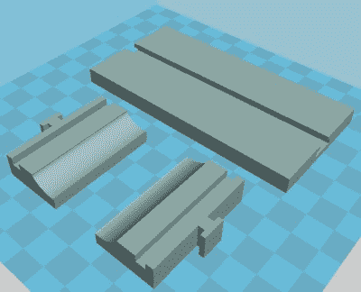
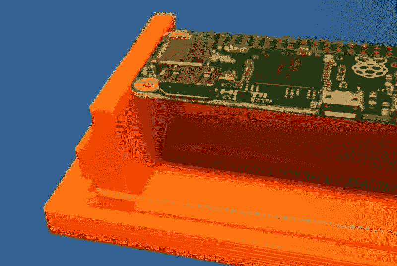
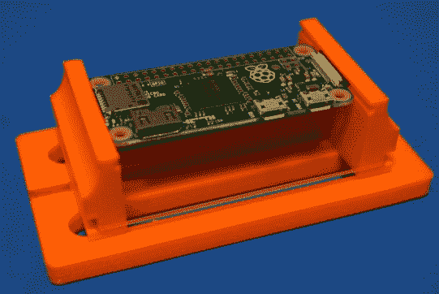
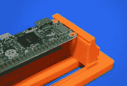
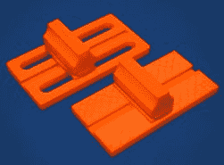

# 印刷它:橡皮筋 PCB 老虎钳

> 原文：<https://hackaday.com/2018/01/24/printed-it-rubber-band-pcb-vice/>

如果你曾经在一个小 PCB 上工作过，你就会知道拿着它有多麻烦。就好像它们不是被设计来被人类肮脏的手握着一样。随着时间的推移，设计变得越来越小型化，PCB 往往非常脆弱，上面挂满了元件，以至于将它们扔进经典焊接“第三只手”的鳄鱼夹中会损坏它们。这项工作的合适工具是专用的 PCB 虎钳，它就像一个普通的台钳，只是它不会非常用力地向下转动，通常在钳口上有塑料垫来保护电路板。

PCB 老虎钳的唯一问题是，像许多很酷的工具和小玩意一样，不是每个人都有一个。除非你在做常规的 PCB 制造，否则你可能也不会冒险买一个。那么，当一个预算有限的黑客拥有需要注意的复杂的小电路板时，他们该怎么办呢？

幸运的是，在我们生活的世界里，你可以按一个按钮，让一个神奇的机器人在你的桌面上为你建造东西。像 Thingiverse 和 YouMagine 这样的在线模型库充满了可打印 PCB 板的设计，你所要做的就是选择一个。在浏览了其中一些之后，我最终决定选择由 Thingiverse 上的[Delph27]设计的[型号，我认为它有几个引人注目的功能，值得为你的长凳添加几米长的灯丝。](https://www.thingiverse.com/thing:2500349)

当然，最好的部分是你可以定制和改进你下载的设计，这就是我要用这个 PCB 老虎钳做的事情！

## 合意的特征

 所以有*很多*可印刷的 PCB 板；足够挑选一个来仔细观察实际上是相当困难的。但是我真的很喜欢这个特别的设计，它让我在众多设计中脱颖而出。

首先，你不需要任何额外的硬件。我发现许多可印刷的老虎钳需要光滑的杆、螺栓、螺母等。如果你打算买光滑的杆和螺栓来做这个东西，你还不如买一个合适的 PCB 老虎钳。我知道在这个问题上会有不同的意见，但我个人倾向于使用最少额外硬件的设计。

我喜欢的另一个因素是它是多么容易打印。这种设计非常宽容，不需要微调打印机来生产一个可用的老虎钳。具有打印螺纹等复杂功能的模型显然需要更好的打印机，如果你是 3D 打印的狂热爱好者，这很好，但这肯定不能描述所有人。

## 第一印象

正如所料，这是一个非常容易的打印。我不太喜欢把所有的部分都放在一个“盘子”里，因为这样会增加失败的几率，但是对于这么简单的东西来说，这已经足够好了。我建议使用 0.2 毫米的图层高度，因为如果你再高一点，下颚的弯曲看起来会很恶心，而且中央通道的突出部分已经够棘手了。如果你没有加热床，底座可能会给你带来一些麻烦，因为直角的大物体边缘容易弯曲。

底座中的通道足够宽，不需要清理，只需将碎片从床上弹出，然后将它们放在一起。另一方面，宽的通道使得颚本身相当松。一旦你把它放在一起，这似乎不会损害功能，但有几次下巴弹出底座，这很烦人。

从功能上来说，老虎钳是有效的，当你找到合适的尺寸时，橡皮筋的驱动是很棒的，但是我对虎钳有点失望。下巴的表面被印在床上，这意味着它有一个相当光滑的表面(或多或少，取决于你的建筑表面)。如此光滑的表面很容易让印刷电路板滑落到老虎钳中，这在某种程度上违背了初衷。

## 丰富

当[Delph27]在知识共享许可下发布这个设计时，我们可以自由地以我们认为合适的方式重新混合和改进这个模型。所以在使用了我认为值得一提的原始模型后，我根据我的印象做了一些改动。

底座的边缘是圆形的，所以在打印过程中不太可能卷曲，我还在两侧做了大的切口，以减少打印时间和所需的材料量。我还重新设计了中心下方的通道，以打印得更干净一点，因为原来的通道有一个非常粗糙的突出部分，不是所有的打印机都能够处理。

除了在顶部增加了一个可以放置 PCB 边缘的小凹口之外，钳口是相同的。这大大提高了老虎钳的抓地力，我可以在板上施加更大的压力，而不用担心它会弹出来。

      

这些零件可与原件互换，因此，例如，您可以打印新的带槽口的钳口，并将其与原件底座一起使用。我对设计的修改可以在 Thingiverse 上找到，是原设计的“混音”。

## 最后的想法

不管你用的是原版还是我的改良版，我认为这个小玩意是必备的。它打印速度快，不需要太多的细丝，如果你能在地板上找到一根橡皮筋，你就有了完成制作所需的所有“维生素”。我不会声称这是最好的印刷电路板虎钳，有一些漂亮的外观设计在野外，但这肯定是最实用的。

* * *

“Printed It”是 Hackaday 专栏，我们在这里看一看你可以用桌面 3D 打印机制作的有用工具和小配件。我们很乐意在评论中听到你对这个专栏的反馈，如果你有一个你认为会是未来一部分的好候选的设计，[让我们知道](https://hackaday.com/submit-a-tip/)。