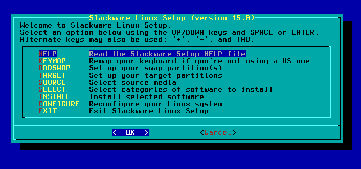

# 打造 2018 年休闲服

> 原文：<https://hackaday.com/2018/01/30/making-the-case-for-slackware-in-2018/>

如果你在过去 10 年左右开始使用 GNU/Linux，你的第一个发行版很有可能是 Ubuntu。但是，尽管你可能在一些精英 Linux 留言板和社区上听说过，这并没有什么错。最重要的事情很简单，你使用的是免费开源软件(FOSS)。如何做和为什么做并不重要，最终真的归结为个人偏好。如果你宁愿走“简单”的路线，还有谁可以评判呢？

话虽如此，这样的选择并不总是存在的。当我第一次开始全职使用 Linux 时，大新闻是内核即将获得对 USB 大容量存储设备的支持。我也不是指某个特定的大容量存储设备，我指的是它的实际的 T2 概念。在那之前，Linux 上的 USB 主要只是用于鼠标和键盘。因此，虽然我可能无法像那些通过软盘在 i386 上安装 Linux 的人一样拥有 Linux 灰胡子的地位，但可以肯定地说，我错过了“简单”Linux 的时代。

但我并不羡慕那些在稍微乐观一些的情况下做出改变的人。恰恰相反。我相信我对核心 Unix/Linux 哲学的理解要深刻得多，因为在早期我不得不“忍受”它。当诸如掌握你的 init 系统和从源代码编译一个普通内核这样的追求不被认为是书呆子式的奢侈，而是运行一个可靠系统的必要方面时。

那么，如果你正在寻找“经典”的 Linux 体验，你应该怎么做呢？自动配置是一个肮脏的词，你的系统的每一个方面都可以用比文本编辑器更奇特的东西来操作。碰巧有一个 Linux 发行版在过去的几十年里基本上没有变化: [Slackware](http://www.slackware.com) 。我们来看看它的起源，我认为是一个非常光明的未来。

## 一个精心设计的时间胶囊

Slackware 是所有 Linux 发行版中最“老派”的，这并不是偶然的。首先，它是最古老的活跃保持了 24 年的发行版。但更重要的是，Slackware 的创造者和首席开发者 [Patrick Volkerding](https://en.wikipedia.org/wiki/Patrick_Volkerding) 就是喜欢这样:

> Patrick Volkerding 正式发布的 Slackware Linux 是一款先进的 Linux 操作系统，它以易用性和稳定性为首要目标。Slackware 包含了最新的流行软件，同时保留了传统意识，提供了简单易用性以及灵活性和功能，将所有领域的精华带到了桌面上。
> 
> [Slackware.com](http://www.slackware.com/info/)

对于那些不熟悉 Linux 发行版术语的人来说,“稳定性”和“传统”在这里可以理解为“旧的”和“更老的”。Slackware 通常避免使用尖端软件和功能，这是福是祸取决于你问谁。完全安装最新版本的 Slackware 可能会有几个月或几年的软件过期，但它肯定会有可以运行的软件。

所有这一切的好处是，在 Slackware-land 中，事情或多或少保持不变。如果你在 2003 年使用的是 Slackware 9.0，那么今天安装 Slackware 14.2 并找到自己的路是没有问题的。

## 简单的好处

The Slackware installer has remained nearly unchanged since the 1990’s.

如果你想学习 Linux，Slackware 对简单性近乎狂热的坚持有很大的好处。“Slackware 方式”很可能适用于您使用的任何其他 Linux 发行版，而不是学习一种特定于发行版的完成任务的方法(在 Ubuntu 等高度发达的发行版中很常见)。就此而言，Slackware 中的许多功能也可以在 BSD 和其他 Unix 变体中使用。

Slackware 初始化系统尤其如此，它与 BSD init 风格密切相关。服务由放入/etc/rc.d/中的简单 Bash 脚本(rc.wireless、rc.samba、rc.httpd 等)控制。要启用和禁用服务，您不需要记住任何特定于发行版的命令，只需使用 chmod 在脚本中添加或删除可执行位。在 Slackware 中添加和删除服务非常简单，这使得为非常特定的目的或为旧的硬件设置精简的安装变得容易。

说到保持简单，有争议的 systemd 无处可寻。在 Slackware 中，文本文件仍然占主导地位，任何混淆系统配置和维护的软件很可能很难得到 Volkerding 和他的维护团队的认可。

最后，Slackware 最好的特性之一是避免定制或“修补”版本的软件。Slackware 不会对其软件包库中的任何软件应用补丁，也不会对内核应用补丁。虽然其他发行版可能会对他们安装的软件进行轻微的更改或调整，以试图更好地将其作为一个整体集成到操作系统中，但 Slackware 会保持软件完全符合最初开发者的意图。这不仅减少了引入错误或兼容性问题的机会，而且知道您正在完全按照开发人员的意图使用软件也是一件好事。

## 无挫折包装

如果你听说过任何关于 Slackware 的坏消息，那几乎肯定是关于软件包的。或者更具体地说，缺乏智能的依赖性管理。在其他发行版中，包管理器知道每个包依赖什么软件来运行，并会提示您安装它们，以确保一切按预期运行。Slackware 中没有这样的系统，但这也是设计使然。

为了使事情尽可能简单，期望您安装所有的。Slackware 的开发和测试是基于这样的假设，即您已经完全安装了存储库中的每个包。事实上，这是 Slackware 安装程序的默认模式；如果你不想要所有的东西，你必须切换到“专家”模式。

如果你不想完全安装，而是选择软件包，你可以这样做，但你需要手动处理依赖关系。如果当你试图启动一个程序时，你得到一个关于一个丢失的库的错误，这取决于你去找出它依赖于什么并安装它。通过检查和手动解决您自己的依赖关系，您将很快对 Linux 系统中需要什么和不需要什么有一种感觉，如果您试图使操作系统适合您的特定需求，这将再次派上用场。

## 你应该偷懒吗？

今天，Slackware 的争论可能比过去更加激烈。由于没有接受向 systemd 的转换，Slackware 比过去几年受到了更多的关注。目前还不清楚它是否能永远避免 systemd，但至少在可预见的未来，没有参与 Linux 生态系统中这一有争议的转变的 Linux 用户已经在 Slackware 中找到了一个避风港。

Slackware 是我的第一个 Linux 发行版，今天我仍然把它推荐给任何想真正学习 Linux 的人。如果你只是想使用 Linux 操作系统，那么我不得不承认 Ubuntu 或 Mint 可能是一个更好的 Windows 转换起点。这是学习你的操作系统如何工作和为什么工作的区别，也是让操作系统不管你，让你可以做别的事情的区别。不是每个人都需要学习前者，但如果后者彻底失败，它可能会在未来对你有所帮助。