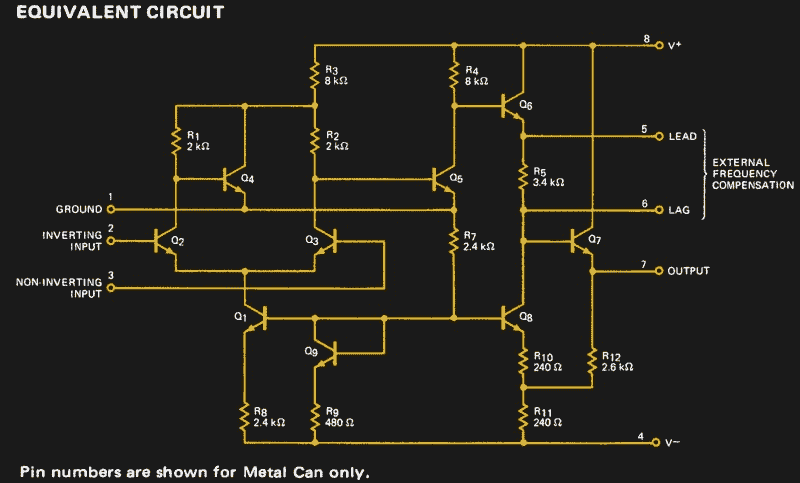
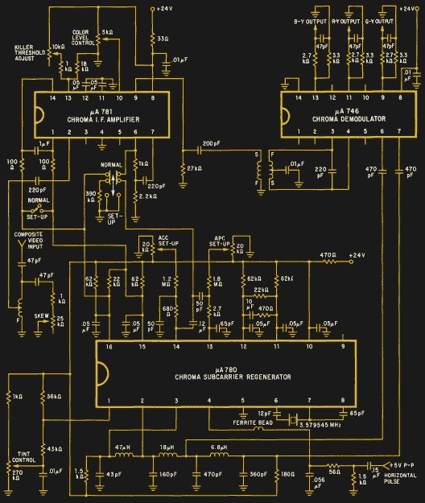

# 技术革新:调幅收音机、磁芯存储器和彩色电视，1973 年什么是热门芯片

> 原文：<https://hackaday.com/2018/02/16/retrotechtacular-am-radios-core-memory-and-color-tv-what-was-hot-in-chips-in-73/>

作为撰写科技报道的一部分，比如我们在 Hackaday 上的专题报道，有大量的研究工作要做。我们翻遍了一页又一页晦涩难懂的博客、视频和数据表。有时候，我们发现的资源非常有趣，以至于我们把它们归档，确信它们包含了未来某个时刻另一个故事的核心。

今天的娱乐话题就是这样一种资源，由互联网档案馆提供。这不是我们经常在*复古*片段中提供的视频，而是【1973 年 2 月版的飞兆半导体线性集成电路目录。像这样的书籍可以从公司销售代表那里获得，在数据手册普遍通过互联网访问之前的日子里，这些书籍非常珍贵，其中的纸上墨水数据手册提供了 45 年前集成电子行业的迷人快照。

当时和现在的第一个明显区别是规模，这是一个包含飞兆整个系列的单卷。这本 548 页的书无论如何都不会是一本薄薄的书，但鉴于飞兆当时是该领域的大公司之一，难以想象 2018 年同等制造商的整个系列可以以同样的方式包含在内。鉴于集成电路在当时还是一项刚刚诞生 15 年的发明，我们看到的是一个仍处于相对初级阶段的行业。

目录包含一系列熟悉标题的部分:运算放大器、比较器、电压调节器、计算机/接口、消费电子和带模拟开关的晶体管/二极管阵列。任何现代的目录都会有类似的标题，甚至有一些设备你会发现已经存活了几十年。原始制造商生产的μA741 运算放大器(第 64 页)尚未成为商品，它与我们熟悉的器件如μA7800 系列(第 201 页)或μA723(第 194 页)稳压器放在一起。

The uA702 circuit has a real simplicity to it.

从 Bob Widlar 的原始μA702(第 20 页，此处标记为“直流放大器”),到我们已经提到的经过改进的频率补偿μA741，再到 FET 输入器件领域，运算放大器一章几乎是这些器件作为集成电路发展的浓缩历史。运算放大器是一个仍在发展的领域，但在这几页中，以及在这十年的发展中，我们看到了它的起源。

1973 年的电源调节器完全是线性的，与今天的开关调节器形成鲜明对比。本节展示了一个处于相对初级阶段的领域，其中 3 端μA7800 系列稳压器仍是一个重要产品，而μA723 的开关应用电路则是一个特例，而不是其主要应用。一个惊喜来自三端调节器的负版本，我们所知的 7900 系列芯片实际上是 78N00 系列(第 238 页)。7900 系列芯片是竞争对手的产品吗？也许读者会想在评论中推测。

计算机接口一章选择了线路驱动器、RS232 接口、显示驱动器和模数转换器。这些功能中的一些在今天的目录中仍然可用，但公平地说，计算机接口自 20 世纪 70 年代以来已经发生了变化。不过，从第 318 页的 75325 开始，一组古老的项目是核心存储器驱动器和读出放大器。核心内存在 1973 年就过时了，现在有点像古董，所以这些数据表对于学习计算硬件历史的学生来说特别有趣。

A complete NTSC color decoder in 3 chips. When you could still buy sets doing this with discrete components, this was a very big deal indeed.

倒数第二章向我们展示了 1973 年最美好的一面，或者也许是我们当时活着的人可能还记得的 1973 年的一部分。飞兆半导体消费产品系列中的功能完全是模拟的，反映了富裕家庭可能希望在客厅或汽车中实现的最先进功能。

CRT 彩色电视和立体声调频收音机在 20 世纪 70 年代初都是大件商品，尽管家用电脑在 20 世纪 70 年代末已经出现，但它们在未来许多年仍将是家庭娱乐领域的霸主。因此，我们在一个芯片上拥有 NTSC(从第 458 页开始)和 PAL 电视的小信号和彩色解码器部分的完整芯片组，彩色 CRT 驱动器的三路视频运算放大器，模拟和 PLL 的立体声多路复用解码器，以及完整的 AM 收音机，但看不到数字 IC。在这本书的所有章节中，独一无二的是，这一章至今没有幸存者，甚至那些可能仍然有用的芯片已经被取代了很多次。

最后，我们熟悉了晶体管阵列、二极管阵列和单个模拟开关这一章。3046 晶体管阵列(第 499 页)应该是一个熟悉的部分，因为它仍然可用，它用来突出飞兆系列的其他一些东西。在大多数章节中，这些器件只有数字而没有字母，是飞兆对竞争对手器件的模仿。例如，3046 是 RCA 的 CA3046，在运算放大器章节中，301 是美国国家半导体公司的 LM301。考虑到 301 是[Bob Widlar]离开 Fairchild 加入 National 时的作品，对于这一特定部分的克隆肯定有一些内部政治。

1973 年，许多电子产品完全由分立元件制成，仍然可以买到包含锗晶体管甚至电子管的消费电子设备，因此本目录为我们提供了线性电路的最新技术，而不是一个通用的图片。这是一本有趣的读物，因为它对古老技术的见解以及对半导体行业一些幸存下来的元件的观察，如果她能找到一本实体副本，它仍然会在黑客作家的书架上找到一席之地。自 1973 年以来，我们走过了漫长的道路，但有时回顾过去仍然是有价值的。