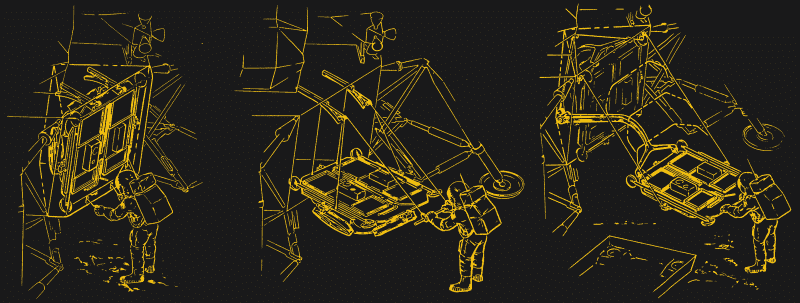
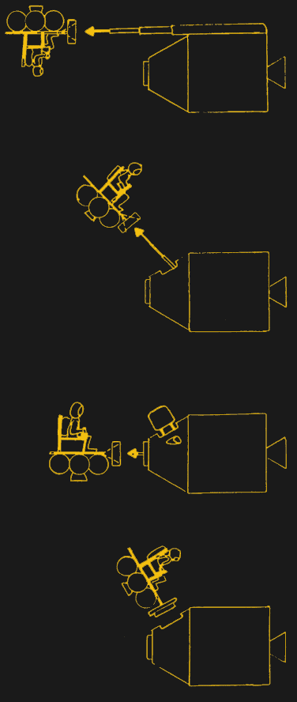
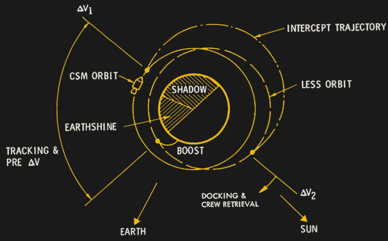

# 太空逃生:驾驶椅子飞向月球轨道

> 原文：<https://hackaday.com/2018/01/19/space-escape-flying-a-chair-to-lunar-orbit/>

在未来的几十年里，人类将再次在月球上行走。现在，围绕拉格朗日点运行的空间站的计划正在制定，熔岩管的调查正在进行，缓慢但肯定的计划正在形成，以建立将成为我们最近的天体邻居的小型科学前哨的硬件。

当然，这一切以前都发生过。在阿波罗计划的早期，计划为每次登月发射两枚土星五号火箭，其中一枚顶部装有指挥舱和三名宇航员，另一枚装有无人驾驶的“LM 卡车”。第二辆车将带着所有的补给和庇护所登陆月球，执行为期 14 天的任务。会有一辆重达数千磅的加压月球车。这不完全是一个月球殖民地，相反，它更像是北极的一个小木屋，用作科学前哨。宇航员和科学家将着陆，花两周时间进行研究和探索，然后带着数百磅的样本返回地球。

就像所有阿波罗登月一样，这也带来了风险。如果上升引擎不亮会发生什么？除了威廉·萨菲尔写的一篇漂亮的演讲外，对于被派往深海的宇航员来说，没有什么具体的东西。在后来的阿波罗计划中，有一个用真正的硬件把受困的宇航员带回家的计划。这就是月球逃生系统(LESS)，基本上是两把椅子安装在一个火箭发动机上。

虽然 LESS 从未建造，但北美 Rockwell 在 1970 年末完成了几项研究，详细说明了将两名宇航员从月球表面返回的硬件。它包括从一个受损的登月舱中吸取燃料，在没有计算机或任何仪器的情况下飞向轨道，并在不到一个月球轨道内与轨道指令舱进行会合。

## 370 磅的 B 计划

月球逃逸系统只能在上升级发动机出现故障的情况下使用。希望所有的任务，这个火箭动力救生筏将是自重，这意味着剃掉每一个不必要的盎司。没有计算机，一些计划要求没有姿态指示器。燃料将从登月舱中吸出，整个飞行器的干重在地球引力下约为 370 磅，比阿波罗 15、16 和 17 号上的月球车轻约 100 磅。

像月球车一样，LESS 将被储存在下降阶段的外部，扁平包装，并在现场组装。一旦 LESS 展开并加满燃料，宇航员将返回登月舱，给飞船加压，给宇航服充电，等待第一次发射机会。

为什么要回到着陆器？阿波罗宇航服中的 PLSS 生命支持系统只能支持一名宇航员大约四个小时，但组装、加油和维修则需要将近三个小时。如果没有快速的缓冲期来穿上宇航服，宇航员将只有一个小时的时间来等待合适的时间发射，乘坐它进入轨道，会合，对接，进入指令舱，最后，给飞船加压。这根本做不到。事实上，在四个小时内简单地发射到轨道并返回指令舱几乎是不可能的。

## 绕着你的裤裆转

 虽然少了能够与休斯顿和指挥舱通讯的船员，少了就不会配备电脑。除了六分仪，没有导航系统。这次救援任务的指挥官将不得不凭直觉飞入月球轨道。

在整个 20 世纪 60 年代，人们非常担心有人最终将不得不发射到轨道上并与航天器会合，即使没有当时可用的原始计算机控制的帮助。在阿波罗 9 号和阿波罗 10 号期间，工作人员试验了闪烁的信标和返回的月球着陆器的视觉观察，巴兹·奥德林的博士论文——可以说是他被选为首次着陆登月舱飞行员的原因——题为“载人轨道会合的视线制导技术”。

这些绕轨道运行和与另一艘宇宙飞船会合的技术一点也不能少。从爬出月球表面损坏的登月舱到爬进轨道指令舱，宇航员只有四个小时的时间。奥尔德林的技术是在几个轨道上慢慢接近一个等待中的航天器，当你有一个真正的、合适的航天器时，LESS 的上升轮廓稍微更直接一些。

在组装好 LESS，爬回登月舱，重新穿上宇航服后，受困的宇航员将等待下一次发射机会，也可能等待指挥舱将自己重新定位到一个更有利的轨道。

临近约定时间时，宇航员将最后一次爬出登月舱，系好安全带。指令舱将从头顶飞过，几秒钟后指令员将点燃引擎。“越少”号将会起飞，但加速度大约是月球重力的两倍。在最初的一万英尺，指挥官会盯着姿态指示器，而飞行员会寻找地标，确保他们确实走对了路。在月球表面上方大约一万英尺的地方——这是一个猜测，因为这艘救生艇上没有高度计 LESS 将开始颠簸，最终将它插入一个远点在月球表面上方六十海里的轨道。

指令舱飞行员在上升时会跟踪更少的。一旦 LESS 在启动引擎 8 分钟左右后进入稳定轨道，CM 飞行员就会将视觉和雷达跟踪的相关角度和时间输入阿波罗制导计算机。反过来，计算机会告诉飞行员多久启动引擎进入更高的拦截轨道。在绕月球飞行了将近一整圈两个小时后，指令舱将再次启动引擎，将它送入与 LESS 相同的轨道。从这里，这是一个简单的事情，从几海里以外的会合。研究表明，指挥舱飞行员可以在 10 到 15 英里外发现更小的目标，在这些范围之外还有雷达制导。

在这一点上，对 LESS 的研究有所突破。在 LESS 研究完成的时候，轨道会合已经被很好的理解了，但是宇航员如何回到里面的问题仍然存在。充气探测器的计划被提出来了，而且有可能是一个小的、简化的对接适配器，它可以锁定在指令舱的前面。由于生命支持背包的体积很大，宇航员必须通过主舱门进入，而不是通过指挥舱的前服务通道，而且必须考虑到丧失能力的宇航员。不过，说真的，在将火箭椅送入月球轨道后，处理绳索和扶手并不是什么大不了的事情。

## 少的遗产

对 LESS 的研究完成后不久，国会取消了阿波罗 18 号、19 号和 20 号。阿波罗应用程序将导致天空实验室，但计划延长停留在月球和飞越金星被抛出。由于没有计划用一辆 LM 卡车来支持更长时间的登月任务，在后来的阿波罗任务中没有空间来放置一艘近 400 磅重的救生艇。无论如何，LESS 需要将近三年的时间来开发，而最后一次登上月球的脚步将在 LESS 研究发表后的 26 个月。

尽管如此，less 背后的工程师们还是有超前的想法。LESS 可以到达月球轨道，但这也意味着它可以从最初的着陆点起飞，在 30 英里外着陆，然后返回登月舱。这是远程飞行器(LRF)的灵感来源。这只是一个稍微更坚固的 LESS，配备了起落架，也能够执行 LESS 救援任务。

LRF 将被用于侦察、研究和扩大宇航员在月球表面停留期间的旅行范围。当然，这种交通工具从未飞行过，但在未来几十年，当人类重返月球时，我们将需要一种快速、简单的方式在月球表面快速走动。在这里，我们可能会看到来自已经不存在的航空航天公司的超过 50 年的研究，并创造一个小的，火箭动力的椅子。有很多好处，如果主着陆器坏了，它可以用来飞到一个等待的指令舱。