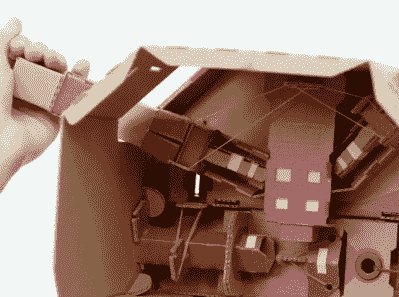

# 任天堂 Switch 和拉博在一起

> 原文：<https://hackaday.com/2018/01/20/nintendo-switch-gets-making-with-labo/>

多年来，任天堂用他们的各种游戏系统印钞几乎没有困难。虽然自 1983 年最初的任天堂娱乐系统发布以来，他们在这里和那里都有一些奇怪的失误，但整体业务一直很好。但是，即使对于一家从本质上把视频游戏带入主流的公司来说，去年也是相当巨大的一年。任天堂 Switch 的发布让这家日本游戏巨头以一种多年来都没有享受过的方式重新成为人们关注的焦点，现在他们希望在 2018 年继续保持这种势头，推出一个杀手级的新游戏配件:一个纸板盒。

Some of the contraptions feature surprisingly complex internal mechanisms.

嗯，不一定是盒子。[但无论你用哪种方式折叠，它绝对是一张纸板](https://labo.nintendo.com)。也许这里或那里有几根绳子。这是“任天堂 Labo”的世界，这是一个最近宣布的计划，它承诺让交换机所有者创建物理对象，他们可以通过为控制台专门设计的软件进行交互。

夸张的发布视频中展示的 Labo 作品巧妙利用了非常独特的开关硬件。可移动的 Joy-Con 控制器通常仍被用作输入设备，尽管使用方式不太传统。扭曲和倾斜纸板创作，采取不同的形式，如钓鱼竿或摩托车把手，由于它们包含的加速度计和陀螺仪，将输入传递到适当的游戏[。](https://hackaday.com/2017/11/06/reverse-engineering-the-nintendo-switch-joy-cons/)

许多更复杂的装置依赖于控制器的一个鲜为人知的功能:红外深度相机。通过将控制器的摄像头指向设备内部，内部组件的运动(可能有红外反射带的帮助)可以被三维跟踪。在视频中，一些设备的内部结构看起来非常吓人。

这就引出了一个自然的问题:*“这到底是给谁的？”*

很明显，一些小玩意，更不用说折叠纸板结构，是针对儿童的，任天堂从来不羞于吸引这个年龄段的人。但一些更先进的设备和整体概念似乎更适合有创造力的青少年和成人，他们希望将开关推向新的方向。

用户将被授权创建他们自己的硬件，进而创建相关的软件吗？黑客和制造商能够使用这个平台为 Switch 打印新的输入设备吗？这肯定是我们将密切关注的事情，因为它将在 4 月份发布。

鉴于这款游戏机如此新颖，Switch 的流行已经[引发了数量惊人的黑客攻击](https://hackaday.com/2017/10/25/teensy-script-plays-nintendo-switch-strikes-out/)。看看 Labo 的引入是否会对已经在做的令人印象深刻的工作[产生任何影响将是有趣的，这些工作是为了使控制台符合所有者的意愿](https://hackaday.com/2017/12/29/34c3-hacking-the-nintendo-switch/)。

 [https://www.youtube.com/embed/P3Bd3HUMkyU?version=3&rel=1&showsearch=0&showinfo=1&iv_load_policy=1&fs=1&hl=en-US&autohide=2&wmode=transparent](https://www.youtube.com/embed/P3Bd3HUMkyU?version=3&rel=1&showsearch=0&showinfo=1&iv_load_policy=1&fs=1&hl=en-US&autohide=2&wmode=transparent)

