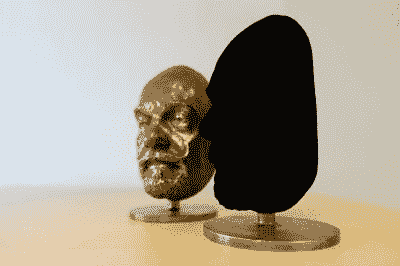
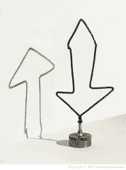
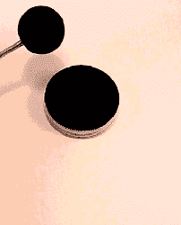

# 黑市的现状:你买不到 Vantablack

> 原文：<https://hackaday.com/2018/01/25/the-current-state-of-the-black-market/>

有时候你需要一些完全、彻底、无可救药的黑色。不只是一点点黑，不只是真的真的真的深蓝色，而是尽可能的黑。出于艺术目的，它可能会在相机或望远镜中捕捉光线，甚至使你的战机成为敌人导弹更难攻击的目标。不管怎样，我们是来帮忙的，不是来评判的。那么你有什么选择？

嗯，首先，有备受称赞的 Vantablack。这个名字本身就暗示了它的起源——V**V**e**A**ligned**N**ano**T**ube**A**rrays。它的工作原理是在一个复杂的真空沉积过程中给一个物体涂上一层碳纳米管。当光照射到表面时，一部分光被纳米管吸收，任何被反射的光都倾向于被邻近的纳米管吸收，而不是从物体的表面涂层逃逸。

## 就像宇宙中的一片空白

Two masks, one in bronze, the other coated in Vantablack. So much incoming light is absorbed that it becomes impossible to see the surface contours of the coated object.

Vantablack 拥有目前市面上最黑的**黑*的桂冠，吸收 99.965%的可见光。然而，在你过于兴奋之前，它确实有一些缺点。在最初的形式中，它必须在实验室条件下在 400 摄氏度的温度下生长在材料上。这妨碍了它在低熔点材料上的应用。不过，它也有喷雾罐的形式，只需要 100℃就能固化。但也许最大的陷阱是，对于绝大多数用户来说，它根本*不可用。**

 *Vantablack 的可悲之处在于，除了工业和军事应用之外，普通大众是买不到它的。一位名叫安尼施·卡普尔的艺术家从制造商萨里纳米系统公司那里获得了该材料的独家艺术权利，这导致了一场有趣的世仇。我们希望看到一种 DIY 方法来复制这种涂层，但迄今为止，技术障碍仍有待家庭化学家来克服。这意味着除了极端的身份盗窃案件，你可能会发现你需要去别处看看。

## 杂牌:奇点黑和 Aeroglaze Z306

A sculpture coated in Singularity Black, using the “void” effect of the black coating to play with the viewer’s perceived shape of the sculpture as their viewing angle changes.

紧随其后的是纳米实验室的[奇点黑。](http://www.nano-lab.com/optical-black-coatings.html)它由聚合物粘合剂中的碳纳米管组成，暴露在 300°c 以上的温度下会分解。吸收高达 98.5%的可见光，并具有类似的红外性能，这可能是目前性能最高的替代品。尽管[杰森·蔡斯]已经在网上分享了[一些实验的结果](http://jasonchase.com/Jason%20Chase%20Black%20Iron%20Ursa.html)，但应用并不容易，而且有些危险。[奇点黑的样品可以在网上轻易买到](http://www.nano-lab.com/singularity-20ml.html)。

另一种选择是 Aeroglaze Z306，美国宇航局将其用作天基成像传感器背后的涂层。在 97%的反射率下，它非常黑，但与基于纳米管的 Vantablack 相比不太好。能够在 13-35°C 之间使用，使用起来稍微容易一点，但是[根据数据表](https://www.lord.com/sites/default/files/Documents/TechnicalDataSheet/AEROGLAZE%20Z306%20TDS.pdf)，普通消费者又一次买不到。

不幸的是，所有上述涂层都有很多缺陷。应用程序过程中的严格要求和有限的健壮性会给许多项目带来问题。价格也是一个因素。

## 非常黑的油漆

A sample coated in Black 2.0\. Under certain conditions, this can achieve similar visual effects to Vantablack, with greatly reduced cost and complexity.

如果你在寻找不离开舒适、熟悉的领域就能得到的最深的黑色，不要害怕——斯图亚特·森普尔的黑色 2.0 就是答案。这是一种简单的丙烯酸涂料，据估计可吸收 95-96%的可见光，其中绝对含有颜料，这意味着涂抹起来很容易，让它在室温下干燥即可。

它不是很耐候(虽然涂层正在开发中！)但是对于现实世界中必须存在的大量应用程序来说，它是非常有用的。最重要的是，除了安尼施·卡普尔，每个人都买得起。

黑色领域是一个不断变化和飞速发展的领域，我们迫不及待地想看到它的下一步。目前，市场上有很多可供选择的产品，我们在下面提供了一些视频来帮助你决定最适合你的产品。也就是说，我们有点难过，我们无法找到任何黑客友好的解决方案来生产 Vantablack 样的物质(我们已经在家庭实验室中看到了许多[碳纳米管的其他用途)。](https://hackaday.com/2018/01/23/diy-graphene-putty-makes-super-sensitive-sensor/)

无论是尖端的油漆还是在家里自己制造纳米管的方法，我们都想知道。如果你有一个关于有史以来最黑的物质的杀手级应用，请在评论中告诉我们。

 [https://www.youtube.com/embed/-RRqj1FORl8?version=3&rel=1&showsearch=0&showinfo=1&iv_load_policy=1&fs=1&hl=en-US&autohide=2&wmode=transparent](https://www.youtube.com/embed/-RRqj1FORl8?version=3&rel=1&showsearch=0&showinfo=1&iv_load_policy=1&fs=1&hl=en-US&autohide=2&wmode=transparent)

 [https://www.youtube.com/embed/9_KyBalghFg?version=3&rel=1&showsearch=0&showinfo=1&iv_load_policy=1&fs=1&hl=en-US&autohide=2&wmode=transparent](https://www.youtube.com/embed/9_KyBalghFg?version=3&rel=1&showsearch=0&showinfo=1&iv_load_policy=1&fs=1&hl=en-US&autohide=2&wmode=transparent)

 [https://www.youtube.com/embed/YuILnYJlWcI?version=3&rel=1&showsearch=0&showinfo=1&iv_load_policy=1&fs=1&hl=en-US&autohide=2&wmode=transparent](https://www.youtube.com/embed/YuILnYJlWcI?version=3&rel=1&showsearch=0&showinfo=1&iv_load_policy=1&fs=1&hl=en-US&autohide=2&wmode=transparent)

*