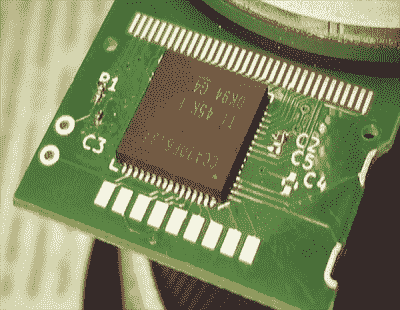

# Shmoocon:先进的低功耗技术和手表

> 原文：<https://hackaday.com/2018/01/25/shmoocon-advanced-low-power-techniques-and-a-watch/>

一个简单的问题:你如何提高工作效率？最伟大的(收入最高的)头脑只会说:做敏捷或 scrum 之类的。scrum 是什么？那是你每天早上聚集在一起浪费时间开会的地方，那会扼杀你的每一个生产欲望。不久前，[特拉维斯·古斯比]被困在类似的地狱小圈子里，为了礼貌起见，他不太看手机，也不太看手表。这导致了 Goodwatch 的诞生，这是一种新的硬件，它用十六进制编辑器、ISM 波段无线电、MSP430 反汇编器，当然还有 RPN 计算器取代了卡西欧计算器手表。

[Travis]已经向世界介绍了[good watch](https://goodwatch.org/)。[我们在 12 月回顾了一下](https://hackaday.com/2017/12/19/a-watch-only-a-ham-can-use/)，但是之后就没有任何消息了。他在 Shmoocon 2018 上的讲话让人们对这个项目的产生有了更多的了解。

Goodwatch 中的关键硬件是 TI 的 [CC430，这是一个真正令人惊讶的小微控制器，包括一个 LCD 驱动器，一个 16 位 MSP430 微控制器，ADC，数量惊人的闪存和 RAM，当然还有一个能够在常用 ISM 频段传输的 CC1101 无线电。这种芯片已经出现在一些受欢迎的项目中，包括](http://www.ti.com/product/CC430F6137)[法拉第开源数字无线电](https://faradayrf.com/)，但这里真正吸引人的是外设、低功耗和无线电的难以置信的结合。

 那么，如何从计算器手表中克隆出一个微型 PCB 呢？这个项目的机械设计实际上是最简单的，也是最不聪明的——只要拿一些卡尺，在 CAD 软件包里画些东西。解码 LCD 的引脚排列要复杂得多。

这些 LCD 有四个通用引脚和二十多个分段引脚。在弄清楚了常见的引脚之后，[Travis]并不真的想要打开手表几十次来弄清楚 LCD，所以他只是简单地写了一点代码来点亮一个像素和清除一个像素。是的，它仍然需要每个引脚组合的像素“映射”,但由于 MSP430 漂亮的内存映射 I/O，一旦映射完成，这段代码非常简单而且非常有用。

现在，[Travis]有一个真正的、可以工作的计算器手表 PCB，可以直接放入卡西欧 CA-53W 手表机身，几乎任何人都可以为自己制作。有一些警告——由于氧化层，无线电不能与黑色腕带一起工作，这些是微型 QFN 和 0201 组件——但这是一个合适的 [RPN](https://hackaday.com/2017/10/24/reverse-polish-notation-and-its-mildly-confusing-elegance/) 计算器手表，也是一个无线电发射机。没有比这更好的了。