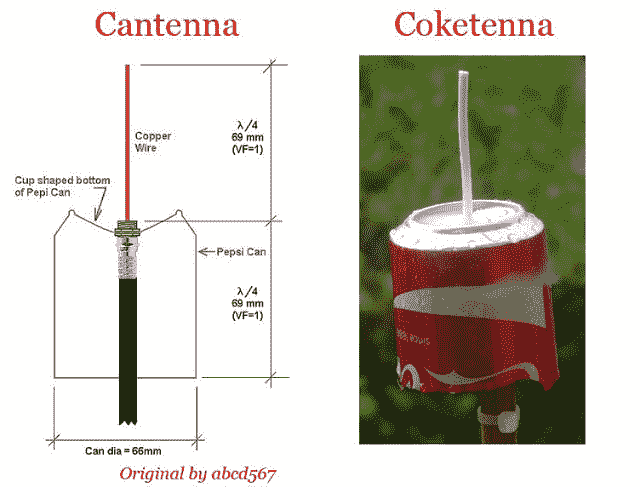

# 用真正的垃圾建造的 ADS-B 天线

> 原文：<https://hackaday.com/2018/01/23/an-ads-b-antenna-built-from-actual-garbage/>

随着低成本软件定义无线电(SDR)的出现，任何感兴趣的人都可以花大约 20 美元在从 FM 波段到地球同步卫星使用的千兆赫频率的电波上冲浪。很难夸大这对无线电黑客世界的影响。过去，只有干瘪的老汉才能从他们价值 1000 多美元的收音机前面板控制电波，但现在，即使是那些自称软件黑客的人也能以略高于一个披萨的价格进入这个领域。

但正如许多新的 SDR 探索者发现的那样，拥有接收器只是成功的一半:你还需要一个天线。插在 SDR 天线插孔中的一段电线会让你摘到一些容易摘到的水果，但如果你想扩大范围或进入更高的频率，你的天线需要仔细设计和构造。但是正如 Akos Czermann 在他的博客上所说，这并不意味着它一定很贵。他向我们展示了如何用一个空汽水罐和一根电线来建造一个功能强大的 ADS-B 天线。

 他明确表示，使用旧汽水罐作为天线的想法并不新鲜，另一个被称为[abcd567]的无线电黑客前段时间推广了他们自己版本的“cantenna”。但[阿科斯]对设计做了一些调整，把门槛拉得更低，他称之为“可乐塔纳”。

他的设计的主要优点是你不再需要焊接任何东西，甚至不需要使用任何特殊的连接器。事实上，你只需要一把小刀就可以组装这个天线。

你首先把罐头切成 68 毫米长，在底部切一个“X”。然后剥去一段同轴电缆，并将其推入 x。同轴电缆的塑料涂层中心导体应该从罐的底部露出，而编织的铜绝缘层将在另一侧聚集在一起。如果你想让它变得非常别致，[Akos]建议将一个塑料饮料瓶切成两半，并用它作为盖子来防止水进入“可乐罐”。

效果如何？他报告说，其性能与他的商用 ADS-B 天线非常相似，花费了他 45 美元。对于垃圾的某些部分来说还不错。

如果你想了解更多关于其工作原理的科学知识，我们已经在过去讲述了制作 ADS-B 天线的数学原理。但是，如果你只是想要一种简单的方式来接收一些信号，这款“coketenna”和[RTL-SDR 加密狗](https://hackaday.com/2017/09/05/19-rtl-sdr-dongles-reviewed/)可以让你立刻开始。