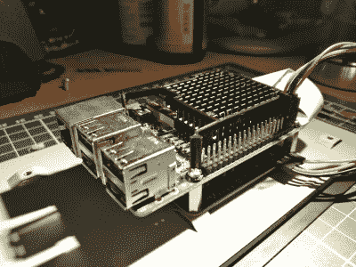

# 不仅仅是雅达利的翻版

> 原文：<https://hackaday.com/2018/01/28/more-than-just-an-atari-look-alike/>

树莓派一直是爱好复古游戏的黑客们的福音。Redditor [KaptinBadkruk]想要加入游戏列车，因此为自己建造了一个受 Atari 2600 启发的 Raspberry Pi 3 主机！

 一个关键的目标是选择玩任天堂 64 个游戏，所以【KaptinBadkruk】不得不对 Pi 进行超频，然后实施一个冷却系统。一个散热器、一些铜垫和一个旧 3D 打印机的风扇——全部由 3D 打印支架固定——在对散热器进行快速修整后，工作正常。Adafruit 的一个旧扬声器和一个单声道放大器——以及几个障碍之后——已经设置好了声音，官方 RPi 触摸屏作为显示屏。

在选定了雅达利 2600 风格的外观后，[KaptinBadkruk]又努力克服了几个障碍——也就是动力。他原本打算让这个项目具有可移植性，但是电力问题意味着这个想法在下一个版本之前不得不靠边站。然而——这可以说是被[KaptinBadkruk]最喜欢的部分抵消了:一个来自马里奥赛车正面和中间的光滑的 3D 打印物品盒以一种适当的新旧结合的方式完成了视觉造型。

那个道具块不是第一次伴随雅达利游戏机的[灯光秀，但是不要让这阻止你](https://hackaday.com/2017/07/09/firework-shows-the-vintage-atari-way/)[在你的口袋里放一个](https://hackaday.com/2016/03/26/an-atari-2600-in-your-pocket/)。

[通过 [/r/DIY](https://www.reddit.com/r/DIY/comments/7rwv7r/i_made_an_atariinspired_portable_retropie_console/)