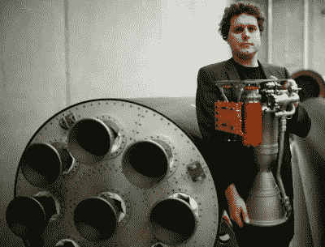
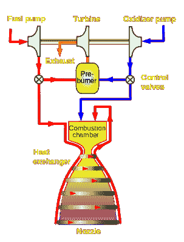

# 更小更智能:电子火箭起飞

> 原文：<https://hackaday.com/2018/01/29/smaller-and-smarter-the-electron-rocket-takes-flight/>

2018 年 1 月 21 日格林尼治时间 1 点 43 分，火箭实验室的电子火箭从新西兰的马希亚半岛升空。大约八分钟后，地面控制中心收到确认，飞行器进入了良好的轨道，随后不久有效载荷成功部署。仅仅经过第二次尝试，Rocket Lab 就成为了最新一家将有效载荷送入轨道的私营公司。这是一项令人印象深刻的成就，但当你意识到电子火箭不同于以往任何时候发射的火箭时，这一成就就更令人印象深刻了。

 从外表看不出来。如果有什么不同的话，电子的外表可以被称为无聊。如果你觉得不够慷慨，甚至可以衍生。它有着和大多数现代火箭一样的无鳍钝头圆柱体形状，一个完全合理的(如果视觉上不令人兴奋的话)设计。该飞行器的九个第一级发动机在 15 年前应该是值得注意的，但今天只能与 SpaceX 大获成功的猎鹰 9 号相提并论。

但是，虽然电子的外表就像它们来的时候一样不起眼，但在漆黑的外壳下是自 V-2 首次证明实用的液体燃料火箭成为可能以来最具革命性的火箭技术。令人印象深刻的是，它观看了 SpaceX 教会火箭倒飞并用尾巴着陆，他们的核心技术仍然在很大程度上与 20 世纪 60 年代人类登月的技术相同。

如你所料，从根本上改变航天飞行既定规则的飞行器非常罕见。它们往往有化为一团火焰的趋势；象征性的，如果不总是字面上的。现在，电子已经到达太空，并传递了它的第一个有效载荷，不再有技术是否可行的问题。但是，除了火箭实验室，是否有人会接受电子带来的所有变化，最终可能会由自由市场决定。

## 成长市场的小火箭

关于电子，首先要理解的是，对于轨道火箭来说，它非常的小和轻。客观地说，航天飞机可以毫不费力地在货舱里携带两枚装满燃料的电子火箭。因此，电子的载重量极低，最高只有 500 磅左右。与猎鹰 9 号大约 50，000 磅的最大容量相比，人们可能会想知道这有什么意义。

Rocket Lab CEO Peter Beck poses with Electron

重点当然是成本。猎鹰 9 号的发射成本约为 6200 万美元，而电子太空之旅不到 600 万美元。如果你的有效载荷足够轻，可以搭乘电子飞船，选择是显而易见的。随着卫星变得越来越小越来越轻，越来越多的有效载荷将能够归入这一类别。事实上，火箭实验室希望每年发射多达 100 枚电子火箭，以满足预期的需求。

同样是英镑，乘坐猎鹰 9 号实际上要便宜得多。但是猎鹰 9 号上的一个轻型有效载荷将被归入次要货物。这种安排的现实在 2012 年得到了证明，当时猎鹰 9 号的一个引擎在上升过程中发生了故障。这只够完成主要任务，向国际空间站运送补给和货物。次要有效载荷[，一颗来自通信供应商 Orbcomm](https://www.space.com/18049-spacex-rocket-stranded-satellite-falls-space.html) 的卫星，不得不被留下。Orbcomm 的卫星只有 379 磅，非常适合专门的电子发射。

## 制造火箭的新方法

电子汽车不仅仅因为体积小而便宜，它的价格也因为全车使用的最先进的制造技术而降低。电子公司的十个卢瑟福发动机中的每一个的燃烧室、喷射器、泵和阀门都是通过电子束熔化在短短 24 小时内 3D 打印出来的。这是火箭技术的第一次，比 NASA 和 SpaceX 早了好几年。SpaceX 将不会飞行他们的 3D 打印引擎，直到他们的“龙 2”太空舱在今年晚些时候飞行，美国宇航局仍处于他们研究的早期阶段。

另一项创举是，火箭实验室几乎用碳复合材料建造了整个火箭。这使火箭拥有了深黑色，但更重要的是，火箭实验室的首席执行官彼得·贝克说，它的干重“T1”比一辆迷你库伯“T2”的“T3”还要轻。至关重要的是，即使是燃料和氧化剂箱也是由碳复合材料制成，而不是传统的铝。“电子”是第一个成功使用碳复合材料燃料箱飞行的火箭，但它肯定不是第一个尝试*的*。

2001 年，美国国家航空航天局著名地取消了洛克希德·马丁公司的 X-33 太空飞机，这是航天飞机的潜在替代品，很大程度上是因为他们确定其复合推进剂罐完全超出了当时的技术水平。

## 电池驱动的火箭

但是电子的最高成就不是它有多小，也不是它的引擎 3D 打印速度有多快。这些本身就是令人印象深刻的壮举，但可以说只是已经持续多年的工作的延伸。火箭实验室能够利用这些可能性，至少是部分利用，因为他们有这么小的飞行器。

A simplified liquid fuel rocket engine with preburner. Credit: Duk

真正的革命是火箭实验室已经完全取消了传统上用于液体燃料火箭的复杂的预燃室和涡轮。火箭发动机消耗大量的燃料和氧化剂，需要大功率的泵将推进剂以必要的压力注入燃烧室。为了给这些泵提供动力，大多数发动机都有一个由预燃室带动旋转的涡轮。在某些情况下，预燃室使用与火箭发动机本身相同的燃料，但可以有自己的燃料供应和相关的管道和油箱。

预燃室、涡轮和泵组成了一个强大而复杂的系统，在某些方面，它和火箭发动机本身一样难以掌握。想想土星 V 中使用的每一台 F-1 发动机中的涡轮都单独产生了 55，000 马力。

在卢瑟福发动机中，整个系统被两个由一组锂聚合物电池供电的 50 马力无刷电机取代。这些电机直接为泵提供动力，并对发动机运行进行一定程度的控制，这是传统技术难以企及的。对于涡轮，旋转时间与油门响应和发动机启动顺序直接相关。但是通过使用电力驱动泵，电子公司的引擎能够更快更准确地响应飞行计算机的指令。

缺点是电池很重，不像液体燃料，在使用时不会被消耗掉。没电的锂电池和充满电的一样重。为了解决这个问题，电子实际上是在飞行器爬升的时候把用完的电池扔到船外。

## 这改变了一切，对吗？

火箭实验室在电子方面所做的工程，以及他们第二次尝试使用这样一种非常规的运载工具就进入轨道的事实，是一个令人难以置信的成就。毫无疑问，电子本身将被视为火箭史上的一个里程碑。

但是，尽管 3D 打印引擎和碳复合推进剂罐几乎是未来几代火箭的必然选择，但电子公司的引擎技术可能会面临更短的寿命。无法回避的事实是，液体燃料的能量密度比电池大得多。虽然火箭实验室已经设法找到了这种特定车辆的电池重量与有效载荷容量的可行组合，但当你扩大设计规模时，这个等式就不起作用了。在某一点上，[电池的重量变得太大而无法继续使用](https://hackaday.com/2017/12/25/how-much-of-a-battery-pack-does-your-electric-car-need/)。

如果火箭实验室是正确的，轻型有效载荷有巨大的市场，那么我们可能会看到其他小型火箭采用类似的发动机。但是，如果市场满足于在猎鹰 9 号这样的大型火箭的二等或三等座位上进入太空，这项创新技术可能会因为经济原因而最终占据后座。

 [https://www.youtube.com/embed/eg5234BOED8?version=3&rel=1&showsearch=0&showinfo=1&iv_load_policy=1&fs=1&hl=en-US&autohide=2&wmode=transparent](https://www.youtube.com/embed/eg5234BOED8?version=3&rel=1&showsearch=0&showinfo=1&iv_load_policy=1&fs=1&hl=en-US&autohide=2&wmode=transparent)

