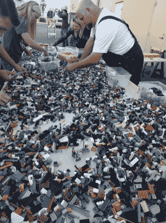
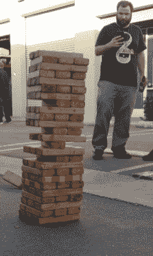
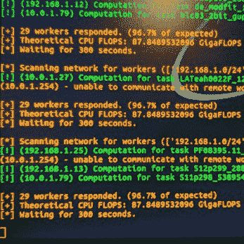
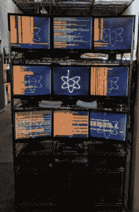

# 黑客日链接:2018 年 1 月 28 日

> 原文：<https://hackaday.com/2018/01/28/hackaday-links-january-28-2018/>

如果你还没听说，我们正在进行一场 3D 打印比赛。[这是你能打印的修理比赛](https://hackaday.io/contest/32812-repairs-you-can-print-contest)。想法很简单:炫耀你如何用 3D 打印机修理东西。奖品包括 100 美元的 Tindie credit，作为对学生和组织(想想 hackerspaces)的特殊奖励，我们将赠送几台 Prusa i3 MK3 打印机。

这些年来，[Drygol]因修理各种“家用”电脑而出名，这次他回来了[展示他对一堆 Amiga 500s 的改装和翻新。这一次，他安装了一些新的 RAM 芯片，通过摆弄 PLCC 上的引脚来修复一些大师冥想，添加了一个内置调制器，安装了一个双 Kickstart ROM，并安装了一个 Gotek 软盘适配器。这是一个了不起的工作，把所有的现代便利都放进了这台经典的电脑。](https://www.retrohax.net/amiga-500-mods-2/)

[这里有一个 FPGA 物联网控制器](https://www.kickstarter.com/projects/quokka-robotics/quokka-fpga-iot-controller)。它是一个 Cyclone IV 和一个 WiFi 模块，被塞进一个类似 Arduino Mega 的东西中。问题来了:这是干什么用的？你使用 FPGA 有两个原因，要么做一些*非常快的事情*，要么做一些普通微控制器做不到的奇怪事情。不知道物联网有没有和 FPGAs 重叠的应用。你能想到什么吗？我不能。

潮汐舱是易燃的。

你知道什么很酷吗？[烟火大会](http://www.sparklecon.org/)。这是一个聚会，充满了 100 磅的乐高、电脑回收公司、等离子教室和黑客空间，隐藏在加利福尼亚州富勒顿的一个工业园区。完全是寒意，是我们这一类人的聚会——喜欢篝火、锤子叠积木、啤酒、拆高压变压器的荧光灯的人。

              

一些为烟火大会欢呼的人。23b 黑客空间我猜是这里的主要主持人，或者至少是主播。小巷对面是 NUCC，国家升级计算集体[。他们是一个非盈利组织，利用旧的服务器，翻新它们，并把它们与 Folding@Home 和 SETI@Home 这样的项目联系起来。这实际上是为科学家服务，因为每个白痴现在都在开采比特币和以太网，这大大降低了这些分布式计算项目的计算能力。感谢 OSH Park 在必胜客购买各种特色披萨。我强烈建议大家明年去烟火大会。这是第五年了，一次比一次大，一次比一次好。](http://nuccinc.org/)