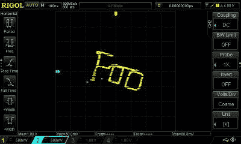

# 浏览器中的示波器艺术

> 原文：<https://hackaday.com/2018/02/01/oscilloscope-art-from-your-browser/>

示波器艺术是一种迷人的追求，其中为示波器的 X 和 Y 通道生成波形，以在屏幕上绘制图像。它与您可能在较旧的街机或 Vectrex 控制台中看到的矢量计算机图形有点不同，因为虽然它使用类似的方法来创建显示，但它有非常不同的目的。有时候，这些作品可能是惊人的美丽的动画，而其他时候可能不是这样。

如果你想探索这个主题作为一种温和的消遣，那么[这个来自【Neil Fraser】的 Javascript 示波器艺术生成器](https://neil.fraser.name/news/2018/01/25/)可能会让你感兴趣。在大约 100 行代码中，他创建了一个浏览器内便笺式存储器，可以在其上绘制波形，然后在计算机的声卡上创建为音频信号。将示波器的 X 轴和 Y 轴左右相连，你在便笺簿上写的东西就会出现在屏幕上。

Draw it, see it on screen. Magic!

这是一个令人印象深刻的作品，你可以在下面的视频中看到或自己尝试，你的书记员的 Rigol 被压入服务中去尝试一下。经过一点调整，找到正确的电压，并选择斜坡触发而不是边缘触发，我们也在屏幕上出现了曲线。

很有趣，他把最好的留到了最后。后来，他还提供了另一个作品的链接，[Javascript 中的示波器时钟](https://neil.fraser.name/news/2018/clock.html)。如果你们中的任何人想更进一步，做一个 Javascript 示波器扳手，我们很乐意让它出名。

 [https://www.youtube.com/embed/JGEsZBPkjNY?version=3&rel=1&showsearch=0&showinfo=1&iv_load_policy=1&fs=1&hl=en-US&autohide=2&wmode=transparent](https://www.youtube.com/embed/JGEsZBPkjNY?version=3&rel=1&showsearch=0&showinfo=1&iv_load_policy=1&fs=1&hl=en-US&autohide=2&wmode=transparent)

如果示波器艺术给了你灵感，看看[这些令人印象深刻的屏幕图形](https://hackaday.com/2016/05/02/amazing-oscilloscope-graphics/)。

Via [黑客新闻](https://news.ycombinator.com/item?id=16244548)。