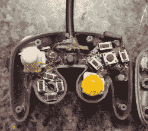

# 这是什么，蚂蚁控制器？！

> 原文：<https://hackaday.com/2018/01/31/what-is-this-a-controller-for-ants/>

你用过的最小的控制器是什么？[bit build]论坛用户[Madmorda]在她当地的 GameStop 上买了一个很酷的小 GameCube 控制器钥匙链，上面有半工作按钮。就像制造商通常做的那样，她认为她可以把它变成一个工作控制器，然后——嗯— [剩下的就是历史了。](https://bitbuilt.net/forums/index.php?threads/worlds-smallest-gamecube-controller.1906/#post-24567)

这种小型化控制器的原始按钮本质上是一片塑料  ，所有按钮都会立刻按下——D-pad 也是如此。同样，最初的操纵杆和 C-stick 没有弹簧，摆弄后也不会回到中间位置。为了启动这个项目，[Madmorda]选择了一个 GC+板——一个定制的 GameCube 控制器板——小到足以适应这个项目，11 个用于各种按钮的硬触动开关，以及两个用于复制原始控制器的 L 和 R 按钮半模拟、半数字功能的软触动开关。

 [https://www.youtube.com/embed/N7YPLAhjW6g?version=3&rel=1&showsearch=0&showinfo=1&iv_load_policy=1&fs=1&hl=en-US&autohide=2&wmode=transparent](https://www.youtube.com/embed/N7YPLAhjW6g?version=3&rel=1&showsearch=0&showinfo=1&iv_load_policy=1&fs=1&hl=en-US&autohide=2&wmode=transparent)

新的 L、R 和 Z 按钮必须 3D 打印，因为原始按钮是固定的，需要清理，但她能够分离并重复使用钥匙链的原始按钮。在组装了新部件并添加了缩短的 GameCube 控制器电缆(因此它仍然可以用作钥匙链)后，唯一缺少的功能是隆隆声。[Madmorda]迟来的计算，一对 Wii 远程隆隆电机将适合，但这是一个未来版本的问题。尽管如此，这是一个功能齐全的控制器——尽管[Madmorda]不建议在《粉碎兄弟》中使用它。