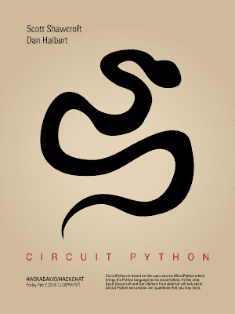

# 周五黑客聊天:电路 Python

> 原文：<https://hackaday.com/2018/01/31/friday-hack-chat-circuit-python/>

在过去，如果你想学习如何给计算机编程，你可以使用存储在只读存储器中的 BASIC 解释程序。这就是整整一代开发人员学习如何编程的方式。现在，家用电脑不存在，ROM 中没有存储编程语言，任何人都不应该对 8 岁的孩子施加 JavaScript。什么是默认的，我今天的第一个编程语言？Python。现在它在微控制器上。

 在本周 hackaday.io 的黑客聊天中，我们将谈论所有关于 Circuit Python 的话题。Circuit Python 基于开源的 [MicroPython](https://micropython.org/) ，这是一个 Python 3 解释器，在微控制器和其他受限环境中实现了 Python 语言的子集。它是 BASIC 在每台计算机上的精神继承者:MicroPython 有交互式提示、任意精度整数、闭包、列表等等。所有这些都可以在一个具有 256 kB 代码空间和 16k RAM 的微控制器上实现。

我们本周黑客聊天的嘉宾是来自 Adafruit 的[Scott Shawcroft]和[Dan Halbert]。[Scott]于 2016 年 9 月开始与 Adafruit 合作开发 MicroPython，此后一直领导更名后的 CircuitPython 工作。【Dan】2017 年初开始从事 CircuitPython 的工作，同年 8 月加入 Adafruit。顺便说一下，[Dan]是 UNIX 中“more”命令的原始作者。

在这次聊天中，我们将讨论 CircuitPython，它的历史，当前支持该项目的电路板，以及 CircuitPython 的最终目标。我们将讨论未来的计划，未来将支持什么，并询问关于 CircuitPython 的任何技术问题。

我们的 Hack Chat 是在 [Hackaday.io Hack Chat 群发消息](https://hackaday.io/project/5373/token/7879571d-62c3-46a8-af36-2b6f265590f2?redirect=messages)上的实时社区活动。这次聊天将于太平洋时间 2 月 2 日星期五中午进行。时区让你沮丧？这里有一个[方便的倒计时定时器！](https://www.timeanddate.com/countdown/generic?iso=20180202T12&p0=137&msg=Circuit+Python+Hack+Chat&font=cursive)

点击左边的语音气泡，你会被直接带到 Hackaday.io 上的黑客聊天群。

你不必等到星期五；随时加入，你可以看到社区在谈论什么。