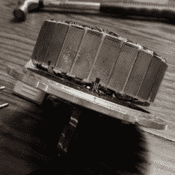

# 这就是悬浮滑板马达可能属于机器人的原因

> 原文：<https://hackaday.com/2018/02/03/heres-why-hoverboard-motors-might-belong-in-robots/>

 [madcowswe]首先指出 ODrive(一种开源的无刷电机驱动板)的整个前提是在工业应用中使用廉价的无刷电机。这通常意味着使用业余电动飞机马达，但机器人应用有时需要比这些马达所能提供的更多的扭矩。增加一个变速箱是一种选择，但还有另一种选择:所谓的“悬浮板”电机很常见，而且[提供了坦率地说非常出色的扭矩价格比](https://discourse.odriverobotics.com/t/project-hoverarm/441)。

拆卸表明，必要的机械和电气接口看起来值得一试，因此原型已经开始。这些电机实际上是为在地面上旋转轮胎而设计的，而不是驱动其他负载，但[madcowswe]认为，通过添加编码器和正确的固定装置，这些电机可以形成优秀机器人手臂的基础。ODrive 项目是 2016 年 Hackaday 奖的竞争者，我们迫不及待地想看到它的结局。