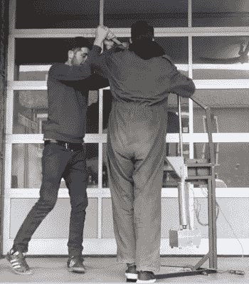

# 用垃圾注射成型 IPhone 外壳

> 原文：<https://hackaday.com/2018/02/07/injection-molding-iphone-cases-from-trash/>

我们猜想你已经听说过这个，但是废塑料是一个环境问题。我们几乎用塑料包装来包装我们购买、食用或饮用的所有东西，然而很少一部分最终被回收。更糟糕的是，融化大量这种塑料并重复使用并不需要一个巨大的工业过程，如果你愿意，你可以在家里做。那么，为什么没有更多的本地化项目将这些塑料垃圾转化为可用的物品呢？

这是[Precious Plastic]提出的问题，通过为希望参与塑料回收游戏的个人和社区提供集中资源，他们希望在全球塑料危机中发挥作用。他们的最新项目之一是[展示如何通过小规模注射成型将塑料垃圾变成功能性的 iPhone 外壳](https://preciousplastic.com/en/creations.html)。

Pushing plastic into the mold

广告之后的视频详细介绍了制作注塑模具所需的 3D CAD 文件的制作过程。即使你不打算在家里回收牛奶罐，如果你曾经考虑过注射成型的东西，视频中的信息和提示也非常有帮助。该视频甚至展示了 SolidWorks 中的一个简洁功能，让您模拟熔融塑料如何在模具中移动，以帮助检查问题区域。

一旦你在电脑上设计好模具，你需要把它变成一个实物。如果你有一台能够铣削铝的 CNC，那你就万事俱备了，但如果没有，你就需要外包。[Precious Plastic]找到了通过 3DHubs 加工模具的人，尽管他们在视频中提到，在当地的机械商店打听也是个不错的主意。

模具完成后，剩下的就是把两边栓在一起，然后注入液态塑料。这里[Precious plastics]展示了一种相当有趣的方法，他们将模具连接到一个装置上，使他们能够用人力注射塑料。如果你想制造成千上万个这样的箱子，这可能不是你想做的事情，但它确实表明，你不一定需要一个高科技的生产设备来制造好看的注塑零件。

这个项目[让我们想起了由高密度聚乙烯塑料](https://hackaday.com/2017/12/30/fresh-baked-plastic-tiles-for-all/)制成的瓷砖，这种瓷砖并不比普通厨房里的瓷砖更有异国情调。像这样的项目真正让人们认识到[用合适的硬件个人可以将垃圾转化为可用的产品](https://hackaday.com/2016/04/03/think-globally-build-locally-with-these-open-source-recycling-machines/)。

[通过 [3DHubs](https://www.3dhubs.com/blog/this-diy-machine-is-recycling-old-bottles-into-iphone-cases/)

 [https://www.youtube.com/embed/ZYFoWP-3MYE?version=3&rel=1&showsearch=0&showinfo=1&iv_load_policy=1&fs=1&hl=en-US&autohide=2&wmode=transparent](https://www.youtube.com/embed/ZYFoWP-3MYE?version=3&rel=1&showsearch=0&showinfo=1&iv_load_policy=1&fs=1&hl=en-US&autohide=2&wmode=transparent)

