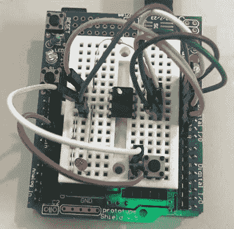

# 用 Arduino 调试 Arduino

> 原文：<https://hackaday.com/2018/02/07/debugging-an-arduino-with-an-arduino/>

每个 Hackaday 的读者都知道，并且一有机会就在评论中告诉我们，在你的项目中添加一个 Arduino 会让它变得更酷。但是，如果在向项目添加 Arduino 的过程中，您遇到了问题，需要调试代码，该怎么办呢？如果您可以使用第二个 Arduino 来调试第一个会怎么样？这将使您的项目达到两个 Arduinos，立即使它比您开始之前更棒四倍！谁能对这样的指数增长说不呢？

Debugging an ATTiny85

不是[韦恩·霍尔德]，这是肯定的。他写信让我们了解他已经工作了一段时间的一个项目，该项目允许你用另一个 Arduino 来[调试一个 Arduino 上代码的执行。事实上，目标芯片甚至可以是另一个 AVR 系列微控制器，如 ATTiny85。使用他的软件，你可以单步执行代码，查看和修改内存中的值，设置断点，甚至反汇编代码。并不是所有的东西都在全力工作，但是他目前所做的给人留下了深刻的印象。](https://sites.google.com/site/wayneholder/debugwire)

[诀窍是利用许多 AVR 微控制器中包含的“调试线”功能](https://hackaday.com/2016/04/07/reverse-engineering-debugwire/)。不幸的是，关于这一功能的文档很难获得，但通过一些工作[Wayne]已经设法弄清楚它的大部分工作原理，并创建了一个 Arduino 草图，让用户通过串行监视器使用简单的菜单系统与目标芯片进行交互，[类似于总线盗版](https://hackaday.com/tag/bus-pirate/)。

[Wayne]在他的网站上和休息后的视频中提供了大量细节，展示了他迄今为止在他的软件中针对 ATTiny85 工作的许多功能。如果你花了很多时间在 AVR 项目上，这看起来像是你想要在你的工具包里的 Arduino 上安装的东西。

当你的代码开始在真正的硬件上运行时，调试微控制器项目可以节省大量的时间，但是 T2 经常需要一些黑客攻击才能让它工作。

 [https://www.youtube.com/embed/kI_Z78a_0y0?version=3&rel=1&showsearch=0&showinfo=1&iv_load_policy=1&fs=1&hl=en-US&autohide=2&wmode=transparent](https://www.youtube.com/embed/kI_Z78a_0y0?version=3&rel=1&showsearch=0&showinfo=1&iv_load_policy=1&fs=1&hl=en-US&autohide=2&wmode=transparent)

